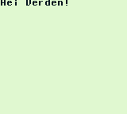

# Introduksjon {.intro}

Gameboy-en kodet man tidligere i "__Asembly__", men med moderne teknologi kan man
bruke kodespråket "__C__", som er enklere å programmere i.


# Steg 1: Lag filen `main.c` {.activity}

Dette steget trenger kun å gjøres hvis filen ikke eksisterer.

All kode vi skriver står i filen `main.c`, men denne filen finnes ikke. Så må
vi lage den.

## Windows {.check}

- [ ] Høyreklikk i mappen `bin`, dette bringer opp handlingsmenyen din

- [ ] Velg "ny"

- [ ] Velg "Tekstdokument"

- [ ] Gi filen navnet `main.c` (Det er viktig at den ikke heter `main.c.txt`!)

Du har nå laget filen `main.c`


# Steg 2: Litt grunnleggende "C" {.activity}

C starter i en funksjon som her heter `main()`, alt som står inne i denne vil
kjøres.

For å lage funksjonen `main()`, skriver vi:

```c
void main()
{
  // Kode som skrives her, vil bli kørt! (Denne setningen kan fjernes)
}
```

Skrift som står bak to skråstreker vil ikke bli lest!

```c
Kode som blir lest!
// Kode som ikke blir lest!
```

"C" har få funksjoner som standard, så vi legger til et "Bibliotek" med
funksjoner.

For å legge til et bibliotek, legger vi til en setning helt på toppen:
```c
#include <eksempel.h>
```

I "C" avslutter man en line med en ";"
```c
Første Linje;
Andre Linje;
Tredje Linje; Fjerde Linje;
```

# Steg 3: Koding {.activity}

Først, en enkel måte å skrive tekst til skjermen, er å bruke en funksjon som heter `printf()`:

```c
printf("Skriv dette!");
// Skriver "Skriv dette!" til skjermen.
```

`printf` er ikke som standard en del av "C", men funksjonen ligger i biblioteket
`stdio.h`.

For å skrive kode åpner du `main.c` i notepad eller lignende!

## Sjekkliste {.check}

- [ ] Legg til biblioteket `stdio.h` med å skrive:
```c
#include <stdio.h>
```

- [ ] Lag en main funksjon med å skrive:
```c
void main()
{

}
```

- [ ] Legg til Funksonen `printf()` i main funksjonen, og skriv "Hei Verden!" i parantesene:

```c
void main()
{
  printf("Hei Verden!")
}
```

- [ ] Lagre og lukk

Koden din skal se noe ut som dette:
```c
#include <stdio.h>

void int main()
{
  printf("Hei Verden!");
}
```

# Steg 4: Kompilere og teste {.activity}

Du har nå skrevet kode, men denne koden er ubrukelig for en Gameboy, men det kan
vi gjøre noe med. Bygg koden med å bruke ByggKode- filen din.
Hvis du får en feil, er det noe galt med koden din!

Etterpå kan du kjøre koden din, med filen Kjør kode.

Ser du dette:



har du gjort det helt riktig. Gratulerer!

# Prøv selv! {.try}

Prøv å endre det som står inne i `printf()`. Hva skjer om flere `printf()` blir
satt etter hverandre? Her er det bare å eksperimentere!

Husk å gjenta steg 4, for å teste!
