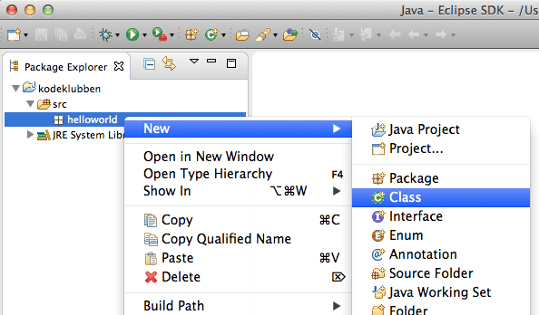
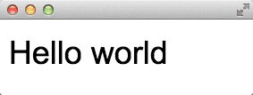
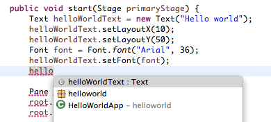

# Introduksjon {.intro}

Formålet til denne leksjonen er å lære hvordan man får satt opp et Java-prosjekt i Eclipse og kjørt et JavaFX-program. I tillegg skal du lære litt om sammenhengen mellom JavaFX-koden og innholdet i app-vindeuet en får opp.

# Steg 1: Sette opp Java-prosjekt, og lage app-mappe og app-klasse {.activity}

Eclipse strukturerer koden i såkalt prosjekter. Vanligvis har en ett Java-prosjekt for hver app en lager, men hvis en for det meste lager små app-er, så er det greit å samle dem i ett Java-prosjekt. Da blir det mindre arbeid med oppsett.

Et prosjekt er enkelt sagt en mappe med innhold/oppsett tilpasset typen app en skal lage. Først og fremst handler det om å velge programmeringsspråk, så når du skal lage en ny app med JavaFX, så må du lage et _Java-prosjekt_. Du vil da få en mappe med flere under-mapper, og en av disse heter `src` og vil inneholde all koden din. For at de ikke skal bli for uoversiktlig, spesielt hvis du har flere app-er i samme prosjekt, så bør du så lage en Java-mappe for app-en din. Når det er gjort så kan lage Java-filen for app-en din!

## Sjekkliste {.check}

+ Lag et nytt Java-prosjekt ved å velge `File > New > Java Project` (altså `New > Java Project` fra `File`-menyen). Du vil da få opp et skjema hvor du bl.a. kan fylle inn navnet på prosjektet. Skriv `kodeklubben` eller et annet passende navn. Merk at du bør holde deg til de engelske bokstavene a-z og A-Z, ellers får du lett problemer siden. De andre innstillingene lar du være.

  

  I `Package Explorer`-panelet vil du se at det dukker opp en mappe med navnet du valgte. Inne mappa vil du ha en `src`-mappe og en mappe som heter `JRE System Library [JavaSE-1.8]`. `src`-mappe er der du legger koden din, mens `JRE System Library [JavaSE-1.8]` viser at prosjektet er satt for å bruke Java 8, som vi trenger for å bruke JavaFX. Skjermutklippet under viser omtrent hvordan det vil bli seende ut.

  

+ Lag en ny Java-_mappe_ for app-en i denne leksjonen. Java kaller slike mapper for _pakker_, men du kan tenke på dem som mapper. Pass først på at du har valgt (klikket på) riktig Java-prosjekt i `Package Exporer`-panelet. Velg så  `File > New > Package` eller ikonet som ser ut som en pakke med et pluss-tegn i hjørnet. Alternativt kan du høyre-klikke på src-mappa og velge `New > Package`.

  Du vil da få opp et skjema hvor du kan skrive inn hvilken kode-mappe (`Source Folder`) som pakken skal puttes i og pakke-navnet. Kode-mappen skal være `kodeklubben/src` (eller prosjektnavnet du skrev inn tidligere etterfulgt av `/src`. Pakkenavn inneholder som regel bare små bokstaver, altså bokstaven a-z. Derfor kan du kalle mappa `helloworld`.

  

  Skjermutklippet under viser omtrent hvordan det vil bli seende ut.

  

+ Lag en ny Java-klasse (Java-filer kalles _klasser_) ved å høyre-klikke på `helloworld`-pakka du nettopp lagde og velge `New > Class`.

  

  Du vil da få opp et skjema hvor kode-mappa og pakken allerede er fylt inn, mens navnet (`Name`) må fylles inn. Klassenavn starter alltid med stor forbokstav, og hvert delord som navnet består av, begynner også med stor forbokstav. Så når vi nå skal lage en app vi kaller Hello World-app, så blir navnet klassenavnet `HelloWorldApp`.

  

  Skjermutklippet under viser omtrent hvordan det vil bli seende ut.

  

# Steg 2: Skrive og kjøre HelloWorldApp-klassen {.activity}

En Hello World-app er ment å være den enkleste app-en en kan tenke seg som viser Hello World på skjermen. F.eks. slik som dette:



En slik app må inneholde følgende elementer:

+ Den må bygge på `Application`-klassen (i pakken `javafx.application`) ved at du skriver `extends Application` i klassedefinisjonen. Uten det, er klassen rett og slett ikke en app-klasse.

+ Den **må** inneholde en metode (Java-funksjoner kalles _metoder_) kalt `start` som lager og putter skjermbilde-elementene inn i app-vinduet (som den får som argument).

+ Den _kan_ inneholde en `init`-metode som typisk brukes for å initialisere variabler i app-en. Koden under har ikke en slik metode.

+ Oppstartsfunksjonen `main`, som kjøres når klassen din startes som et program, må kalle `launch`-metoden med klassen din som argument. Når du kjører koden vil følgende skje:

  * App-en din vil bli laget. App-en vil være et **HelloWorldApp**-`objekt`, også kalt en _instans_ av **HelloWorldApp**-klassen.
  * `init`-metoden vil bli kalt (hvis du har en, og det har ikke koden vår)
  * App-vinduet vil bli laget (automatisk av JavaFX, ikke av vår kode)
  * start-metoden blir kalt med app-vinduet som argument (det er derfor det står `(Stage primaryStage)` bak start-navnet)

Her er den nødvendige koden, med kommentarer:
```java
// klassen ligger i pakken helloworld, og
// det må stemme med package-deklarasjonen
package helloworld;

// med en import-setning, så slipper en å skrive hele navnet på klassene vi bruker
// vi har like godt en import-setning for hver av klassene vi bruker
import javafx.application.Application;
import javafx.scene.Scene;
import javafx.scene.layout.Pane;
import javafx.scene.text.Font;
import javafx.scene.text.Text;
import javafx.stage.Stage;

// bygg på Application-klassen med extends
// det er det som gjør at vår klasse kan fungere som en JavaFX-app
public class HelloWorldApp extends Application {

  // her er metoden som kalles med app-vinduet
  // den tar inn app-vinduet som argument
  public void start(Stage primaryStage) {
    // vi lager oss det grafiske tekst-objektet, av typen Text
    Text helloWorldText = new Text("Hello world");
    // så sier vi hvor i vindet den skal plasseres, x- og y-posisjon
    helloWorldText.setLayoutX(10);
    helloWorldText.setLayoutY(50);
    // vi lager oss et font-objekt, av typen Font
    Font font = Font.font("Arial", 36);
    // og setter den som teksten font
    helloWorldText.setFont(font);

    // vi mnå også lage et panel, av typen Pane
        Pane root = new Pane();
        // vi setter ønsket størrelse, bredde og høyde
        root.setPrefWidth(300);
        root.setPrefHeight(200);
        // og putter teksten inni
    root.getChildren().add(helloWorldText);

    // til slutt legges panelet inn i app-vinduet
        primaryStage.setScene(new Scene(root));
        // og vises frem
        primaryStage.show();
  }

  // dette er den egentlig oppstartsmetoden
  public static void main(String[] args) {
    // kall den innebygde funksjonen launch, med app-klassen vår som argument
    launch(HelloWorldApp.class, args);
  }
}
```

## Sjekkliste {.check}

+ Skriv inn koden over, ved å kopiere og lime inn linjene i din egen **HelloWorldApp.java**-fil. Legg merke til at ulike ord får ulik farge. Innebygde Java-nøkkelord som `package`, `class`, `extends` og `new` blir lilla, variabler er brune, tekst-verdier er blå osv. Dette hjelper oss å skjønne hvordan Eclipse har forstått koden. Hvis mye av koden plutselig blir blå, så har vi kanskje glemt en " som avslutter en tekst-verdi.

+ Kjør koden ved å høyreklikke på fila eller i editoren og velge `Run as > Java Application`. Du skal da få opp følgende vindu:

  

+ Lek litt med koden over. Prøv f.eks. å endre verdiene som styrer teksten (`new Text(...)`), plassering (`setLayoutX(...)` og `setLayoutY(...)`), skriftstypen (`Font.font(...)`), og vindusstørrelsen (`setPrefWidth(...)` og `setPrefHeight(...)`):

  * Skriv inn en annen tekst, f.eks. navnet ditt.
  * Endre posisjonen slik at teksten kommer lenger ned og til høyre ved å øke `layoutX`- og `layoutY`-verdiene.
  * Finn en annen skriftstype du liker og se hva som skjer når du velger en kjempestor font. Hva må du endre for å unngå at toppen av teksten kuttes?
  * Velg en kjempestor font og skriv en laaaaang tekst. Øk vindusstørrelsen så hele teksten fortsatt vises.
  * Deklarer en variabel **windowHeight** med `int windowHeight = ...;` (bytt ut ... med et tall) og prøv å lage en formel som beregner y-posisjonen du setter med `setLayoutX(...)`, slik at teksten havner pent i bunnen av vinduet.

+ Legg merke til at det er ulike måter å sette ulike verdier på:

  * Teksten settes direkte når en lager **Text**-objektet med `new Text(...)`
  * De fleste verdier settes med egen metoder som begynner med `set`
  * Skriftstypen settes også når den lages, men den lages med funksjonen (`Font.font(...)`) og ikke med `new Font(...)`.

# Steg 3: Bruke kode-kompletteringsfunksjonen i Eclipse {.activity}

Eclipse inneholder mange nyttige funksjoner for å gjøre koding mer effektivt. Eclipse kjenner til alt Java har av muligheter, og kan både _foreslå_ kode du kan skrive og _rette_ enkle feil i koden.

+ Eclipse holder rede på hvilke navn (på variabler, klasser og pakker) som gjelder hvor og kan foreslå alternativer basert på hva du har skrevet inn. Lag en ny linje under der skriftstypen settes med `setFont(...)`. Skriv inn begynnelsen på variablen for Text-objektet f.eks. `hello`. Så holder du nede ctrl-tasten og trykker mellomrom. Eclipse vil da vise en liste over alle navn som begynner med **hello**:

  

Her ser du at Eclipse foreslår et variabelnavn (**helloWorldText**), et pakkenavn (**helloworld**) og et klassenavn (**HelloWorldApp**). Hvis du velger **helloWorldText**, så legges denne teksten inn. Denne funksjonen kalles _kode-komplettering_ (eng: _code completion_) og gjør det bl.a. greit å bruke lange navn på variabler, klasser og pakker.

+ Eclipse vet hvilke verdier du kan sette for ulike typer grafiske objekter og kan hjelpe deg å skrive (og lære) dem. Skriv et punktum (`.`) etter **helloWorldText**-navnet. Eclipse vil automatisk aktivere kode-kompletteringsfunksjonen og vise en liste over alle metodene til **Text**-objektet. Hvis du skriver inn `setF` så vil Eclipse begrense lista til metodene som begynner med nettopp **setF**:

  

Der finner du bl.a. **setFill** og **setFont**. **fill** og **font** kalles _egenskaper_ (eng: _properties_) og i Java setter du slike egenskaper med metoder som har **set** foran egenskapsnavnet.

Argument-typen viser hva slags verdi du må gi inn. F.eks. tar **setFill** et argument av typen **Paint** (egentlig **javafx.scene.paint.Paint**). Velg setFill fra lista og skriv inn `Color.BLUE`. Igjen ser du at Eclipse foreslår navn tilsvarende det du har skrevet.

+ Kjør app-en din igjen, så ser du effekten av kallet til setFill-metoden.

# Hva har du lært?

+ lage nye Java-prosjekter med `New > Java Project`
+ lage nye Java-pakker med `New > Package`
+ lage nye Java-klasser med `New > Class`
+ hva en klasse må ha av kode for å bli en app-klasse
+ kjøre app-klassen som en Java-applikasjone
+ hvordan plassere en tekst i et vindu
+ hvordan endre verdier for plassering, skriftstype, farge og vindusstørrelse
+ hvordan bruke kode-kompletteringsfunksjonen

I leksjonen [FXML-logo](../fxmllogo/fxmllogo.html) vil du lære hvordan lage skjerminnhold med FXML og tegne med JavaFX Scene Builder.
