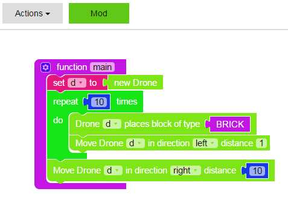

# Introduksjon {.intro}

Vi skal bygge en kube i minecraft og lære endel viktige klosser i Learn To Mod. Oppgaven er forklart i detalj og egner seg som den første oppgaven du gjør i Learn To Mod.

# Steg 1: Lage en ny mod {.activity}

Gå til Mod-siden ved å velge **Play** &gt; **Mod** i menyen på toppen:

## Sjekkliste {.check}

+ Klikk i feltet hvor det står **mod\_name\_here**.
+ Gi modden navnet `kube` og trykk på den blå knappen som heter **Blockly (Multiplayer)**.

  

  Modden dukker da opp til høyre:

  

+ Klikk på modden og du kommer til en side som ser sånn ut:

  

+ Klikk på knappen **Code** for å komme til kodesiden:

  

  Her lages koden i modden ved å velge blokker fra menyen til venstre.

# Steg 2: Bygge en rad {.activity}
Kuben skal bestå av mange rader med blokker. Vi begynner med å lage en rad.

## Sjekkliste {.check}

+ Alle modder må ha en funksjon som heter main, klikk på **Functions**:

  

+ Velg den øverste klossen og klikk på den for å legge den til. Klikk så i
  feltet der det står **do something** og skriv `main` (bare små bokstaver).

  

+ Legg til en variabel ved å klikke **Variables**, velg klossen **set item to**
  og dra den inn i main-funksjonen.

  

+ Variabelen heter nå item, men du skal gi den et nytt navn. Klikk på
  pilen ved siden av teksten `item`:

  

+ Velg **New variable...** og skriv `d`:

  

  Klikk **OK**. Nå heter den nye variabelen `d`.

  For at modden vår skal kunne bygge ting i Minecraft skal vi bruke en drone.
  En drone er som en usynlig robot som kan gå hvor som helst i Minecraft (også gjennom vegger).
  En drone kan gjøre mye kult, først skal vi bruke den til å bygge ting.

+ Variabelen `d` skal inneholde en ny drone. Klikk på **Minecraft** til venstre,
  klikk så på **Drone** og velg **new Drone**.

  

+ Dra klossen **new Drone** så den klikker sammen med **set d to** klossen.

  For å lage raden med klosser skal dronen plassere en kloss, flytte seg,
  plassere en kloss, flytte seg, plassere en kloss, flytte seg og så videre.
  Når vi skal gjøre noe likt flere ganger i et program så bruker vi løkker, som kalles *loops* på engelsk.

+ Klikk på **Loops**:

  

+ Velg klossen som heter **repeat 10 times** og dra den under
  **set d to new drone** klossen. Så klikker du **Minecraft** &gt; **Drone** og
  velger klossen som heter **Drone d places block of type** og
  drar den så den havner inni **repeat 10 times** løkken:

  

+ Så skal du bestemme hva slags materiale som det skal bygges med. Til
  venstre under **Minecraft** finnes alle materialene du kan bygge med i
  alfabetisk rekkefølge **Materials \[A-C\]** osv. Velg det materialet du vil
  bruke og putt det inn i det tomme feltet.

+ Så skal du få dronen til å flytte seg en plass til venstre. Velg
  **Minecraft** &gt; **Drone** og velg klossen **Move Drone d in
  direction up distance 1**. Dra klossen inn i løkken så det ser sånn ut:

  

+ Klikk på den lille pilen ved siden av **up** og velg **left** sånn at dronen
  går et steg til venstre.

+ Så skal du få dronen til å gå 10 steg tilbake når den er ferdig med
  raden (utenfor løkken og under). Velg **Minecraft** &gt; **Drone** og velg
  **Move Drone d in direction right distance 10** og dra den under løkken så det blir sånn:

  

## Test prosjektet {.flag}

Nå er du klar til å teste ut modden. Klikk på den grønne knappen på
toppen som heter **Mod**. Det skal da komme en beskjed til høyre om at
modden er laget på Minecraft serveren.

Da kan du gå til Minecraft og teste modden!

## Koble til serveren {.check}
* Åpne **Minecraft**, velg **multiplayer** og dobbeltklikk på **Learntomod** serveren.
* Hvis du ikke har lagt inn serveren så gjør du det nå:
  * Adressen til serveren er `play.learntomod.com`.
  * Gå inn på serveren og se at du blir flyttet til din egen server.

## Kjøre modden {.check}
* Finn en bra plass hvor du vil at modden skal bygge.
* Trykk **9** for å aktivere modde-kisten din.
* **Høyre-klikk** for å åpne kisten.
* Sjekk at du har en mod der.
* Putt modden i spor **1**.
* **Esc** ut.
* Trykk **1**.
* **Høyre-klikk** for å kjøre modden din.
* Sjekk at den har blitt kjørt.
* OK? Ble det laget en rad i Minecraft? Hvis ikke må du finne ut hva som er feil, rette det opp i modden og teste på nytt i Minecraft.

  Når jeg kjørte min mod så ble det en rad i bakken der jeg pekte når jeg kjørte modden:

  

  Raden ble bygd i bakken hvis du pekte på bakken når du kjørte modden. La
  oss endre modden så den bygger over bakken.

+ Velg **Minecraft** &gt; **Drone** og
  velg **Move drone d in direction up distance 1** og dra den under klossen som heter **set d to
  new drone**. Så det blir sånn:

  

+ Trykk på den grønne knappen som heter **Mod** og gå til Minecraft og test modden på nytt.

  

  Nå ble det bedre!

# Steg 3: Bruke egne funksjoner {.activity}

Når du skal lage store modder er det greit å bryte opp i flere
funksjoner så blir det lettere å lese hva modden gjør.

## Sjekkliste {.check}

+ Velg **Functions** og lag en ny funksjon som heter `rad`:

  

+ Ta tak i klossene ved å klikke på **repeat 10 times** og dra dem inn i den nye funksjonen:

  

  For at den nye funksjonen skal utføres så må du legge inn et **kall** til funksjonen
  fra main-funksjonen.

+ Velg **Functions** og dra klossen som heter **rad** inn til slutt i main-funksjonen:

  

## Test prosjektet {.flag}
Nå kan du teste modden på nytt. Trykk på **Mod** knappen og gå til
Minecraft og kjør modden på nytt. Den skal fremdeles bygge en rad.

# Steg 4: Bygge en firkant {.activity}

## Sjekkliste {.check}

+ Du skal lage en funksjon som heter `firkant` og som bruker **rad** funksjonen
  til å bygge en firkant. Når du er ferdig skal det se sånn ut:

  

## Test prosjektet {.flag}

+ Nå kan du teste modden på nytt. Trykk på **Mod** knappen og gå til
  Minecraft og kjør modden på nytt. Den skal nå bygge en firkant.

# Steg 4: Bygge en kube {.activity}

## Sjekkliste {.check}

+ Du skal lage en ny funksjon som heter `kube` og som bruker **firkant** funksjonen
til å bygge en hel kube. Når du er ferdig skal det se sånn ut:

  

## Test prosjektet {.flag}

+ Test modden, trykk **Mod** knappen og gå til Minecraft og kjør den.
+ Hva skjer i Minecraft? Ble det bygd en kube?

  Hvis ikke så må du finne feilen, rette den og trykke **Mod** knappen på nytt og teste den i Minecraft.

# Steg 5: Bruke variabler {.activity}

Hvis du vil lage en mindre eller større kube så er det tungvint å få det til
siden vi bruke tallet `10` så mange forskjellige steder. Når vi bruker noe
mange steder er det bedre å bruke en variabel.

## Sjekkliste {.check}

+ Gå til **Variables** og lag en ny variabel som heter **bredde** og plasser den
  som kloss nr. 2 i **main** funksjonen.

+ Ta bort alle **10-tallene** ved å dra dem bort i søppelkassen.

+ Gå til **Variables** og velg den nye variabelen **bredde**
  og dra den inn i alle de tomme hullene der 10-tallet var før.

+ Når du har lagt inn variabelen bredde på alle de tomme hullene så kan du
  endre på **verdien** til variabelen i toppen av programmet og teste at
  modden bygger en større eller mindre kube i Minecraft.

  Kult! Du har laget din første mod i Minecraft og lært masse! Du har lært
  å bruke variabler og funksjoner til å gjøre programmet lett å forstå. Du
  har lært å bruke løkker til å gjøre noe mange ganger og å bruke droner
  til å bygge ting i Minecraft.

### Tips: Kopiere klosser {.protip}
Du kan lage en kopi av en kloss ved å **peke** på den, **høyre-klikke** og velge
**Duplicate**:

## Utfordring: Hul kube med monstre! {.challenge}
Nå kommer det en utfordring! Du skal lage en kube som er tom innvendig
ved å bygge en ny kube inni den første, men denne skal bygges med luft.
Pass på at den innerste kuben har en bredde som er **2 mindre enn** den ytterste kuben.
Til slutt skal du lage en funksjon som fyller kuben med **monstre**.

Når du er ferdig skal modden ligne på denne:

Test modden i Minecraft og lag et hull i kuben for å se hva som er inni.
Hvis du vil så kan du lage den første kuben av glass så er det enda
lettere å se monstrene.
