# Introduksjon {.intro}

La oss gjøre som Egypterne og bygge en pyramide!
Denne oppgaven har ikke så detaljerte instruksjoner som "Bygge en kube",
den passer fint som oppgave nr 2.

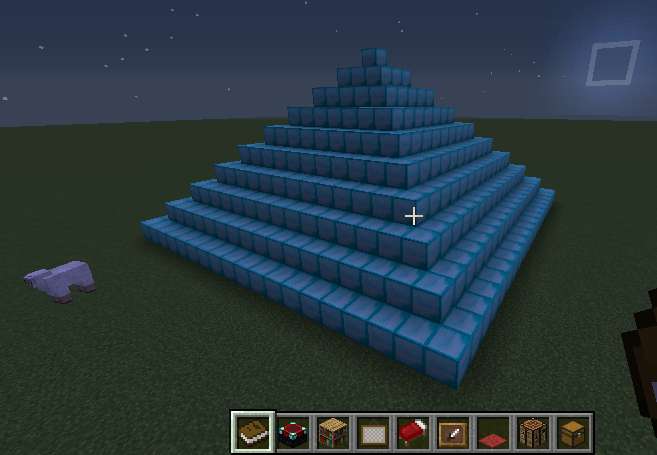

# Steg 1: Lage en ny mod {.activity}

## Sjekkliste {.check}
+ Gå til **Play** &gt; **Mod** (i menyen) og skriv `pyramide` i feltet der det står **mod\_name\_here**. Trykk på den blå knappen som heter **Blockly (multiplayer)**

  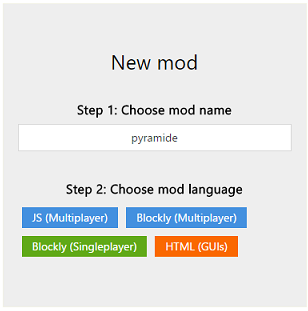

+ Klikk på den nye firkanten som dukker opp til høyre for teksten:

  

+ Klikk på den gule **Code** knappen til høyre i bildet for å redigere modden:

  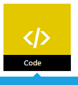

# Steg 1: Lage main funksjonen {.activity}

## Sjekkliste {.check}

+ Lag en funksjon som heter `main` med en ny drone som heter `d`:

  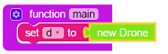

+ Lag en variabel som heter bredde og en som heter høyde:
  **Variables** &gt; **Velg den øverste klossen** &gt; **dra den inn i main** &gt;
  **klikk på pil nedover** &gt; **velg new variable** &gt; `skriv navnet` &gt; Klikk **OK**

  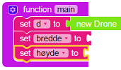

+ Bredde variabelen skal du bestemme selv, men det er best å velge et
  oddetall for da kan vi få en kloss på toppen av pyramiden. Høyde variabelen skal datamaskinen regne ut. (kan du tenke deg hvorfor?).

  Sett **bredde** til et tall og høyde til **bredde delt på 2**:

  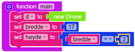

+ Når vi deler et oddetall på 2 så avrunder datamaskinen nedover så vi må legge til **1**
  for å få en kloss på toppen av pyramiden. Du må legge inn en if-test som sjekker om bredde
  er et oddetall og i så fall legger til 1 på høyde variabelen.

  **Logic** &gt; **If-klossen** &gt; **dra den inn i slutten på main funksjonen**

  **Math** &gt;  &gt; **koble den til if-klossen** &gt; **forandre even til odd**

  **Variables** &gt; **bredde-klossen** &gt; **dra den inn i det tomme hullet i if-klossen**

  **Variables** &gt;  &gt; **dra inni if-klossen** (til høyre for do).

  **Math** &gt;  &gt; **kobles til set høyde klossen**

  **Variables** &gt; **høyde klossen** &gt; **dra inn i den første tomme hullet**

  **Math** &gt; **øverste klossen** &gt; **dra inn i det siste tomme hullet** &gt; **forandre tallet til 1**

  Da blir det sånn:

  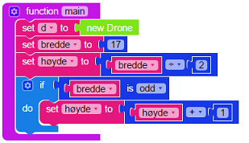

# Steg 2: Bygge en pyramide {.activity}

## Sjekkliste {.check}

+ Lag en funksjon som bygger en rad med klosser. Bredde variablen
  skal bestemme hvor mange klosser som skal brukes. Denne funksjonen
  har du laget før så vi viser bare et eksempel på hvordan den kan se ut:

  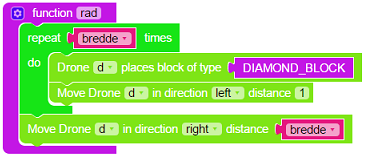

+ Lag en funksjon som du kaller **pyramide** og dra 2 **repeat-løkker** inni hverandre:

  **Functions** &gt; **den øverste klossen** &gt; **endre navnet til pyramide**

  **Loops** &gt; **Repeat 10 times klossen** &gt; **dra inn i funksjonen**

  **Loops** &gt; **Repeat 10 times klossen** &gt; **dra inn i den første repeat-løkken**

  Det skal se sånn ut:

  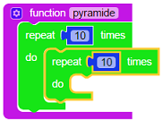

+ Dra de to **10 klossene** i søppelkassen. Putt **høyde** variabelen i det første tomme hullet
  og **bredde** variabelen i det andre tomme hullet:

  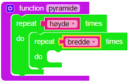

    Den innerste løkken skal bygge en nivå og den ytterste løkken skal styre dronen oppover i høyden
    og justere størrelsen på hvert nivå sånn at det blir en pyramide.

+ Inni den innerste løkken skal du legge til et «kall» til rad funksjonen
  og så styre dronen fremover sånn at denne løkken bygger et nivå i pyramiden:

  **Functions** &gt; **rad** &gt; **dra den inn i den innerste løkken**

  **Minecraft** &gt; **Drone** &gt; **Kloss nr. 2 fra toppen** &gt; **dra den rett under
  rad klossen** (inni den innerste løkken) og forandre retningen til **forward**

+ Utenfor den innerste løkken skal du så få dronen til å gå tilbake til
  der den startet, dvs. bakover `bredde` ganger:

  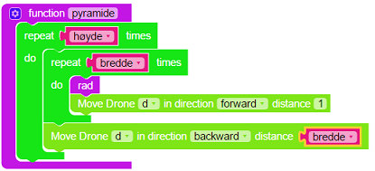

+ Siden hvert nivå oppover i pyramiden skal være 2 klosser mindre må du
  justere bredde variabelen med -2. Så må du få dronen til å gå 1 posisjon
  oppover, 1 posisjon fremover og 1 posisjon til venstre:

  **Math** &gt; **change item klossen** &gt; **dra under forrige kloss** &gt; **pil
  nedover og velge bredde variablen** &gt; **forandre tallet til -2**

  **Minecraft** &gt; **Drone** &gt; **Kloss nr. 2 fra toppen** &gt; **dra under forrige kloss**

  **Minecraft** &gt; **Drone** &gt; **Kloss nr. 2 fra toppen** &gt; **dra under forrige
  kloss** &gt; **forandre retning til fremover**

  **Minecraft** &gt; **Drone** &gt; **Kloss nr. 2 fra toppen** &gt; **dra under forrige
  kloss** &gt; **forandre retning til venstre**

  Da blir pyramide funksjonen sånn:

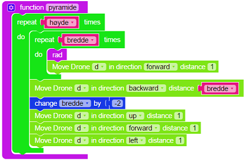

+ Nå mangler du bare litt i main funksjonen før pyramiden er klar!

  For at dronen skal starte å bygge over bakken så flytter du dronen opp en posisjon:

  **Minecraft** &gt; **Drone** &gt; **Kloss nr. 2 fra toppen** &gt; **dra den inn på
  slutten av main funksjonen**

  Tilslutt må du utføre pyramide funksjonen helt til slutt i main funksjonen

  **Functions** &gt; **pyramide** &gt; **dra den inn på slutten av main funksjonen**

  Da skal main funksjonen se sånn ut:

  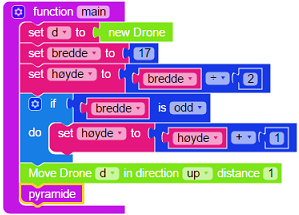

## Test prosjektet {.flag}

Nå kan du teste modden din i Minecraft! Trykk på den grønne **Mod** knappen
øverst og gå til Minecraft og kjør modden din!

Hvis den ikke fungerer så må du rette opp litt i modden, det er helt vanlig.

Modden din skal se omtrent slik ut:

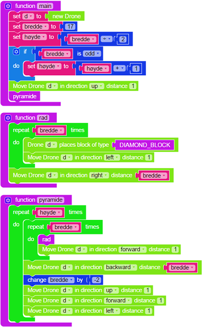

Gratulerer!

## Utfordring: Pyramider av forskjellig størrelse {.challenge}
Hvis du kjører modden din flere ganger etter hverandre i Minecraft
så blir alltid pyramidene like store. Litt kjedelig!
Du kan enkelt endre modden så den bygger pyramider av forskjellig størrelse.
Under Math kategorien er det en kloss som heter **Random integer from 1 to 100**
som velger et tilfeldig tall mellom det første tallet og det siste tallet.
Når du bruker den så er det lurt å forandre tallene så bredden på pyramidene blir sånn passe, f.eks. fra 10 til 40.

Prøv å legg inn en if-test sånn at det alltid blir et oddetall i bredde variabelen.
Tips: du kan bruke **is even** betingelsen under Math kategorien og legge til **1** hvis tallet er et partall.

Test modden din flere ganger etter hverandre i Minecraft og sjekk at du får forskjellig størrelse på pyramidene.
