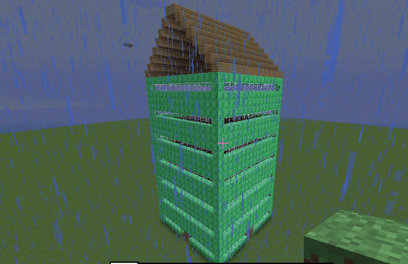
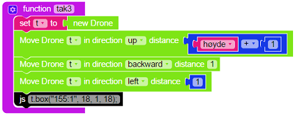

# Introduksjon {.intro}
Du må ha et hus så du kan bo i stil!
La oss kode en modd som bygger et hus med vegger og tak, flere etasjer,
vinduer, dører og trapp mellom hver etasje.

# Steg 1: Vegger {.activity}
Først skal du kode modden så den bygger fire vegger.

## Sjekkliste {.check}
+ Lag en modd som bygger fire vegger:

  

## Test prosjektet {.flag}
Da kan du teste modden i Minecraft og se om den bygger 4 vegger.

  Som du kan se så bygger du med materialet som har ID kode ‘155:2’ for å
  bygge med ‘Chiseled Quartz Block’. Siden LTM ikke har absolutt alle
  materialene som er i Minecraft som ferdige klosser så kan du gå til denne siden:
  [*http://www.minecraftinfo.com/idlist.htm*](http://www.minecraftinfo.com/idlist.htm)
  for å finne ID koden for det materialet du vil bygge med.

# Steg 2: Plass til dører {.activity}

## Sjekkliste {.check}
+ Nå må du bestemme hvor du vil ha dører og vinduer, det kan være lurt å
  tegne opp en vegg på et ruteark og markere hvor du vil ha dør, vinduer
  og i hvilke etasjer du vil ha gulv.

  Du skal legge inn en if-test i den innerste løkken som bygger med
  riktig materiale i hver posisjon. Det er lurt å begynne if-testen med
  det materialet som er du skal ha minst av. Denne if-testen kan bli
  ganske stor etter hvert, så vi lager en egen funksjon som vi kaller
  velgmateriale.

  La oss først bestemme hvor dørene skal være. Det som er spesiellt med
  dører er at de må bygges etter at det som er rundt dem er bygd, så vi
  lar de posisjonene være tomme i første omgang. Så setter vi inn dører
  der senere i programmet.

  Jeg vil ha en dør i X posisjon 8-9 og Y posisjon 1-2, da blir funksjonen min sånn:

  

+ Du må også huske å kalle funksjonen fra den innerste løkken i vegger funksjonen:

  

## Test prosjektet {.flag}
Da kan du teste modden!

# Steg 3: Vinduer {.activity}

## Sjekkliste {.check}
+ Nå kan du utvide if-testen sånn at den bygger vinduer der du vil ha dem.
  Jeg vil ha vinduer i Y posisjon 2, 6, 10 og 14, men ikke i hjørnene av
  hver vegg (X posisjon 1). Da blir min funksjon sånn:

  

# Steg 4: Tak, dører, gulv og trapper {.activity}
Nå skal vi bygge tak på huset, la oss prøve noen forskjellige typer tak
før du velger den du liker best.

Når du bygger tak skal du du bruke noen funksjoner som finnes i ScriptCraft
som gjør at du trenger å kode veldig lite. Learn To Mod er bygd på ScriptCraft
så alt du kan gjøre med ScriptCraft kan du få til i Learn To Mod.
For å se alle mulighetene som finnes kan du gå til denne siden:
[ScriptCraft API Referanse](https://github.com/walterhiggins/ScriptCraft/blob/master/docs/API-Reference.md)

Hvis du vil lære mer om hvordan du kan programmere i Javascript med ScriptCraft
kan du gå til denne siden:
[The young persons guide to programming in Minecraft](https://github.com/walterhiggins/ScriptCraft/blob/master/docs/YoungPersonsGuideToProgrammingMinecraft.md\#the-young-persons-guide-to-programming-in-minecraft)

## Sjekkliste {.check}
+ Du skal bruke en drone funksjon som heter prism for å bygge et skråtak.
  Lag en funksjon som heter tak1 og legg inn følgende kode:

  

+ Husk også å legge inn kall til tak1 funksjonen på slutten av main funksjonen.

+ Nå kan du teste modden i Minecraft, taket mitt ser sånn ut:

  

+ Hvis du ser inni huset så ser du at taket er flatt på innsiden, hvis du
  bruker prism0 (tallet null tilslutt) funksjonen så får du et tak som er
  hult på innsiden, prøv det og se hva du liker best.

+ Hvis du vil se hvordan huset blir med et flatt tak kan du prøve det som står i dette punktet.
  Det flate taket skal stikke en kloss utenfor huset på hver side.
  Siden huset vårt er 16 klosser i bredde og dypde må taket da bli 18 x 18 klosser.
  Du kan programmere denne «manuellt» ved å lage en sånn funksjon:

  

  Eller du kan utnytte en ScriptCraft funksjon som heter box og lage en
  enklere funksjon som gjør akkurat det samme:

  

  Det kan lønne seg å lære kode som andre har laget!

+ La oss bygge gulv. Nå som du har lært box funksjonen så bruker du den
  til å lage gulv på bakken og på 4, 8 og 12 posisjon i høyden. Innsiden
  av huset vårt er 14x14 klosser og vi bygger med glowstone så det blir
  lyst også om natten (husk å legge inn kall til gulv funksjonen til slutt
  i main funksjonen):

  

+ Hm det fungerte for så vidt, men vi trenger hull i gulvene så vi kan
  bygge trapp mellom hver etasje. La oss bygge en funksjon som lager hull
  i hver etasje:

  

+ La oss bygge en trapp mellom hver etasje, ScriptCraft har en funksjon
  for å bygge trapper, men den fungerer dessverre ikke på LTM så vi må
  bygge trappen litt mer manuellt. Koden du skal lime inn i Javascript klossen er:

    `tr.box(blocks.stairs.quartz + ":" + Drone.PLAYER\_STAIRS\_FACING\[tr.dir\]);`

  Funksjonen skal se sånn ut:

  

+ La oss sette inn fire dører, du skal bruke en ScriptCraft funksjon som
  heter door2 som lager en dobbeltdør:

  

    Hvis du heller vil ha en jerndør så bruker du door2_iron funksjonen isteden.
    Hvis du bruker jerndører så må du også legge til en knapp eller noe annet
    som kan åpne døren.

+ Husk å legge inn kall til trapp og dør funksjonene til slutt i main funksjonen.

## Test prosjektet {.flag}

Nå kan du teste modden din i Minecraft! Trykk på den grønne **Mod** knappen
øverst og gå til Minecraft og kjør modden din!

Hvis den ikke fungerer så må du rette opp litt i modden, det er helt vanlig.

## Utfordring: Innredning i alle etasjene {.challenge}
Når du går inn i huset ditt så ser du at alle etasjene mangler innredning.
Din utfordring er å lage innredning i alle etasjene. En mulighet er å lage en funksjon som lager
en type innredning og teste den i Minecraft. Hvis du vil ha forskjellig innredning i hver etasje
så kan du enten lage flere forskjellige funksjoner (f.eks. innredning1, innredning2 osv.) eller
du kan lage en liste med de tingene du vil ha som innredning og velge tilfeldige rader fra den listen
etterhvert som du styrer dronen din rundt i hver etasje. Lykke til!
