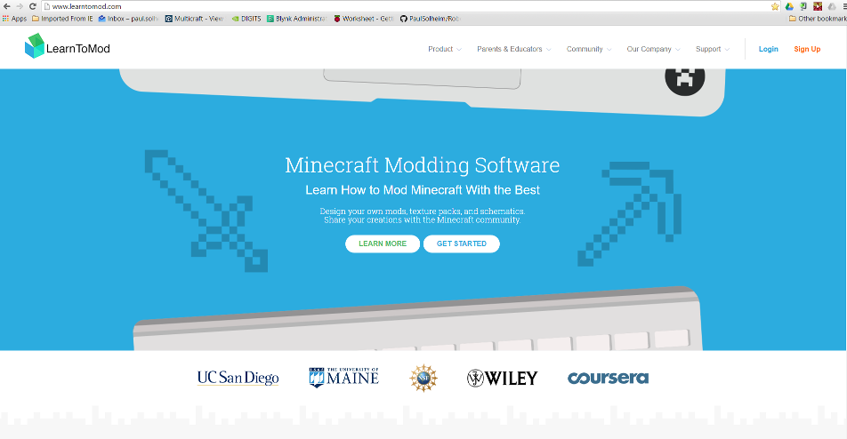
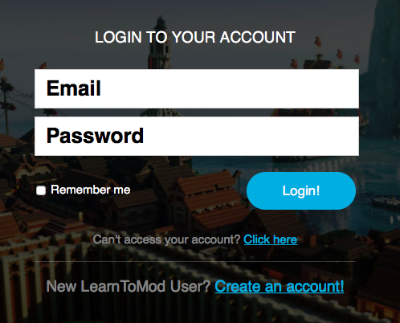
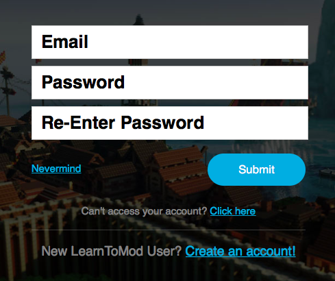
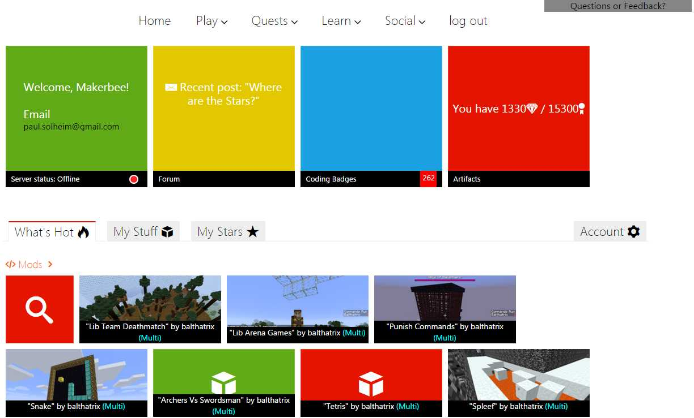
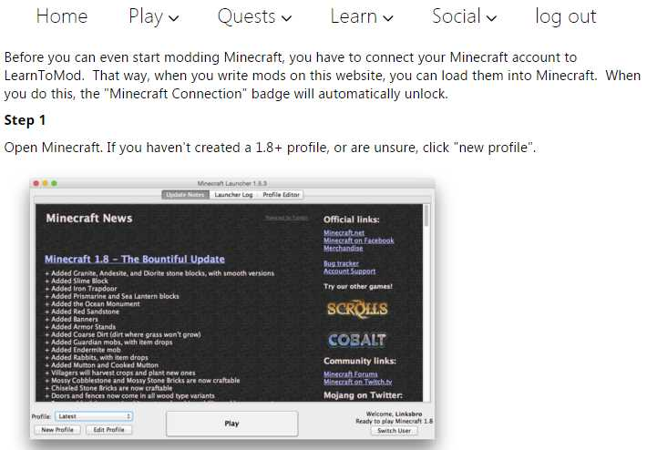
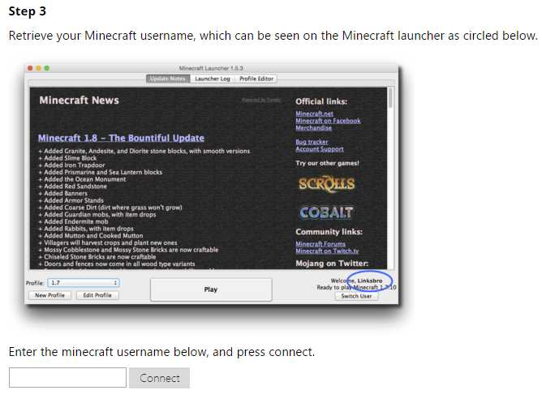
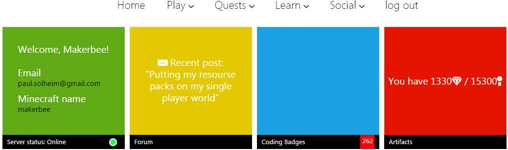
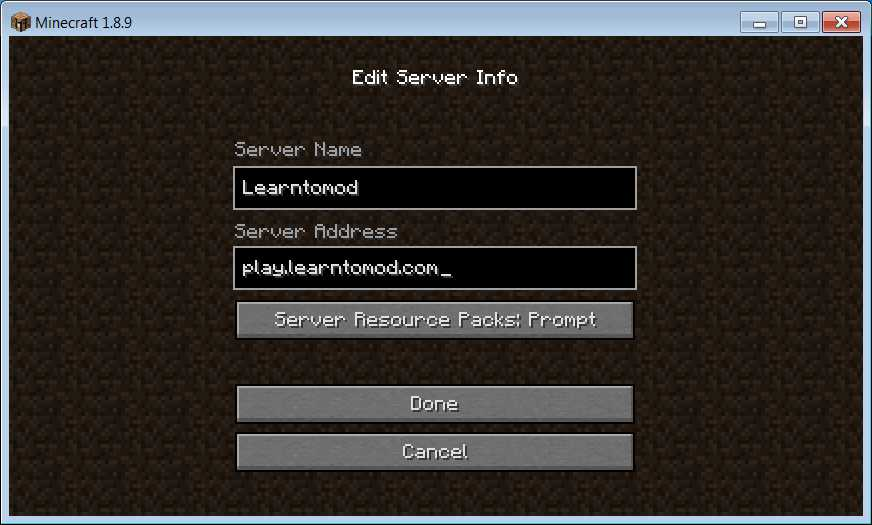
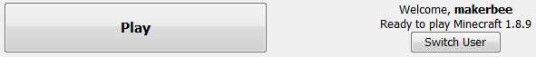

# Introduksjon {.intro}
I denne veiledningen skal du lage en konto på Learn To Mod (LTM) og koble den til din Minecraft-konto.

# Lage en LTM-konto {.activity}

## Sjekkliste {.check}
- Åpne nettleseren din (Chrome, Internett Explorer, Firefox eller Safari).
- Gå til adressen *[learntomod.com]*.
- Du skal komme til en side som ser sånn ut:

  

- Trykk på knappen øverst til høyre som heter **Login**, ikke klikk på **Sign Up** enda.

  

- Trykk på **Create an account!** for å registrere en konto.
- Fyll inn epost og passord.
- Klikk på **Submit**.
- Det er smart å velge et passord som du husker. Lagre gjerne passordet om du får beskjed om det.

[learntomod.com]: http://www.learntomod.com

# Logge inn på LTM {.activity}

## Sjekkliste {.check}
- Logg deg inn ved å fylle ut epost og passord:

  

- Første gang du er med på kurs må du angi en klassekode.
- Klassekoden får du av den som holder kurset.
- Fyll klassekoden i det feltet som heter **Class Key**.
- Du får spørsmål om hva som skal være ditt **Nickname**.
- Du kan bruke det navnet du vil, for eksempel det samme som du kaller deg i minecraft, men ikke start navnet med tall.
- Fyll ut navnet og trykk på knappen.
- Du skal nå få opp hjemmesiden:

  

# Koble til Minecraft-kontoen din {.activity}
Hvis det er første gang du er med på kurset vil du se et grønt felt som sier **Server status: Offline**. Altså må du koble til Minecraft kontoen din.

## Sjekkliste {.check}
- Klikk på det grønne feltet hvor det står **Server status: Offline**.
- Du kommer til en side som dette:

  

- Gå nedover på siden til du kommer til **Step 3**:

  

- Skriv brukernavnet ditt i Minecraft inn i feltet.
- Trykk på knappen **Connect**.
- Det vil komme opp et vindu som sier at du har fått en badge.
- Knappen som heter **Back to badges** fungerer ikke enda, så du må må lukke vinduet.
- Trykk på bakoverknappen i nettleseren for å komme til hjemmesiden.
- Oppfrisk siden eller trykk på **Home** øverst til venstre for å friske opp siden.
- Hjemmesiden skal nå vise **Server status: Online** i det grønne feltet til venstre:

  

# Logge på LTMs server i Minecraft {.activity}
Til slutt må du logge på Learn To Mod sin Minecraft-server, slik at du
kan kjøre moddene dine i Minecraft.

## Sjekkliste {.check}
- Åpne Minecraft.
- Trykk på knappen **Play**.
- Velg **Multiplayer**.
- Velg **Add Server**.
- Fyll inn navnet `Learntomod` og adresse `play.learntomod.com`:

  

- Trykk på knappen **Done**.
- Serveren blir nå lagt til i serverlisten din.
- Koble deg til ved å dobbeltklikke på serveren i listen.
- Når du er tilkoblet skal du komme til din egen verden. Det vil stå **Loading your private server** i noen sekunder før verdenen din starter i **creative mode**.

# Ved neste kurs {.activity}
Når du kommer på kurset neste gang trenger du ikke gjøre alt på nytt. Da holder det å logge inn på siden [learntomod.com] og logge på serveren til Learn To Mod i Minecraft.

Nå er du klar til å begynne å kode!

### Tips hvis du får trøbbel {.protip}
Hvis du ikke kommer til din egen server i Minecraft så er de vanligste grunnene:

1. Du prøver å koble deg til serveren når klassen din ikke er aktivert.
   Det vanligste er at klassen bare er aktivert når dere har undervisning.
   Hvis du har undervisning kan du spørre læreren om serveren er åpnet.

2. Minecraft kontoen din ikke er koblet riktig opp mot Learntomod.
   Gå til [learntomod.com] og følg anvisningene i [Koble til Minecraft-kontoen din](#koble-til-minecraft-kontoen-din).
   Du må huske å skrive Minecraft-brukernavnet nøyaktig slik det
   er i Minecraft, husk at det er forskjell på store og små bokstaver.
   Den enkleste måten å finne brukernavnet ditt i Minecraft er å
   starte opp Minecraft. Da står brukernavnet helt nede til høyre ved
   **Play**-knappen.

   Her kan du se at mitt brukernavn er `makerbee`:

   

3. Noe er feil med verdenen din eller med en modd som du har laget. Som
   regel er det en feil i den siste modden din. Gå over til nettleseren
   og sjekk om det er noe feil med den siste modden. Hvis du finner en
   feil og retter den må du:

   - Trykk på **mod**-knappen for å oppdatere modden på serveren.
   - Velg **disconnect** i Minecraft.
   - Koble deg til serveren på nytt.

   Hvis det ikke fungerer så er det best å
   spørre læreren din om hjelp. Noen ganger må du velge en ny verden og
   legge den inn på serveren.
