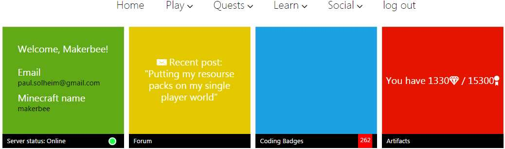

# Introduksjon {.intro}

Åpne nettleseren din (Chrome, Internett Explorer , Firefox eller Safari)
og skriv inn adressen:

[*www.learntomod.com*](http://www.learntomod.com)

Du kan også søke etter learntomod og finne siden på den måten.

Du skal komme til en side som ser sånn ut:

Trykk på knappen øverst til høyre som heter ”Login” (ikke klikk på "Sign Up" her).

Hvis du ikke har konto på LearnToMod (heretter kallt LTM) dvs. ikke har
har vært med tidligere så skal du først registrere en konto. Da skal du
fylle ut de nederst tre feltene og trykke på knappen som heter ”Sign
Up!”. Det er best å velge et passord som er enkelt å huske fra gang til
gang:

Deretter må du logge deg inn ved å fylle ut de to øverste feltene og
trykke på knappen som heter ”Log In!”:

Hvis det er første gangen som du er med på kurset så må du angi en
klassekode i det nederste feltet på siden som kommer frem der det står
”Class Key” .

Klassekoden får du av den som holder kurset.

Skriv inn klassekoden og trykk på knappen.

Nå får du spørsmål om hva som skal være ditt ”Nickname”. Du kan bruke
det navnet du vil f.eks. det samme som minecraft navnet ditt (ikke start
navnet med tall). Fyll ut navnet og trykk på knappen.

Da skal du komme til Hjemmesiden som starter sånn:

Hvis det er første gangen du er med på kurset så vil det under det
grønne feltet øverst til venstre stå ”Server status: Offline”. Da må du
koble til Minecraft kontoen din. Det gjør du ved å klikke på det grønne
feltet. Da kommer du til en side som starter sånn:

Gå nedover på siden til du kommer til ”Step 3”:

Skriv brukernavnet ditt i Minecraft inn i feltet og trykk på knappen som
heter ”Connect”.

Da vil det komme opp et vindu som sier at du har fått en badge. Knappen
som heter ”Back to badges” fungerer ikke pr idag, så du må må lukke
dette vinduet ved å trykke på X i hjørnet av vinduet og så trykke på
bakoverknappen i nettleseren for å komme til hjemmesiden.

Trykk på Home teksten øverst til venstre for å friske opp siden (hente
siden på nytt). Hjemmesiden skal nå vise ”Server status: Online” under
det grønne feltet øverst til venstre. Slik du ser på siden min som ser
sånn ut nå:

Til slutt skal du legge inn Learntomod sin Minecraft server sånn at du
kan kjøre moddene dine i Minecraft. Åpne Minecraft, trykk på play
knappen og velg Multiplayer, velg Add Server og legg inn:

I tilfelle det er vanskelig å se på bildet over så skal server adressen
være:

play.learntomod.com

Trykk på done knappen så blir serveren lagt til i server listen din. Du
kan koble deg til den ved å dobbeltklikke på den i listen.

Når du kobler deg til serveren i Minecraft så skal du komme til din egen
verden. Det vil stå ”Loading your private server” i noen sekunder før du
kommer til din egen server i ”creative mode”.

Når du kommer på kurset neste gang så er det mye enklere å komme igang.
Da skal du bare logge deg inn på Learntomod med email-adressen og passordet som du har valgt.
Det er best om du har valgt et passord som er enkelt å huske fra gang til gang.

Nå er du klar til å begynne å kode!

### Tips hvis du får trøbbel {.protip}
Hvis du ikke kommer til din egen server i Minecraft så er de vanligste grunnene:

1.  Du prøver å koble deg til serveren når klassen din ikke er aktivert.
    Det vanligste er at klassen bare er aktivert når dere har undervisning.
    Hvis du har undervisning kan du spørre læreren om serveren er åpnet.

2.  Et annet vanlig problem er at Minecraft kontoen din ikke er koblet
    riktig opp mot Learntomod. Da må du gå over til nettleseren og koble
    til Minecraft kontoen din pånytt sånn som det er forklart foran. Du
    må huske å skrive Minecraft brukernavnet ditt nøyaktig sånn som det
    er i Minecraft (husk at det er forskjell på store og små bokstaver).
    Den enkleste måten å finne Minecraft brukernavnet ditt på er å
    starte opp Minecraft og se nederst til høyre ved siden av
    ”Play” knappen. Her kan du se at mitt brukernavn er makerbee:

  

3.  Det kan også hende at du ikke kommer til din egen verden hvis det er
    noe feil med verdenen din eller med en modd som du har laget. Som
    regel er det en feil i den siste modden din. Gå over til nettleseren
    og sjekk om det er noe feil med den siste modden. Hvis du finner en
    feil og retter den så må du trykke på mod knappen for å oppdatere
    modden på serveren. Så må du velge dissconnect i Minecraft og koble
    deg på serveren på nytt. Hvis det ikke fungerer så er det best å
    spørre læreren din om hjelp. Noen ganger må du velge en ny verden og
    legge den inn på serveren.
