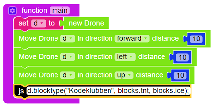
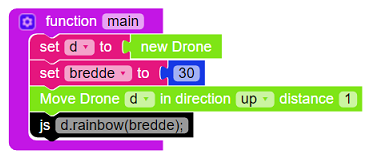
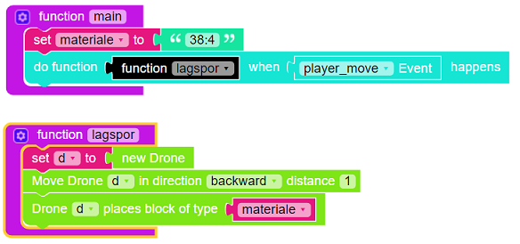
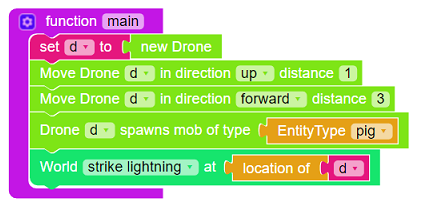
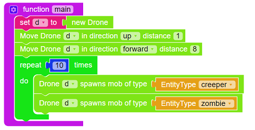
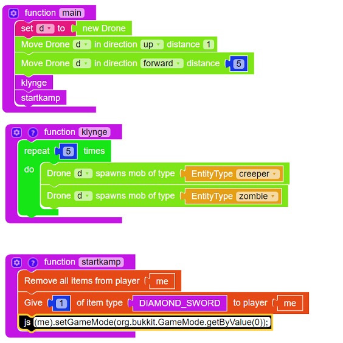

# Introduksjon {.intro}

Her er noen korte oppgaver som gjør kule ting i Minecraft.
Det er kjapt å kode disse moddene så de kan brukes innimellom andre større oppgaver.

De er ikke forklart i detalj så de passer best for de som har litt erfaring med Learn To Mod.

## Megaskilt

## Regnbue

## Lage spor

## Pig Zombie

## Monster

## Monster kamp

