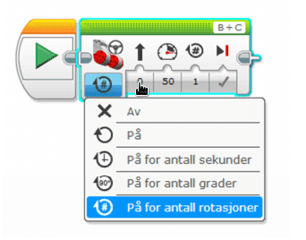
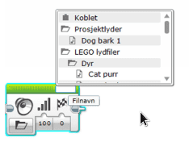

# Kjøre rett fram {.intro}

I denne oppgaven skal vi gjøre noe så enkelt, men viktig som å kjøre rett fram
ved å bruke begge motorene. Vi skal teste ut ulike egenskaper til objektet «Kjør
med styring» Et «Kjør med styring» objekt har flere ulike egenskaper, og de
ulike egenskapene kan endres.

* Øverst til høyre ser en hvilken motorer som er koblet til hvilken port.

* Til venstre ser en hvilke kjøremuligheter en har.

* Til høyre for disse kan en sette verdier til egenskapene

  * Retning

  * Hastighet

  * Antall

  * Brems mot slutten

Gjør følgende oppgaver. Kjør programmene etter hvert.

## Fremgangsmåte {.check}

- [ ] Sett «På for antall rotasjoner» og sett antall til 1 rotasjoner. Hvor
  langt kjører roboten?

- [ ] Sett «På antall grader» og sett antall til 360 grader. Hvor langt kjører
  roboten?

- [ ] Sett «På for antall sekunder» og sett antall til 1 sekund. Hvor langt
  kjører roboten?

- [ ] Sett «På». Hva skjer med muligheten for å sette verdier? Hvor langt kjører
  roboten?

- [ ] Sett «På for antall rotasjoner» og sett antall til 2 rotasjoner. Spill
  deretter av en lyd. Hva skjer?

- [ ] Roboten skal kjøre fram 2 rotasjoner, stoppe og deretter kjøre 1 rotasjon
  til. Hvordan løses dette?

- [ ] Roboten skal spille av en lyd, deretter kjøre seks sekunder framover, og
  deretter spille en ny lyd.

- [ ] Roboten skal kjøre framover med 25% kraft i 2 sekunder, deretter 50% kraft
  i 2 sekunder, deretter med 75% i 2 sekunder og til slutt 100% kraft i 2
  sekunder og deretter stopp.

- [ ] Roboten skal kjøre framover 3 rotasjoner, og deretter rygge tilbake 3
  rotasjoner.

- [ ] Roboten kommer for langt om den kjører 4 rotasjoner, men kommer for kort
  med 3 rotasjoner. Hva gjør vi?
