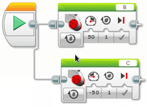

# Tur - retur {.intro}

I denne oppgaven skal vi bruke standard robotoppsett, og kjøre en liten tur –
retur. Det må brukes flere objekter i rekkefølge for at det skal fungere, og vi
tar det steg for steg.

## Fremgangsmåte {.check}

- [ ] Programmer roboten til å kjøre fram til streken. Finn ut hvor mange
  rotasjoner du trenger og hvor mange grader.

- [ ] Programmer roboten til å snu 180 grader ved:

  - [ ] Bruke «Kjør med styring» - rotasjoner, full sving

  - [ ] Bruke «Kjør med styring» - rotasjoner, halv sving

  - [ ] det noen forskjell i hvordan roboten svinger? Trenger den mer plass?
    Bruker den flere rotasjoner? Hvordan beveger dekkene seg ?

  - [ ] Bruke «Kjør med styring» - grader, full sving

  - [ ] Bruke «Kjør med styring» - grader, halv sving

  - [ ] det noen forskjell i hvordan roboten svinger? Trenger den mer plass?
    Bruker den flere grader? Hvorfor kan jeg ikke sette gradene til 180 grader?
    Hvordan beveger dekkene seg

  - [ ] Bruke «Stor motor» - rotasjoner

  - [ ] Bruke «Stor motor» - grader

  - [ ] det noen forskjell på svingen i forhold til de andre måtene å snu på?

  - [ ] Hva skjer om du endrer farten? Test å endre farten på de forskjellige
    måtene å snu på.

  - [ ] Bruke «Stor motor» for å snu 180 grader. Sett den ene til å kjøre
    framover og en den andre til å kjøre bakover. Hva skjer? Skjer dette ved
    bruk av andre objekter?

- [ ] Når roboten har snudd 180 skal den kjøre tilbake til startpunktet.
