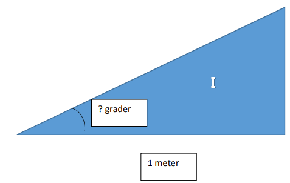

# Klatring {.intro}

Hvor sterke er motorene i Lego Mindstorms robotene? I denne oppgaven skal vi se
hvor bratt bakke EV3 roboten klarer å kjøre med og uten last. Til dette trenger
vi en planke som kan plasseres på skrått, og som er bred nok til at roboten kan
kjøre på den. Pass godt på roboten slik at den ikke faller utfor kanten av
planken.

## Fremgangsmåte {.check}

- [ ] Konstruere roboten til å frakte inntil 4 løkker opp bakken som er
  konstruert. Løkkene skal være plassert på roboten slik at de ikke faller av
  når roboten kjører opp bakken.

- [ ] Programmere roboten til å frakte objekter fra bunn til topps av en bane.
  Dette er enkel programmering, men hva er best å sette kraften på?

- [ ] Finn ut hvor stor vinkel roboten er i stand til å klatre med ulik vekt ved
  å justere vinkelen på planken. Fyll inn i tabellen under. Bruk vinkelmåler for
  å finne vinkelen.

|        | Uten | 1 løkke | 2 løkker | 3 løkker | 4 løkker |
| :----- | :--- | :------ | :------- | :------- | :------- |
| vinkel |      |         |          |          |          |
|        |      |         |          |          |          |

