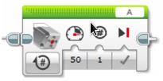
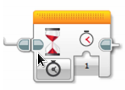

# Svingete bane {.intro}

I denne oppgaven skal vi programmere roboten til å kjøre en gitt bane som
inneholder ulike svinger. De voksne har bygget en bane på gulvet/bordet enten
ved å bruke teip eller elementer som roboten skal kjøre gjennom eller forbi. Det
er viktig at roboten ikke berører kantene eller kjører utenfor banen. Banen kan
for eksempel se slik ut.

Husk at jo mer du slurver i begynnelsen, og jo vanskeligere er det å komme i
mål, og spesielt dersom du må gjøre endringer underveis.

## Fremgangsmåte {.check}

- [ ] Bruk «Kjør med styring» og velg rotasjoner for å kjøre framover.

- [ ] Prøv deg fram med ulike måter å svinge på alt etter hvor skarp svingen er.

  - [ ] Sving med «Kjør med styring»

  - [ ] Sving med «Stor motor»

Når dere klarer å kjøre gjennom banen plasseres en løkke litt ut i løypen.

- [ ] Bygg på en ekstra arm, som kan plukke opp løkken som står på banen.

Programmer denne til å løfte opp løkken, slik at den trygt kan bli tatt med til
mål. For å programmere den lille motoren, bruker vi «Middels motor». Det er
viktig å tenke nøye gjennom hvor mye du skal løfte gjennom rotasjoner/grader.

Det kan også være en ide, å sette inn en pause på 1 sekund, slik at roboten får
stoppet skikkelig:

