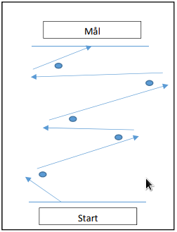

# Om oppgaven {.activity}

I denne oppgaven skal vi programmere roboten til å kjøre en gitt bane som
inneholder ulike svinger. De voksne har bygget en bane på gulvet/bordet enten
ved å bruke teip eller elementer som roboten skal kjøre gjennom eller forbi. Det
er viktig at roboten ikke berører kantene eller kjører utenfor banen. Banen kan
for eksempel se slik ut.

Husk at jo mer man slurver i begynnelsen, og jo vanskeligere er det å komme i
mål, og spesielt dersom man må gjøre endringer underveis.

## Oppgaven passer til: {.check}

 __Fag__: Matematikk, Naturfag, Programmering

__Anbefalte trinn__: 4.-10. trinn

__Tema__: Bane, Løkker

__Tidsbruk__: En enkelttime

## Kompetansemål {.challenge}

- [ ] __Matematikk, 3.trinn__: eksperimentere med og forklare plasseringer i
      koordinatsystemet

- [ ] __Matematikk, 5.trinn__: lage og programmere algoritmer med bruk av
      variabler, vilkår og løkker

- [ ] __Naturfag, 4.trinn__: utforske, lage og programmere teknologiske systemer
      som består av deler som virker sammen

- [ ] __Programmering, 10.trinn__: analysere problemer, gjøre dem om til
      delproblemer og gjøre rede for hvordan noen av delproblemene kan løses med
      programmering

## Forslag til læringsmål {.challenge}

- [ ] Elevene kan forklare banen som et koordinatsystemet roboten skal
      manøvrere gjennom.

- [ ] Elevene kan justere gradene roboten skal svinge for å komme rundt hinder.

- [ ] Elevene kan måle lengden mellom hinder, og programmere roboten til å kjøre
      den lengden.

- [ ] Elevene kan programmere roboten til å gjennomføre oppgaven uten
      detaljert fremgangsmåte.

## Forslag til vurderingskriterier {.challenge}

- [ ] Eleven viser middels måloppnåelse ved å fullføre oppgaven.

- [ ] Eleven viser høy måloppnåelse ved å videreutvikle egen kode basert på
      oppgaven.

## Forutsetninger og utstyr {.challenge}

- [ ] __Forutsetninger__: Elevene burde kunne grunnleggende programmering i LEGO
      Mindstorms.

- [ ] __Utstyr__: Datamaskin med EV3-programmerings-app installert, og en robot
      satt opp med standardoppsett. Man trenger også teip eller lignende for å
      sette opp en bane.

## Fremgangsmåte

Her kommer tips, erfaring og utfordringer til de ulike stegene i den faktiske
oppgaven. [Klikk her for å se
oppgaveteksten.](../genprog_6svingebane/6svingebane_nb.html){target=_blank}

_Vi har dessverre ikke noen tips, erfaringer eller utfordringer tilknyttet denne
oppgaven enda._

## Variasjoner {.challenge}

- [ ]  _Vi har dessverre ikke noen variasjoner tilknyttet denne oppgaven enda._

## Eksterne ressurser {.challenge}

- [ ] Foreløpig ingen eksterne ressurser ...
