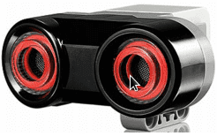

# Om oppgaven {.activity}

I disse oppgavene skal vi ta i bruk ultralydsensoren, og lære å bruke
ultralydsensoren til å måle avstander til objekter. Deretter kan vi få roboten
til å utføre ulike oppgaver basert på informasjon som den får fra sensoren.

Ultralydsensoren sender ut lydbølger og tolker ekkoene den får tilbake til å
finne gjenstander og måle avstanden til den. I denne oppgaven skal vi konstruere
og programmere roboten slik at den gjennom å bruke ultralydsensor stopper en
gitt avstand fra et objekt.

## Oppgaven passer til: {.check}

 __Fag__: Matematikk, Naturfag, Programmering, Teknologi og forskningslære

__Anbefalte trinn__: 4.trinn - VG2

__Tema__: Ultralydsensor, Avstand

__Tidsbruk__: En enkelttime

## Kompetansemål {.challenge}

- [ ] __Matematikk, 3.trinn__: beskrive likhet og ulikheter i sammenligning av
      størrelser, antall, uttrykk og tall og bruk likhets- og ulikhetstegn

- [ ] __Naturfag, 7.trinn__: utforske, lage og programmere teknologiske
      systemer som består av deler som virker sammen

- [ ] __Naturfag, 10.trinn__: bruke programmering til å utforske naturfaglige
      fenomener

- [ ] __Naturfag, 10.trinn__: utforske, forstå og lage teknologiske systemer
      som består av en sender og en mottaker

- [ ] __Programmering, 10.trinn__: utvikle og feilsøke dataprogram som løser
      definerte problemer, inkludert kontrollering eller simulering av fysiske
      objekter

- [ ] __Teknologi og forskningslære, VG2__: utforske analoge og digitale
      signaler fra sensorer

## Forslag til læringsmål {.challenge}

- [ ] Elevene kan bruke signaler fra sensorer i programmeringen sin.

- [ ] Elevene kan forklare grunnprinsippet bak ultralyd.

## Forslag til vurderingskriterier {.challenge}

- [ ] Eleven viser middels måloppnåelse ved å fullføre oppgaven.

- [ ] Eleven viser høy måloppnåelse ved å videreutvikle egen kode basert på
      oppgaven.

## Forutsetninger og utstyr {.challenge}

- [ ] __Forutsetninger__: Elevene burde kunne grunnleggende programmering i LEGO
      Mindstorms, samt ha bakgrunnskunnskaper for å forstå ultralyd.

- [ ] __Utstyr__: Datamaskin med EV3-programmerings-app installert, og en robot
      satt opp med standardoppsett med ultralydsensor.

## Fremgangsmåte

Her kommer tips, erfaring og utfordringer til de ulike stegene i den faktiske
oppgaven.
[Klikk her for å se oppgaveteksten.](../lyd_1ultralydsensor/1ultralydsensor_nb.html){target=_blank}

_Vi har dessverre ikke noen tips, erfaringer eller utfordringer tilknyttet denne
oppgaven enda._

## Variasjoner {.challenge}

- [ ]  _Vi har dessverre ikke noen variasjoner tilknyttet denne oppgaven enda._

## Eksterne ressurser {.challenge}

- [ ] Foreløpig ingen eksterne ressurser ...
