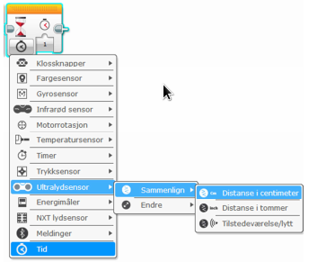

# Ultralydsensor og litt regning {.intro}

I denne oppgaven skal vi programmere roboten slik at den gjennom å bruke
ultralydsensor stopper en gitt avstand fra et objekt, rygger tilbake en ny
avstand, og tilslutt stopper og kjører tilbake til start.

## Fremgangsmåte {.check}

- [ ] Konstruere et feste til Ultralydsensoren slik at den ikke står veien for
  andre deler på roboten. Du finner alternativ plassering i instruksjonsboken.

- [ ] Koble til Ultralydsensoren til EV3 roboten ved hjelp av en kabel. Kabelen
  skal kobles til en av portene merket med 1-4.

- [ ] Roboten skal kjøre framover.

- [ ] Når den kommer til linjen, skal den stoppe. Det er «Ultralydsensoren» som
  skal fortelle når roboten skal stoppe.

- [ ] Nå skal den spille av en lyd, gjerne en fanfare.

- [ ] Deretter skal den rygge 10 cm tilbake og stoppe på nytt. Avstanden til
  objektet skal endres med 10 cm. Igjen er det «Ultralydsensoren» som skal
  fortelle når roboten skal stoppe.

- [ ] Roboten skal så snu 180 grader.

- [ ] Tilslutt skal den kjøre tilbake til startpunktet for programmet.

- [ ] Første delen av et ferdig program kan se slik ut:

