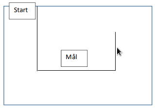

# Hinderløype {.intro}

I denne oppgaven, skal vi konstruere og programmere roboten slik at den ved
hjelp av ultralydsensor klarer å bevege seg gjennom en bane med vegger. Her
gjelder det å holde kontroll på høyre og venstre svinger, samt passe på å svinge
når avstanden til veggen er akkurat passe.

Det å kunne bruke ultralydsensor mot veggene og andre objekter til å manøvrere
seg fram på et FLL bord er nyttig og tidsbesparende. I tillegg har en bedre
kontroll på hvor roboten er i forhold til veggene og objektene.

## Fremgangsmåte {.check}

- [ ] De voksne konstruerer en hinderløype, der veggene består av kartonger,
  bøker eller andre objekter som har litt høyde og som ultralydsensoren er i
  stand til å oppfatte. Ta gjerne utgangspunkt i skissen under.

- [ ] Konstruere et feste til Ultralydsensoren slik at den ikke står veien for
  andre deler på roboten, og med en høyde som gjør at den oppdager hindrene. Du
  finner alternativ plassering i instruksjonsboken.

- [ ] Koble til Ultralydsensoren til EV3 roboten ved hjelp av en kabel. Kabelen
  skal kobles til en av portene merket med 1-4.

- [ ] Roboten skal kjøre framover. Når den kommer fram til en vegg/hinder, skal
  den svinge den vei som passer. Det er ultralydsensoren som skal fortelle når
  roboten skal stoppe for å svinge.

- [ ] Sving nøyaktig i riktig retning. Da går det lettere når roboten skal kjøre
  videre.

- [ ] Legg gjerne inn et sekund pause mellom hver hendelse. Da har du bedre
  kontroll på roboten.

- [ ] Når den kommer til «Mål», skal den spille av en fanfare.

- [ ] Når den har kommet til «Mål», klarer dere å få den til å kjøre tilbake til
  «Start»?
