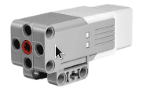
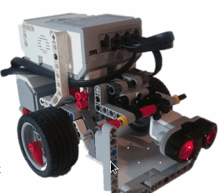
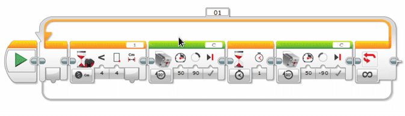

# Slå en ball {.intro}

I denne oppgaven skal vi få roboten til å slå en ball. I første del av oppgaven
skal roboten stå stille, og ballen trilles mot roboten. Når den er nærme nok,
skal den slå ballen av vekk med en arm som vi skal bygge foran på roboten. I den
andre oppgaven skal roboten kjøre mot ballen, og slå den vekk når den er nærme
nok.

## Fremgangsmåte {.check}

- [ ] Konstruer roboten på en slik måte at ultralydsensoren blir plassert foran
  på roboten, lavt og mot midten, slik at den er i stand til å se ballen.

- [ ] Koble til Ultralydsensoren til EV3 roboten ved hjelp av en kabel. Kabelen
  skal kobles til en av portene merket med 1-4.

- [ ] Finn fram medium motor, og koble den til roboten. Det går fint an å bruke
  standard plassering av motoren, slik du finner på grunntegningene.

- [ ] Koble til medium motor til en av portene merket A-D.

- [ ] Konstruer deretter en arm på denne motoren. Den må være i nærheten av
  ultralydsensoren, ellers vil den ikke være i stand til å slå ballen.

- [ ] Lag først et program som aktiverer motoren, og løfter armen. Hvor langt må
  armen løftes? Hvor mange grader/rotasjoner?

- [ ] Husk at armen også må komme ned igjen.

- [ ] Lag deretter et komplett program, der ultralydsensoren oppdager når ballen
  kommer og sender beskjed til armen om å slå ballen unna. Her trengs det nok en
  del prøving og feiling før en finner korrekt plassering av ultralydsensor og
  når ultralydsensoren skal gi beskjed om å slå ballen.

- [ ] I det neste programmet, skal roboten kjøre mot ballen. Ballen kan enten
  ligge i ro, eller trille mot roboten. Når ballen er nærme nok skal armen slå
  ballen og roboten må stoppe.

Et ferdig program på del en, kan se slik ut:

