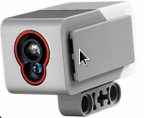

# Om oppgaven {.activity}

I disse oppgavene skal vi ta i bruk lys og fargesensoren, og lære å bruke
sensoren til å finne farger og lysintensiteten til objekter og linjer på bordet.
Deretter kan vi få roboten til å utføre ulike oppgaver basert på informasjon som
den får fra sensoren.

Lys og fargesensoren sender ut lys og refleksjonen den får tilbake bruker
hjernen til enten å finne ut hvilken farge det er snakk om, eller hvor sterk
lyset som kommer tilbake er for å kunne skille mellom det hvite og de svarte
linjene på bordet.

I disse oppgavene skal vi konstruere og programmere roboten for å finne de ulike
fargene den kan lese, og se hvordan den skiller mellom hvit og svart.

## Oppgaven passer til: {.check}

 __Fag__: Naturfag, Teknologi og forskningslære

__Anbefalte trinn__: 4.trinn - VG2

__Tema__: Lyssensor

__Tidsbruk__: En enkelttime

## Kompetansemål {.challenge}

- [ ] __Naturfag, 2.trinn__: utforske og beskrive observerbare egenskaper til
      ulike objekter, materialer og stoffer og sortere etter egenskaper

- [ ] __Naturfag, 4.trinn__: undre seg, stille spørsmål og lage hypoteser og
      utforske disse for å finne svar

- [ ] __Naturfag, 10.trinn__: bruke programmering til å utforske naturfaglige
      fenomener

- [ ] __Naturfag, 10.trinn__: utforske, forstå og lage teknologiske systemer
      som består av en sender og en mottaker

- [ ] __Teknologi og forskningslære, VG2__: utforske analoge og digitale
      signaler fra sensorer

- [ ] __Teknologi og forskningslære, VG2__: planlegge og utføre reproduserbare
      forsøk og vurdere hvor pålitelig resultatet er

## Forslag til læringsmål {.challenge}

- [ ] Elevene kan montere og bruke signaler fra sensorer i programmeringen sin
      på en hensiktsmessig måte.

- [ ] Elevene kan formulere en hypotese for hvor sterk lysintensiteten til svart
      og hvitt er.

- [ ] Elevene kan reprodusere forsøk på lysintensitet for å finne pålitelige
      resultater.  

## Forslag til vurderingskriterier {.challenge}

- [ ] Eleven viser middels måloppnåelse ved å fullføre oppgaven.

- [ ] Eleven viser høy måloppnåelse ved å videreutvikle egen kode basert på
      oppgaven.

## Forutsetninger og utstyr {.challenge}

- [ ] __Forutsetninger__: Elevene burde kunne grunnleggende programmering i LEGO
      Mindstorms.

- [ ] __Utstyr__: Datamaskin med EV3-programmerings-app installert, og en robot
      satt opp med farge- og lysintensitetssensor.

## Fremgangsmåte

Her kommer tips, erfaring og utfordringer til de ulike stegene i den faktiske
oppgaven.
[Klikk her for å se oppgaveteksten.](../lys_1lysintensitet/1lysintensitet_nb.html){target=_blank}

_Vi har dessverre ikke noen tips, erfaringer eller utfordringer tilknyttet denne
oppgaven enda._

## Variasjoner {.challenge}

- [ ]  _Vi har dessverre ikke noen variasjoner tilknyttet denne oppgaven enda._

## Eksterne ressurser {.challenge}

- [ ] Foreløpig ingen eksterne ressurser ...
