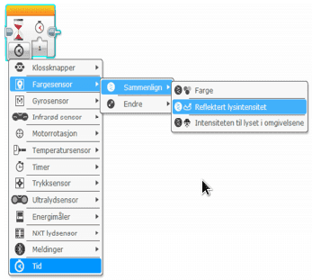

# Svart strek {.intro}

I denne oppgaven skal vi konstruere og programmere roboten til å kjøre fram og
stoppe når den kommer til en svart strek. Dette er en veldig viktig oppgave, og
noe som du kommer til å få bruk for i forbindelse med First Lego League.

## Fremgangsmåte {.check}

- [ ] Konstruer roboten på en slik måte at lys- og fargesensor blir passert
  foran på roboten. Den skal peke nedover mot bordet. Det er viktig at den
  ligger tett på bakken, men ikke for tett for da vil alt bli svart. En ½ cm fra
  bordet er OK avstand.

- [ ] Koble lys- og fargesensoren til EV3 roboten ved hjelp av en kabel. Kabelen
  skal kobles til en av portene merket med 1-4.

- [ ] Åpne programmeringsverktøyet.

- [ ] Koble roboten til datamaskinen og sjekk at lys og fargesensor er koblet
  til nede til høyre.

- [ ] Ved å klikke på sensoren i programmet kan en endre mellom lysintensitet og
  farge. Velg lysintensitet.

- [ ] Roboten skal kjøre framover.

- [ ] Når den kommer til en svart stripe på bordet/gulvet skal den stoppe.

- [ ] Lyssensoren hentes fra slik i programmeringen.

- [ ] Sjekk lysintensiteten for svart fra oppgave 4.1, og bruk denne som
  grenseverdi. Det er mulig det må justeres litt underveis, før det virker
  skikkelig.

Et ferdig program kan se slik ut:

