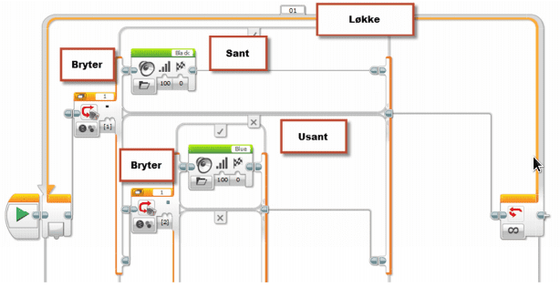

# Fargegjenkjenner {.intro}

I denne oppgaven skal vi konstruere og programmere roboten til å fortelle
hvilken farge klossene du holder fram har. Den skal både skrive fargen i
displayet og «rope» ut hvilken farge du har.

## Fremgangsmåte {.check}

- [ ] Konstruer roboten på en slik måte at lys- og fargesensor blir passert
  foran på roboten. Den skal peke framover, og ikke ned mot bordet.

- [ ] Koble lys- og fargesensoren til EV3 roboten ved hjelp av en kabel. Kabelen
  skal kobles til en av portene merket med 1-4.

- [ ] Åpne programmeringsverktøyet.

- [ ] Koble roboten til datamaskinen og sjekk at lys- og fargesensor er koblet
  til nede til høyre.

- [ ] Ved å klikke på sensoren i programmet kan en endre mellom lysintensitet og
  farge. Velg farge.

- [ ] Dette programmet skal kjøre til det blir stoppet. Derfor trengs en løkke
  ytterst.

- [ ] Deretter må den sjekke for en farge. Da brukes en «bryter». Den
  kontrollerer fargen, og svarer om det er «Sant» eller «Usant» (rett eller
  galt). a. Er det «Sant», skal den spille av lydfilen som stemmer med fargen.
  b. Er det «Usant», skal den gå videre og sjekke for neste farge.

- [ ] Ny bryter legges inn på «Usant» delen av den forrige.

- [ ] Slik må du kontrollere for hver farge.

Begynnelsen på programmet blir seende slik ut:

