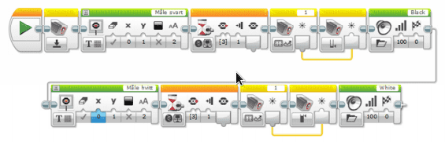

# Fargegjenkjenner 2 {.intro}

I denne oppgaven skal vi konstruere og programmere roboten til å velge en
tilfeldig farge. Deretter kjøre fram til en løkke, finne ut hvilken farge den
har og om fargen er riktig, plukke opp løkken og ta den med tilbake til basen.
Roboten skal kun velge mellom 3 farger (blå, grønn og gul), slik at det ikke
blir for tidkrevende.

## Fremgangsmåte {.check}

- [ ] Konstruer roboten på en slik måte at lys- og fargesensor blir passert
  foran på roboten. Den skal peke framover, og ikke ned mot bordet.

- [ ] Koble lys- og fargesensoren til EV3 roboten ved hjelp av en kabel. Kabelen
  skal kobles til en portene merket med 1-4.

- [ ] Åpne programmeringsverktøyet.

- [ ] Koble roboten til datamaskinen og sjekk at lys- og fargesensor er koblet
  til nede til høyre.

- [ ] Ved å klikke på sensoren i programmet kan en endre mellom lysintensitet og
  farge. Velg farge.

- [ ] Konstruer roboten på en slik måte at ultralydsensoren blir plassert foran
  på roboten, lavt og mot midten, slik at den er i stand til å se ballen.

- [ ] Koble til Ultralydsensoren til EV3 roboten ved hjelp av en kabel. Kabelen
  skal kobles til en av portene merket med 1-4.

- [ ] Finn fram medium motor, og koble den til roboten. Det går fint an å bruke
  standard plassering av motoren, slik du finner på grunntegningene.

- [ ] Koble til medium motor til en av portene merket A-D.

- [ ] Konstruer en arm på roboten som plukker med seg riktig løkke.

- [ ] Roboten skal få tildelt farge av «Tilfeldig» blokken. Verdiene må være i
  området som er lik fargene vi har løkker i.

- [ ] Roboten skal kjøre fram mot løkken.

- [ ] Ultralydsensoren skal fortelle roboten når den skal stoppe.

- [ ] Fargesensoren skal lese av fargen på løkken.

  - [ ] Dersom fargen stemmer, skal roboten løfte opp løkken.

  NB! Roboten må kanskje flytte seg litt for å få tak i løkken...

  - [ ] Dersom fargen ikke stemmer, skal roboten vise et surt fjes.

- [ ] Deretter skal roboten snu og kjøre tilbake til basen. NB! Her trengs det
  litt prøving og feiling...

