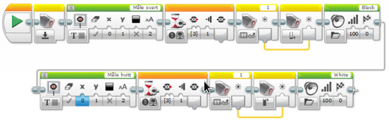

# Kalibrere lyssensor {.intro}

Vi skal lage et kalibreringsprogram for lyssensoren siden vi kan anta at lyset
på konkurransebordet er forskjellig fra det lyset som finnes på øvingsbordene
rundt omkring. Vi skal registrere hvitt og svart. Displayet på roboten skal
fortelle oss hva vi skal gjøre.

## Fremgangsmåte {.check}

- [ ] Konstruer roboten på en slik måte at lys- og fargesensor blir passert
  foran på roboten. Den skal peke nedover mot bordet. Det er viktig at den
  ligger tett på bakken, men ikke for tett for da vil alt bli svart. En ½ cm fra
  bordet er OK avstand.

- [ ] Koble lys- og fargesensoren til EV3 roboten ved hjelp av en kabel. Kabelen
  skal kobles til en av portene merket med 1-4.

- [ ] Åpne programmeringsverktøyet.

- [ ] Koble roboten til datamaskinen og sjekk at lys og fargesensor er koblet
  til nede til høyre.

- [ ] Ved å klikke på sensoren i programmet kan en endre mellom lysintensitet og
  farge. Velg lysintensitet.

- [ ] Velg ut Fargesensor – ikonet, og velg Kalibrer og deretter Tilbakestill.

- [ ] 1) Først skal svart måles. Vi melding om «Måle svart» i displayet på
  EV3en.

- [ ] 2) Kalibreringen skal starte når den midterste knappen trykkes. Legg til
  Vent, Velg «Klossknapper» - «Sammenlign».

- [ ] 3) Start kalibrering. Velg ut Fargesensor, velg Måle – Reflektert
  lysintensitet.

- [ ] Nullstill verdien. Velg ut Fargesensor, velg Kalibrer - Reflektert
  lysintensitet – Minimum. Verdien som måles av sensoren skal lagres her.

- [ ] Gjenta punkt 1) - 3). Denne gangen skal det måles hvitt. Den skal lagres
  som et Maksimum.

- [ ] Du kan også spille av en lyd når den er ferdig med å måle fargene, slik at
  vi vet at den er ferdig. Et ferdig program kan se slik ut:

