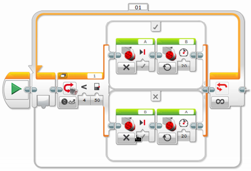

# Følge en svart linje – versjon 1 {.intro}

På et bord i en FLL konkurranse er det mange svarte linjer. Disse svarte linjene
er laget for å blant annet å hjelpe robotene til å finne fram på bordet. En kan
bruke lyssensoren til å følge en svart linje.

## Fremgangsmåte {.check}

- [ ] Konstruer roboten på en slik måte at lys- og fargesensor blir passert
  foran på roboten. Den skal peke nedover mot bordet. Det er viktig at den
  ligger tett på bakken, men ikke for tett for da vil alt bli svart. En ½ cm fra
  bordet er OK avstand.

- [ ] Koble lys- og fargesensoren til EV3 roboten ved hjelp av en kabel. Kabelen
  skal kobles til en av portene merket med 1-4.

- [ ] Åpne programmeringsverktøyet.

- [ ] Koble roboten til datamaskinen og sjekk at lys og fargesensor er koblet
  til nede til høyre.

- [ ] Ved å klikke på sensoren i programmet kan en endre mellom lysintensitet og
  farge. Velg lysintensitet.

- [ ] Dette programmet skal kjøres uendelig, eller fram til annen beskjed blir
  gitt.

- [ ] Lyssensoren skal måle svart eller hvitt, og gjøre enten det ene eller det
  andre. Vi trenger en bryter til dette. Koble lyssensoren i bryteren.

- [ ] Sett grenseverdien til 50.

- [ ] Dersom mindre enn 50, skal den ene motoren stå i ro, mens den andre
  kjører.

- [ ] Dersom større enn 50, skal den motsatte motoren stå i ro, mens den andre
  kjører.

- [ ] Prøv deg fram med hastighet på motoren som skal kjøre.

Et ferdig program kan se slik ut:

