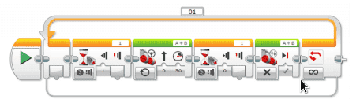

# Trykksensor {.intro}

I denne oppgaven skal vi ta i bruk en sensor. Den første vi skal ta i bruk er
trykksensoren. Trykkesensoren registrerer eventuelle trykk mot den røde delen av
sensoren. Ofte kan en forlenge mottakeren for sensoren ved å montere på
forlenger.

I denne oppgaven skal vi programmere roboten til å kjøre framover når
trykksensoren trykkes inn. Når den slippes, skal roboten stoppe.

## Fremgangsmåte {.check}

- [ ] Koble til trykksensoren til EV3 hjernen ved hjelp av en kabel. Kabelen
  skal kobles til en av portene merket med 1-4.

- [ ] Nede i høyre hjørne i LEGO Mindstorms programmet kan du nå se om sensorene
  er koblet riktig til og hvilken tilstand de har. 0 – ute, 1 – inne.

- [ ] Sett opp en løkke. Siden programmet skal kjøre om igjen og om igjen,
  trenger den å bli fortalt dette. For hver gang du trykker inn skal den kjøre,
  og for hver gang den slippes skal den stoppe.

- [ ] Sett inn ikonet for «Trykksensor». Dette gjør du ved å velge «Vent» -
  ikonet og deretter velge «Trykksensor», «Sammenlign» og «Tilstand»

- [ ] Velg tilstand som tilsvarer trykket inn.

- [ ] Deretter kobler du inn «Kjør med styring» for å få roboten til å kjøre.
  Prøv programmet. Hva skjer?

- [ ] For å roboten til å stoppe må vi legge inn en ny kontroll på
  «Trykksensor». Sensoren endrer posisjon, den slippes.

- [ ] Legg deretter inn en «Kjør med styring» og velg «Av». Prøv programmet. Hva
  skjer?

Et ferdig program, kan se slik ut.

