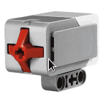

# Om oppgaven {.activity}

I denne oppgaven skal vi ta i bruk en sensor. Den første vi skal ta i bruk er
trykksensoren. Trykkesensoren registrerer eventuelle trykk mot den røde delen av
sensoren. Ofte kan en forlenge mottakeren for sensoren ved å montere på
forlenger.

I denne oppgaven skal vi programmere roboten til å kjøre framover når
trykksensoren trykkes inn. Når den slippes, skal roboten stoppe.

## Oppgaven passer til: {.check}

 __Fag__: Naturfag, Programmering, Teknologi og forskningslære

__Anbefalte trinn__: 4.trinn - VG2

__Tema__: Trykksensor

__Tidsbruk__: En enkelttime

## Kompetansemål {.challenge}

- [ ] __Naturfag, 4.trinn__: utforske teknologiske systemer som er satt sammen
      av ulike deler, og beskrive hvordan delene fungerer og virker sammen

- [ ] __Naturfag, 7.trinn__: utforske, lage og programmere teknologiske
      systemer som består av deler som virker sammen

- [ ] __Naturfag, 10.trinn__: utforske, forstå og lage teknologiske systemer
      som består av en sender og en mottaker

- [ ] __Programmering, 10.trinn__: utvikle og feilsøke dataprogram som løser
      definerte problemer, inkludert kontrollering eller simulering av fysiske
      objekter

- [ ] __Teknologi og forskningslære, VG2__: utforske analoge og digitale
      signaler fra sensorer

## Forslag til læringsmål {.challenge}

- [ ] Elevene kan forklare grunnideen bak en trykksensor.

- [ ] Elevene kan bruke signaler fra sensorer i programmeringen sin.

## Forslag til vurderingskriterier {.challenge}

- [ ] Eleven viser middels måloppnåelse ved å fullføre oppgaven.

- [ ] Eleven viser høy måloppnåelse ved å videreutvikle egen kode basert på
      oppgaven.

## Forutsetninger og utstyr {.challenge}

- [ ] __Forutsetninger__: Elevene burde kunne grunnleggende programmering i LEGO
      Mindstorms.

- [ ] __Utstyr__: Datamaskin med EV3-programmerings-app installert, og en robot
      satt opp med standardoppsett med trykksensor.

## Fremgangsmåte

Her kommer tips, erfaring og utfordringer til de ulike stegene i den faktiske
oppgaven.
[Klikk her for å se oppgaveteksten.](../trykk_1trykksensor/1trykksensor_nb.html){target=_blank}

_Vi har dessverre ikke noen tips, erfaringer eller utfordringer tilknyttet denne
oppgaven enda._

## Variasjoner {.challenge}

- [ ]  _Vi har dessverre ikke noen variasjoner tilknyttet denne oppgaven enda._

## Eksterne ressurser {.challenge}

- [ ] Foreløpig ingen eksterne ressurser ...
