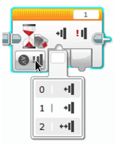

# Enkel fjernkontroll {.intro}

I denne oppgaven, skal vi lage en enkel fjernkontroll til roboten. Når
trykksensoren aktiveres skal den utføre ulike oppgaver, alt etter hvor langt i
sekvensen den er kommet. Første gang den trykkes skal den kjøre framover. Neste
gang skal den svinge til venstre, og tredje gang den trykkes skal den svinge til
høyre.

Etter at den har gjennomført alle disse manøvrene i sekvensen, skal den begynne
på nytt.

## Fremgangsmåte {.check}

- [ ] Koble til trykksensoren til EV3 hjernen ved hjelp av en kabel. Kabelen
  skal kobles til en av portene merket med 1-4.

- [ ] Sett opp en løkke. Siden programmet skal kjøre om igjen og om igjen,
  trenger den å bli fortalt dette. For hver gang du trykker inn skal den kjøre,
  og for hver gang den slippes skal den stoppe.

- [ ] Sett inn ikonet for «Trykksensor». Dette gjør du ved å velge «Vent» -
  ikonet og deretter velge «Trykksensor», «Sammenlign» og «Tilstand»

- [ ] Velg tilstand som tilsvarer trykket inn.

- [ ] Deretter kobler du inn «Kjør med styring» for å få roboten til å kjøre.
  Prøv programmet.

- [ ] For å roboten til å stoppe må vi legge inn en ny kontroll på
  «Trykksensor». Sensoren endrer posisjon, den slippes.

- [ ] Legg deretter inn en «Kjør med styring» og velg «Av». Prøv programmet.

- [ ] Gjenta sekvensen for å svinge til venstre og deretter for å svinge til
  høyre. For hver gang du slipper knappen skal roboten stoppe.

Slik kan et ferdig program se ut.

