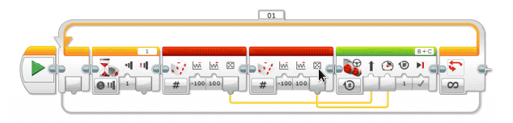

# Gal robot {.intro}

I denne oppgaven skal vi lage en gal robot, en robot som gjør litt akkurat som
den vil. Vi skal koble til en trykksensor som endrer retning og fart hver gang
vi aktiverer trykksensoren.

## Fremgangsmåte {.check}

- [ ] Koble til trykksensoren til EV3 hjernen ved hjelp av en kabel. Kabelen
  skal kobles til en av portene merket med 1-4.

- [ ] Sett opp en løkke. Siden programmet skal kjøre om igjen og om igjen,
  trenger den å bli fortalt dette. For hver gang du trykker inn skal den kjøre,
  og for hver gang den slippes skal den stoppe.

- [ ] Sett inn ikonet for «Trykksensor». Dette gjør du ved å velge «Vent» -
  ikonet og deretter velge «Trykksensor», «Sammenlign» og «Tilstand»

- [ ] Velg tilstand som tilsvarer trykket inn.

- [ ] Når sensoren aktiveres skal den sende tilfeldige tall til «Kjør med
  styring» som skal fortelle hvilken retning den skal kjøres og hvilken fart den
  skal kjøre med. Tilfeldig tall kan vi få ved å hente objektet «Tilfeldig» som
  du finner under «Dataoperasjoner».

- [ ] Koble sammen et objekt «Tilfeldig» med et objekt «Kjør med styring» for å
  fortelle hvilken retning som skal kjøres. Sett nedre område til -100 og øvre
  område til 100, og knytt deretter resultatet sammen med egenskapen for retning
  i «Kjør med styring» - objektet.

- [ ] Test programmet.

- [ ] Hent inn enda et «Tilfeldig» objekt til å styre hastigheten, og koble
  dette til hastigheten på «Kjør med styring». Sett nedre område til -100 og
  øvre område til 100. Programmet kan se slik ut da:

- [ ] Test programmet. Hvordan oppfører roboten seg?

- [ ] Hvordan er «Kjør med styring» programmert? En rotasjon, uendelig? Kan vi
  variere hvor lenge den kjører hvert enkelt runde?

- [ ] Klarer du å programmere løkken til å stoppe etter 10 runder?
