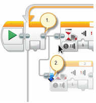

# Radiostyrt bil {.intro}

I denne oppgaven skal vi konstruere og programmere roboten slik at den oppfører
seg som en radiostyrt bil. Vi skal koble til to trykksensorer, som hver styrer
sin egen motor. Dermed kan vi kjøre framover i tillegg til å svinge til begge
sider.

## Fremgangsmåte {.check}

- [ ] Koble til trykksensoren til EV3 hjernen ved hjelp av en kabel. Kabelen
  skal kobles til en av portene merket med 1-4. Denne trykksensoren skal styre
  den venstre motoren.

- [ ] Koble til den andre trykksensoren til EV3 hjernen ved hjelp av en kabel.
  Kabelen skal kobles til en ledig port merket med 1-4. Denne trykksensoren skal
  styre den høyre motoren.

- [ ] Sett opp en løkke. Siden programmet skal kjøre om igjen og om igjen,
  trenger den å bli fortalt dette. For hver gang du trykker inn skal den kjøre,
  og for hver gang den slippes skal den stoppe.

- [ ] Sett inn ikonet for «Trykksensor». Dette gjør du ved å velge «Vent» -
  ikonet og deretter velge «Trykksensor», «Sammenlign» og «Tilstand»

- [ ] Velg tilstand som tilsvarer trykket inn.

- [ ] Når «Trykksensor» er aktivert skal den kjøre med venstre motor. I det den
  slippes skal den stoppe.

- [ ] Test programmet.

- [ ] Lag en tilsvarende for den andre trykksensoren som skal styre høyre motor.

- [ ] For at dette skal virke er det viktig å koble begge delene av programmet
  til løkken. Dette gjøres ved at en klikker på løkkens kobling (punkt 1) og
  drar en ny kobling til andre delen av programmet (punkt 2).

- [ ] Test programmet.

Et ferdig program se slik ut:

