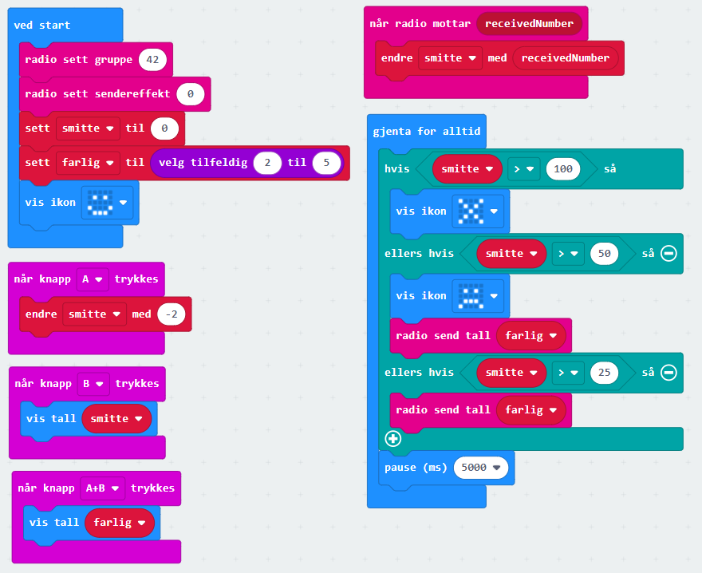

# Introduksjon {.intro}

Virus kan smitte gjennom luft, men hvor fort smitter det, og hvor lang tid tar det før en hel klasse er smittet? Vi skal simulere dette med micro:bit. Simulere betyr å etterligne og som regel forenkler vi virkeligheten. Til dette programmet trenger dere flere micro:bit som snakker sammen.

# Steg 1: Radiokommunikasjon {.activity}

Micro:Bit kan kommunisere med hverandre ved hjelp av radio. Først må vi få sette opp radio og teste radiokommunikasjonen. Dette programmerer vi på [https://makecode.microbit.org/](https://makecode.microbit.org/){target=_blank}. Start et nytt prosjekt og gi det navn, gjerne __Smittebit__.

## Sjekkliste {.check}

- [ ] I seksjonen Radio finner du alle kodeblokkene for å bruke radiofunksjonene.

- [ ] I kodeblokken __ved start__ må du fortelle micro:biten hvilken radiokanal som skal brukes. Sett inn `radio sett gruppe`{.microbitradio} og velg f. eks. 42. Alle micro:bit som skal snakke sammen må ha samme kanal. Er du i kodeklubben eller på skolen vil instruktøren eller læreren gi deg en kode.

- [ ] Når du trykker på A skal micro:bit sende et tall.

- [ ] Når micro:biten mottar et tall, skal tallet vises.

Koden kan se slik ut:

## Test prosjektet {.flag}

**Last inn programmet på 2 micro:biter. Det er lurt å samarbeide med en annen.** 

- [ ] Mottar den andre micro:biten når du sender ved å trykke på A?

- [ ] Hvor langt unna kan man være og likevel motta?

- [ ] Kodeblokken `radio sett sendereffekt`{.microbitradio} som du finner under Radio - mer justerer hvor sterkt micro:bit skal sende. Legg denne blokken inn i `ved start`{.microbitbasic} og juster senderstyrken. Hvor langt rekker senderen ved styrke 5, 3, 1, og 0?

- [ ] Hvilken sendereffekt bør vi bruke i dette eksperimentet?

## Avansert: signalstyrke {.tip}
Under radio finner du også blokken `mottok pakke signalstyrke`{.microbitradio}. Den gir et tall mellom -127 og -42. Et svakt signal gir en verdi nær -127, og et meget sterkt signal gir verdi -42. Ved å sjekke signalstyrken i en `hvis`{.microbitlogic} - løkke kan vi gjøre mottaket mindre følsomt og sikre at to micro:biter må være nær for å kunne snakke sammen.

# Steg 2: Smittespredning {.activity}

I dette steget skal vi sette opp en funksjon for å vise status til micro:biten, og spre smitte når man er smittet.

## Sjekkliste {.check}

- [ ] Vi begynner med å opprette to nye variabler som vi kan kalle `smitte`{.microbitvariables} - den skal vise hvor smittet man er - og `farlig`{.microbitvariables} - den skal fortelle hvor mye denne micro:biten skal smitte videre. Den første, `smitte`{.microbitvariables}, setter vi til 0 i `ved start`{.microbitbasic}. `farlig`{.microbitvariables} setter vi til et tilfeldig tall mellom 2 og 5. Bruk `velg tilfeldig`{.microbitmath} som du finner under matematikk.

- [ ] I samme blokk kan vi også gi beskjed om at micro:biten skal vise et smilefjes når den starter.

- [ ] I blokken `gjenta for alltid`{.microbitbasic} trenger vi en `hvis`{.microbitlogic}-løkke. Den skal sjekke hvor mye `smitte`{.microbitvariables} denne micro:biten har mottatt. Når smitten er over 25, skal den sende tallet som ligger i variabelen `farlig`{.microbitvariables} over radio hvert 5. sekund. Når smitten er over 50, skal vi få sur munn og sende som over, og når smitten er over 100, skal micro:biten "dø": Den skal ikke sende noe, og den skal vise X.

- [ ] Vi må oppdatere blokken `når radio mottar`{.microbitradio}. I stedet for at tallet skal vises, vil vi at variabelen `smitte`{.microbitvariables} endres med det tallet vi får.

- [ ] Det er lurt å lage to testfunksjoner: Når du trykker på B skal du se `smitte`{.microbitvariables}, og når du trykker på A og B skal du se `farlig`{.microbitvariables}.

## Tips: Rekkefølge i en hvis-løkke{.tip}
Når du lager en hvis - eller-løkke med områder som inneholder andre områder du også skal sjekke (mer enn 100 er også mer enn 25), bør du begynne med det som inneholder alt, i dette tilfellet mer enn 100.
#

Koden kan se slik ut:

## Test prosjektet {.flag}

**Last inn programmet på 2 micro:biter. Det er lurt å samarbeide med en annen.**

- [ ] Får du smilefjes når du skrur på micro:biten?

- [ ] Har `farlig`{.microbitvariables} fått en verdi? Hvilken verdi har `smitte`{.microbitvariables}?

- [ ] Trykk på A på den ene micro:biten, da skal den sende 5. Har den andre micro:biten mottatt og endret `smitte`{.microbitvariables}?

- [ ] Når den andre micro:biten er smittet, begynner den å sende tall?

- [ ] Blir begge micro:bitene smittet, og dør til slutt?

# Steg 3: Prøve med hele gruppen {.activity}

Nå er det på tide å prøve dette med hele gruppen, men først kan vi legge inn litt mer funksjonalitet.

## Sjekkliste {.check}

- [ ] Håndvask reduserer smitten. I stedet for å sende et tall når vi trykker på A, vil vi vaske hendene. En forenkling kan være at `smitte`{.microbitvariables} reduseres med 1 eller 2.

- [ ] Er alle micro:bitene i samme radiogruppe? Til det store eksperimentet må alle snakke på samme kanal.

##  Det store eksperimentet {.flag}

**Last inn programmet på alle micro:bitene. Jo flere som er med, jo bedre er det for forsøket.** Når programmet er lastet inn, kan dere ha vanlig time eller gå rundt. Pass på at det er en micro:bit som er smittet ved starten.

- [ ] Har dere en micro:bit som er smittet og kan begynne smitten?

- [ ] Hvor lang tid tar det før alle er smittet?

- [ ] Er det sikrest å være i ro, eller bevege seg rundt?

## Utfordring {.challenge}

- [ ] Munnbind begrenser smitte begge veier. Hvordan kan vi få det inn i koden?

- [ ] Hvordan vil det gå hvis viruset er mer eller mindre farlig?

- [ ] Hva skjer hvis vi dekker til en micro:bit med aluminiumsfolie? Hvorfor?

- [ ] Kan du simulere hosting eller nysing? Her kan du bruke `riste`{.microbitinput}-blokken.

- [ ] Mange virus blir svekket av UV-lys. Kan du legge inn en funksjon for å simulere det?

##  {.tip}

Hvordan virus smitter er avhengig av mange ting. Dette er en simulering og er sterkt forenklet. Her er den endelige koden:

## Lagre spillet {.save}

Vi har laget en smittesimulator og testet det. Hvis du vil ta vare på prosjektet, kan du enten dele på makecode.microbit.org - der får du en lenke, eller laste programmet ned på din datamaskin.