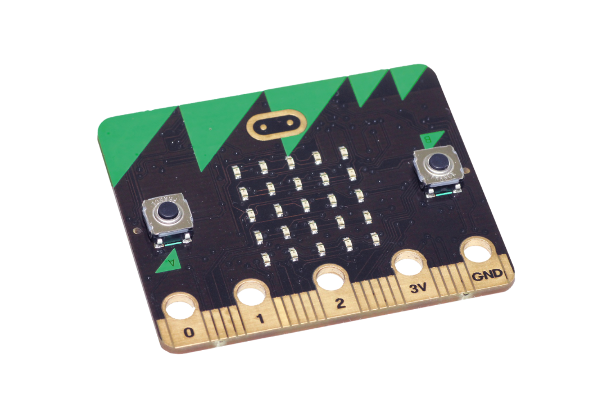

# Introduction {.intro}



In this assignment, we are going to create a program that makes an LED on the micro:bit blink!


# Step 1: Turn on an LED {.activity}

The *block* `on`{.microbitled} *can be used to turn on an LED on the micro:bit,
and the block* `off`{.microbitled} *can be used to turn off an LED that is on.
Both blocks can be found in the* `Screen`{.microbitled} *category.*

## Checklist {.check}

- [ ] Try to see what happens when the `on`{.microbitled} block is used inside a
`on start`{.microbitbasic} block.

```microbit
led.plot(0, 0)
```

To turn the LED off again, we need to add an `off`{.microbitled} block. But we
also want to see the LED actually light up for a bit, so we can add a
`pause`{.microbitbasic} block.

- [ ] Add a `pause`{.microbitbasic} block below the `on`{.microbitled} block
  and an `off`{.microbitled} block below the `pause`{.microbitbasic} block.
  You can find the `pause`{.microbitbasic} block in `Basic`{.microbitbasic}.

- [ ] Set the number inside the `pause`{.microbitbasic} block to 1000 (1 second).

```microbit
led.plot(0, 0)
basic.pause(1000)
led.unplot(0, 0)
```

## Test the project {.flag}

__Try the code in the simulator to test the code so far.__

- [ ] What happens when you change the numbers in the `on`{.microbitled} block and the `off`{.microbitled} block?
  *Hint: try with a number between 0 and 4*

- [ ] What happens when the numbers in the `on`{.microbitled} block are different from the numbers
  in the `off`{.microbitled} block?


# Step 2: Make it blink {.activity}

*What we have created so far makes the LED blink once, but we would like it to blink multiple times.*

## Checklist {.check}

- [ ] Try to make the LED blink several times using a loop. You may also need to add an extra pause.

- [ ] Your code could look like this:

```microbit
basic.forever(function () {
    led.plot(0, 0)
    basic.pause(1000)
    led.unplot(0, 0)
    basic.pause(1000)
})
```

## Test the project {.flag}

- [ ] Download the program to the micro:bit and see the LED turn on and off

## Challenges {.challenge}

- [ ] Add code so that multiple LEDs blink at the same time

- [ ] Make multiple LEDs blink, but at different speeds.
  *Try using different numbers in the* `pause`{.microbitbasic} *blocks.*