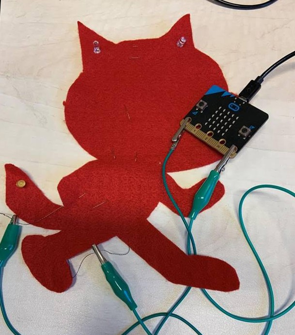
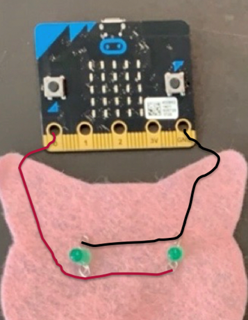
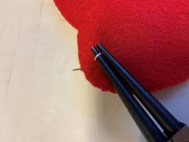
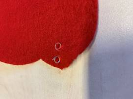
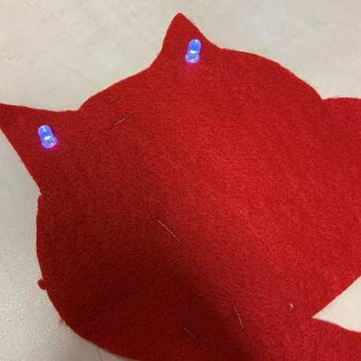
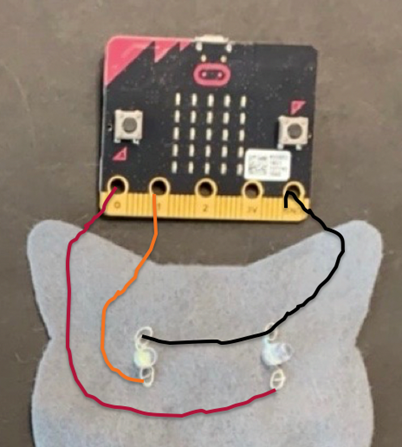

# Introduksjon til eTekstil {.intro}

I denne oppgaven skal vi lage en figur i filt og koble den opp mot en micro:bit ved hjelp av strømledende sytråd, noen LED-pærer og kabler. LED-pærene skal vi programmere til å lyse eller blinke!




## Mål for arbeidet {.check}
- Lage et fysisk produkt av tekstiler, LED-lys, strømledende sytråd og micro:bit.

- Bli kjent med elektriske kretser og programmerbar elektronikk

- Utforske mulighetene som ligger i programmerbar elektronikk og tekstil

## Nødvendig utstyr {.check}
- [ ] 1 BBC Micro:bit med USB-kabel og/eller batteripakke
- [ ] 2 LED-pærer
- [ ] Filt
- [ ] Saks
- [ ] Strømførende (konduktiv) sytråd
- [ ] Synål
- [ ] Ringtang
- [ ] To kabler med krokodilleklemmer
- [ ] PC/nettbrett

# Lag en filt-figur {.activity}
Figuren du skal lage, kan du bestemme selv. Til denne oppgaven trenger den ikke ha noen spesiell form, men om du har lyst til å lage for eksempel en katt, hund, ei sol eller ei sky, står du fritt til å gjøre det! Figuren trenger ikke være være større enn ca 15 cm * 15 cm. LED-pærene kan du plassere der du selv ønsker - for eksempel som øyne på figuren din.


## {.tip}
Pass på at ingen strømførende tråder berører hverandre eller andre poler enn den de tilhører. Det vil nemlig kunne gi en kortslutning, og ingenting fungerer.
#

# Les og forstå: Elektriske kretser {.activity}
For å få en LED-pære til å lyse, må vi danne en elektrisk *krets*. Vi må passe på at kretsen er *lukket*, og at pluss- og minus-polene er koblet riktig, både på strømkilden og LED-pæra. At kretsen er lukket, betyr at elektrisiteten kan strømme fra minuspol til plusspol.


Strømkilden vår i dette arbeidet er en micro:bit. På en micro:bit har vi mange plusspoler, men bare én minuspol: GND.  Alle de andre kontaktene (kalles ofte "*pin*") er separate plusspoler, som gjør at vi kan sende ulike beskjeder fra de ulike kontaktpunktene. I denne oppgaven fokuserer vi kun på P0 (Pin 0) og P1 (Pin 1), i tillegg til GND.

På en LED-pære er alltid det lange "beinet" pluss, og det korte beinet er minus. For at strømmen skal kunne flyte mellom strømkildens plusspol og minuspol, må pluss-beinet kobles til strømkildens plusspol, og minus-beinet til strømkildens minuspol. Altså må LED-pæras lange bein kobles mot eksempelvis P0, og det korte beinet mot GND. På grunn av måten LED-teknologien fungerer, er dette viktig å passe på. Hadde vi koblet til en gammeldags lyspære med glødetråd, ville det ikke hatt noe å si hvilken retning vi koblet til pæra.

## {.tip}
**Eksempel 1**

På bildet under ser du en krets som lar begge LED-pærene lyse på samme måte, fordi P0 er koblet til plusspolen på begge LED-pærene, og begge minuspolene er koblet til GND. Det betyr at begge lysene mottar den samme beskjeden fra micro:biten.




# Montere LED-lys og koble sammen elektronikken {.activity}
Montér LED-lysene der du vil ha dem på figuren. Bruk ringtanga til å "rulle opp" beina til LED-lysene, slik at de danner hver sin lille løkke. Sy så en "bane" de strømførende trådene skal følge, og knyt trådene fast i hver sin løkke.

Koble en krokodilleklemme til P0, og koble den andre enden av ledningen til den sytråden som går til pluss-beinet på LED-pærene. Den andre ledningen kobler du til GND og sytråden som er koblet til minus-beinet på LED-pærene.

Til denne oppgaven trenger du kun én sytråd ut til plusspolene på begge LED-pærene, og én sytråd fra minuspolene tilbake til GND.



Pass på at beina rulles opp slik at de ikke berører hverandre:




# Programmere micro:bit {.activity}


## Få LED til å blinke automatisk {.check}

Nå skal vi skrive den første algoritmen som får LED-pærene til å blinke.

- [ ] Start et nytt prosjekt på [makecode.microbit.org](https://makecode.microbit.org){target=_blank}.
- [ ] Som standard ligger det to blå blokker klare til bruk; `ved start`{.microbitbasic} og en `gjenta for alltid`{.microbitbasic}-løkke. `ved start`{.microbitbasic}-blokken kan du fjerne ved å dra den til verktøykassa midt på skjermen.
- [ ] Finn frem `basis`{.microbitbasic}-blokken og legg den inni `gjenta for alltid`{.microbitbasic}-blokken:

```microbit
basic.forever(function () {
    basic.pause(100)
})
```
- [ ] Den neste blokken du trenger, finner du under "Avansert"  - `Tilkobling`{.microbitpins}
- [ ] Hent blokken som heter `skriv digital til (P0) verdi (0)`{.microbitpins} og legg den inn i løkka, over `pause`{.microbitbasic}-blokka. Samtidig kan du sette pause-verdien til 500 ms:
```microbit
basic.forever(function () {
    pins.digitalWritePin(DigitalPin.P0, 0)
    basic.pause(500)
})
```
## {.tip}
I denne oppgaven ønsker vi kun å skru lyset av eller på. Derfor bruker vi `skriv digital`{.microbitpins}-blokken. Digitale beskjeder kan kun være 0 eller 1 altså "av" eller "på". Ved å bruke blokken `Skriv analog`{.microbitpins} kan du endre strømstyrken som sendes ut. 0 er fremdeles "av", mens 1023 betyr "full strømstyrke". Hva skjer om du setter analog-verdien til for eksempel 600?
##

- [ ] Lag en kopi av de to blokkene, og lag denne algoritmen:

```microbit
basic.forever(function () {
    pins.digitalWritePin(DigitalPin.P0, 0)
    basic.pause(500)
    pins.digitalWritePin(DigitalPin.P0, 1)
    basic.pause(500)
})
```

## {.tip}
Algoritmen vi har laget, skal altså for alltid sende ut beskjed om å skru av lyset, vente 500 ms (et halvt sekund), skru på lyset, vente et halvt sekund - og begynne på toppen av løkka igjen.
##

## Blinke blinke! {.flag}

- [ ] Last ned koden og overfør den til micro:biten.
- [ ] Koble micro:biten til den strømførende tråden ved hjelp av krokodilleklemmene.
- [ ] Blinker LED-lysene som de skal?



# Alternativer {.activity}
Hittil i oppgaven har vi kun koblet de to LED-lysene til samme pin, P0. Det fungerer fint det, men vi kan ha det litt mer moro ved å kjøre lysene på hver sin krets! Legg opp en ny krets med strømførende sytråd til det ene LED-lyset, og koble den til P1. Fjern koblingen til den andre kretsen. Pass på at trådene fra de to kretsene ikke berører hverandre.

## {.tip}
På bildet under ser du hvordan vi kan få de to LED-pærene til å lyse ulikt. Den ene pæra er koblet til P0, den andre til P1. Da kan vi sende ulike signaler til de to pærene. Vi ser at begge pærene er koblet til GND.


#
Her følger tre alternative forslag til hvordan du kan få lysene til å blinke:

# Alternativ 1: Individuell blinking {.activity}
Vi utvider algoritmen vår med flere `skriv digital`{.microbitpins}-blokker og kobler til flere LED-lys som vist på bildet over.

Husk å legge inn `pause`{.microbitbasic}, som styrer hvor fort LED-lysene skal blinke. Lek deg gjerne litt med lengden på pausene for skape andre blinkemønster! Du kan lage lengre blinkealgoritmer med ulike pauser om du vil - bare sett inn flere `skriv digital`{.microbitpins}-blokker og flere `pause`{.microbitbasic}-blokker i algoritmen!

Eksempelkode:

```microbit
basic.forever(function () {
    pins.digitalWritePin(DigitalPin.P1, 1)
    pins.digitalWritePin(DigitalPin.P0, 0)
    basic.pause(500)
    pins.digitalWritePin(DigitalPin.P0, 1)
    pins.digitalWritePin(DigitalPin.P1, 0)
    basic.pause(500)
})
```

# Alternativ 2: Bruke knapper til å styre lys {.activity}
micro:bit har to knapper: A og B. Vi kan bruke disse knappene styre LED-lysene. I eksempelkoden sier vi at A-knappen skrur på LED-lyset koblet til P0, B-knappen skrur på P1, og A+B (trykk begge knappene samtidig) skrur av begge lysene. Du kan også bruke andre inndata-kilder, for eksempel ved å bruke `når [ristes]`{.microbitinput}-blokken. Prøv deg gjerne frem!

```microbit
input.onButtonPressed(Button.A, function () {
    pins.digitalWritePin(DigitalPin.P0, 1)
})
input.onButtonPressed(Button.AB, function () {
    pins.digitalWritePin(DigitalPin.P1, 0)
    pins.digitalWritePin(DigitalPin.P0, 0)
})
input.onButtonPressed(Button.B, function () {
    pins.digitalWritePin(DigitalPin.P1, 1)
```

# Alternativ 3: Skru på lys når det blir mørkt {.activity}

Micro:biten har innebygget lyssensor i den midterste LED-pixelen, altså de LED-lysene som sitter på selve micro:biten. Her må du prøve deg frem med å finne riktig lysnivå for å få øynene til å lyse bare når det er mørkt. Du trenger et `vilkår`{.microbitlogic} som vi kaller `hvis/ellers`{.microbitlogic}. Prøv deg frem ved å måle `lysnivå`{.microbitinput} og endre verdien i testen (verdien er satt til 20 i eksempelet) til å være under lysnivået i rommet.

Eksempelkode:

```microbit
basic.forever(function () {
    if (input.lightLevel() > 20) {
        pins.digitalWritePin(DigitalPin.P0, 1)
    } else {
        pins.digitalWritePin(DigitalPin.P0, 0)
    }
})
basic.forever(function () {
    basic.showNumber(input.lightLevel())
})

```

# Veien videre {.try}
Nå som du har prøvd å jobbe litt med e-Tekstil, kan du selv prøve å finne ut hva mer du kan gjøre. Vil du kanskje sy på en bakside til filtfiguren din og fylle den med vatt, slik at det blir en e-Bamse?

Eller kanskje du fikk en god idé der du kombinerer både elektronikk, tekstiler og andre materialer?

Uansett hva du velger å gjøre videre: Lykke til!

#
