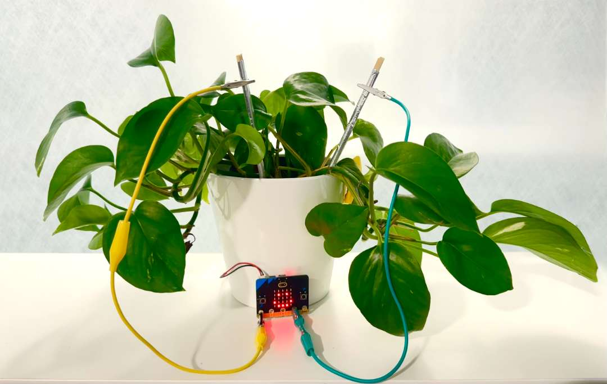
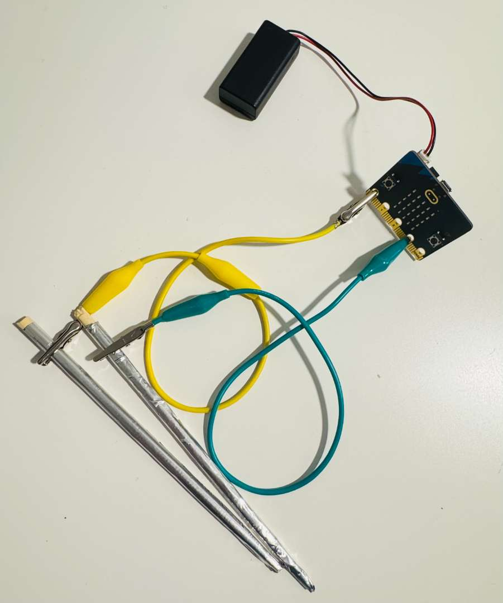
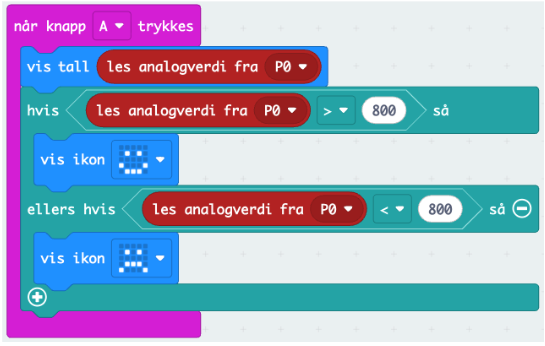
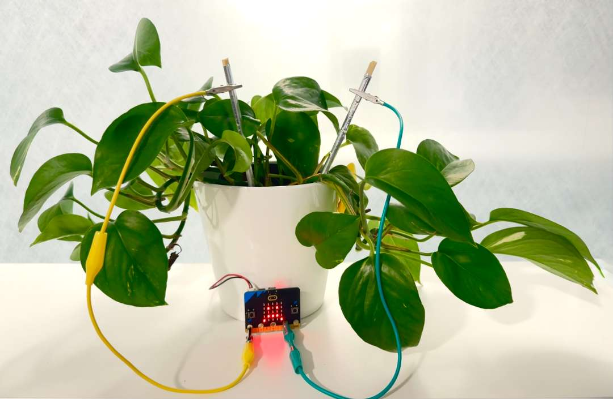

  
# Lag en fuktmåler med Micro:bit!  {.intro}
  

**Planter trenger både lys og vann for å trives.** Gjennom fotosyntesen bruker de lys fra sola, vann fra jorda og karbondioksid fra lufta til å lage sin egen mat i form av sukker. Samtidig frigjør de oksygen, som både mennesker og dyr er avhengige av for å puste!

Når planten mangler lys eller vann, går fotosyntesen saktere, og den får mindre energi til å vokse.

**Visste du forresten at plantene lagrer vann inni cellene sine, som er med på å holder de oppreist?** 

Inne i planten finnes det nemlig mange små “rør” som frakter vann fra røttene og opp til stilken, bladene og blomsten. Når planten har nok vann, er cellene fulle av væske og står “spent” fra innsiden (nesten som små vannballonger). Denne effekten heter **[turgotrykk](https://snl.no/turgortrykk)** eller **saftspenning**, og gjør at stilken blir stiv, og bladene og blomsten holder seg oppe og ser friske ut.

Når planten ikke får nok vann, mister cellene denne spenningen. Da blir stilken myk, bladene henger ned, og hele planten ser slapp og trist ut. Hvis den får vann igjen, trekker røttene opp nytt vann, cellene fylles på, og planten reiser seg!

I denne oppgaven skal du **bygge en enkel jordfuktsensor** som kan fortelle deg om en plante trenger mer vann. Når du er ferdig med oppgaven kan du bruke sensoren til å finne ut hvor fuktig jorda faktisk er, og kanskje programmere micro:biten til å varsle med et bilde når jorda blir for tørr.

# Utstyrsoversikt {.activity}

## Sjekkliste {.check}

- [ ] 1x micro:bit (v1 eller v2) + USB/batteripakke

- [ ] Potter eller kopper med jord
- [ ] 2 spiker (eller metallpinner)
- [ ] 2 ledninger med krokodilleklemmer
- [ ] Kopper med vann
- [ ] Valgfritt: Høyttaler til Micro:bit (kan finnes i Super:bit-kasse dersom dere har)

Oppgaven kan løses på litt forskjellige måter, men det enkleste kan være å sette frem 3-5 planter eller potter/kopper/skåler med jord. **Her er det viktigste at hver potte har ulikt fuktnivå fra start** : en potte som har **helt tørr jord**, en som er **klissvåt**, og resten med litt ulikt fuktnivå. 
Da vil dere kunne lese av ulike nivåer av fuktighet. 

# Steg 2: Koble opp krokodilleklemmene {.activity}
Vi starter med å gjøre klar måleinstrumentene våre. Det trenger ikke være spiker, det må bare være et materiale som leder strøm. **På bildet ser du vårt eksempel hvor vi har pakket inn to spisepinner i aluminiumsteip!** 

- [ ] Koble den ene enden på begge krokodilleklemmene til spikerne/metallstengene dine. 
- [ ] Koble den andre enden på krokodilleklemmen fra den ene spikeren til **P0** på Micro:biten.

- [ ] Koble krokodilleklemmen fra den andre spikeren til **3V** på micro:biten.
Du skal nå ha en Micro:bit som er koblet til to ledninger (**i P0 og 3V**) med en spiker/metallpinne i enden av hver ledning. 

# Steg 3: Programmer fuktmåleren {.activity}
- [ ] Åpne [makecode.microbit.org](https://makecode.microbit.org)  
og start et nytt prosjekt. Du kan kalle prosjektet “Fuktighetsmåler”.

- [ ] Hent en `Når knapp A`{.microbitinput} trykkes-kloss fra `Inndata`{.microbitinput}.

- [ ] Inne i denne legger du klossen `vis tall`{.microbitbasic} (fra `Basis`{.microbitbasic}).

- [ ] Gå til **Avansert** og finn klossen `les analogverdi fra P0`{.microbitpins}. (`P0`{.microbitpins} er hullet nederst til venstre på Micro:bit’en vår!)

- [ ] Legg den inn i `vis tall`{.microbitbasic}-klossen. 

**Koden din skal nå se slik ut:**

Spikrene/metallpinnene vil nå fungere som en enkel **fuktighetsmåler**: når jorda er våt, leder den strøm bedre, og når den er tørr, leder den dårligere - det er dette analogverdien forteller oss noe om. 

# Steg 4: Last ned koden og undersøk verdiene {.activity}

- [ ] Koble micro:biten til datamaskinen med USB-kabel.

- [ ] Trykk på de tre prikkene for å paire Micro:biten med nettleseren. Når Micro:biten er pairet vil du kunne trykke på Last ned, og koden vil lastes ned direkte til Micro:bit!

- [ ] Dersom dette ikke dukker opp i din nettleser må du laste ned koden til datamaskinen manuelt:
    * Klikk på Last ned nede til venstre i MakeCode.
  * Flytt filen som heter microbit.hex fra Nedlastrninger til MICROBIT-disken på datamaskinen din.
  * Micro:biten starter programmet ditt når du trykker på knapp A.

Last ned koden til micro:biten, og se hva som skjer når du trykker på Knapp A mens spikerne/metallpinnene ikke er i kontakt med noe annet enn luften. Hvilken verdi får du opp? 

Verdien du får opp burde være **ca 500** - resultatet du får nå er den laveste verdien du kan måle i ditt miljø, ettersom det ikke er noe fuktighet å måle. 

Den neste testen du kan utføre er å putte spikerne/metallpinnene i et glass med vann, og se hvilken verdi som dukker opp nå. **Pass på at spikerne / metallpinnene ikke kommer borti hverandre.**  Her vil verdien være **over 1000** - og vil være den høyeste verdien du kan måle. 

## Noter ned disse to verdiene, dette er dine ytterpunkter for å vurdere hvor fuktig jorden er. 
 

# Steg 5: Undersøk fuktnivå i ulike kopper jord eller i ulike potter med planter {.activity}
 
**Nå skal du få testet å måle fuktighetsverdiene i jord!**
Noter ned de ulike verdiene du får opp for de ulike koppene med jord eller de ulike pottene med planter i. 

Disse verdiene vil variere fra plante til plante, og også etter hvilken jordtype du bruker.
**Du har nå målt hvordan ledningsevnen i jorda endrer seg med fuktighet.**

# Steg 6: Legg til symboler for å symbolisere tørr jord {.activity}

For å enklere kunne tolke at planten vår trenger mer vann, kan vi legge til smilefjes eller surefjes på Micro:bit’en. 

Vi utvider koden med en `hvis - så`{.microbitlogic} logikk-kloss, som skal plukke opp om den `leste analogverdien fra p0`{.microbitpins} er **høyere eller lavere enn 800**, før vi legger til `vis ikon :)`{.microbitbasic} eller `vis ikon :(`{.microbitbasic} basert på målingene fra `p0`{.microbitpins}. 

**Koden din vil nå se slik ut:**

## Last ned den nye koden og se om du får opp smilefjes når du måler fuktighetsnivå!

## Utfordring {.challenge}

- [ ] Klarer du å utvide koden til å kontinuerlig måle fuktighet? 
- [ ] Dersom du har tilgang på høyttaler enten gjennom Micro:bit versjon 2, eller gjennom Super:bit-kassen - kan du få koden til å lage lyd hvis fuktighetsnivået er for lavt? 

