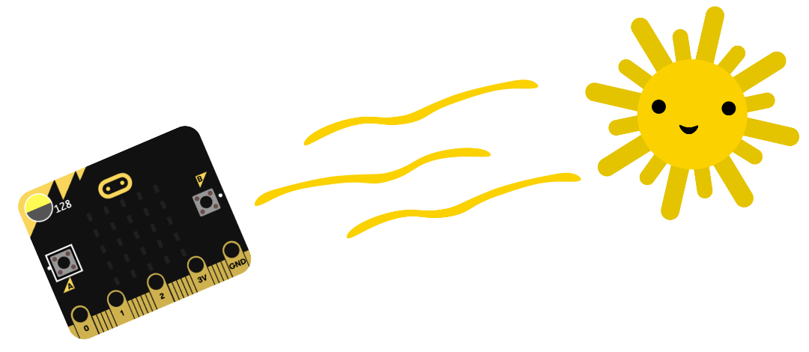
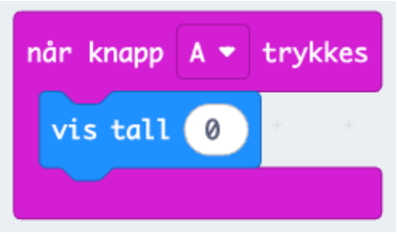
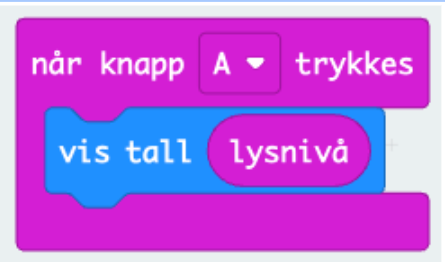
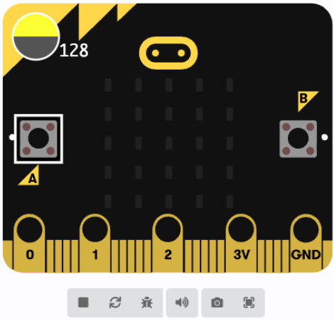
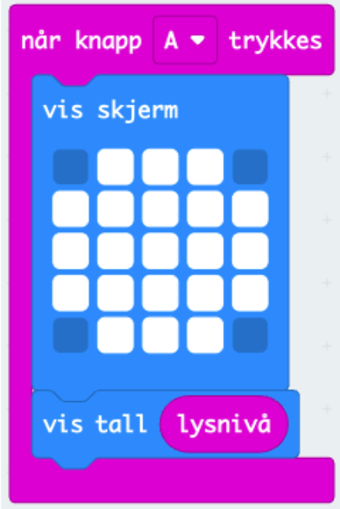

# Introduksjon {.intro}
  
Har du noen gang tenkt over hvorfor planter plasseres i vinduskarmen og ikke midt inne i rommet?
I denne oppgaven skal dere bruke **micro:bit som lysmåler** for å finne ut hvor i klasserommet en plante ville hatt best sjanse til å overleve! 

Planter trenger lys for å kunne lage sin egen mat gjennom fotosyntesen, men hvor mye lys de trenger, varierer. Ved hjelp av micro:bit kan dere måle hvor mye lys som faktisk treffer ulike steder i rommet, og sammenligne målingene med det planter trenger for å trives.

Målet med oppgaven er å utforske hvordan lysnivået endrer seg i rommet, og å bruke dataene til å trekke en naturfaglig konklusjon:
Hvor er det lyst nok til at en plante kan overleve?

Hvor er det for mørkt?

Og hvor i klasserommet ville du plassert en plante for at den skulle hatt det best?

Når dere har gjort målingene, kan dere lage et **lyskart over klasserommet og markere sonene som er best egnet for planter.**
.

Kanskje dere oppdager at den mørke kroken ved tavla ikke er så livskraftig som dere trodde, eller at pulten ved vinduet egentlig fungerer som et lite drivhus!

 

# Bakgrunnsinformasjon {.intro}

## Ulike plantetyper og deres behov for lysnivå:

Det finnes utrolig mange forskjellige planter som alle har ulike lysbehov for å trives. 

For å gjøre det enklere, kan vi dele dem inn i tre hoved­kategorier: Planter som tåler mye skygge, Vanlige potte­planter og Planter som trenger mye lys. Her kan du lese mer om lyspåvirkning på planter: [https://snl.no/lysvirkning_p%C3%A5_planter](https://snl.no/lysvirkning_p%C3%A5_planter)

Planter som tåler mye skygge klarer seg med lite lys og gjerne vokser i skyggefulle omgivelser. Eksempler kan være **fredsliljer og bregner**.

Vanlige potte­planter trenger moderat lys, typisk indirekte dagslys, og trives godt i vinduskarm eller lyst rom uten direkte sol. Eksempler kan være **monstera** og **gullranke**.

Planter som trenger mye lys kommer fra steder med mye sol og trenger mye lys for å vokse godt. Eksempler kan være **sukkulenter** og **solsikker**.

## Om micro:bitens lysmåler 

Micro:bit kan måle hvor mye lys den er eksponert for gjennom LED-panelet på forsiden av Micro:biten. Målingene den klarer å fange opp vil ligge mellom verdiene **0 og 255**, hvor 0-verdien måles i et helt mørkt rom, og max-verdien vil dukke opp i direkte sollys. 

Målingene er ikke helt nøyaktige, men gir et godt bilde av forskjeller i lysnivå, for eksempel mellom ulike steder i rommet eller på ulike tider av dagen. For beste resultat kan det være lurt å ta flere målinger og finne gjennomsnittet. 

.

## PLANTETYPE			OG   		LYSNIVÅ MICROBIT
**Tar man utgangspunkt i disse tre kategoriene av planter, kan vi sette opp denne tabellen som viser et estimert lysnivå som micro:bit kan måle for oss:**

Skyggeplanter 			- 			ca 100 - 150 

Vanlige potteplanter			-			ca 150 - 200 

Lysplanter 				- 			ca 200 - 255

# Steg 1: Finne klossen for når knapp A trykkes {.activity}

## Sjekkliste {.check}

- [ ] Start et nytt PXT-prosjekt ved å gå til[ makecode.microbit.org](https://makecode.microbit.org/).

Sjekkliste
Nå skal vi måle hvor lyst det er i rommet!
Her er vi ute etter å vise frem en tallverdi for lysnivået (som nevnt over, måler vi hvor mye lys micro:biten registrerer (0 = mørkt, 255 = veldig lyst)) derfor henter vi frem en “Vis tall” kloss. 
Koden din ser nå slik ut:

- [ ] Klossen `ved start`{.microbitbasic} ligger allerede i kodefeltet når du åpner et nytt prosjekt. Denne kan du slette, siden vi vil bestemme selv når koden skal kjøres. 

- [ ] En enkel måte å sette i gang en kode på, er ved å legge inn en `Inndata`{.microbitinput}-kloss
- [ ] Her velger vi `Når knapp A trykkes`{.microbitinput}

- [ ] Alt vi legger inn i “Når knapp A trykkes”-klossen skjer når programmet starter på micro:biten.

# Steg 2: Lag en måling av lysnivå {.activity}
- [ ]  Nå skal vi måle hvor lyst det er i rommet! 
- [ ] Her er vi ute etter å vise frem en tallverdi for lysnivået (som nevnt over, måler vi hvor mye lys micro:biten registrerer (0 = mørkt, 255 = veldig lyst)) derfor henter vi frem en `Vis tall`{.microbitbasic} kloss. 

**Koden din ser nå slik ut:**
 

For at vi skal kunne måle lysstyrken går vi til kategorien `Inndata`{.microbitinput} og finner klossen `lysnivå`{.microbitinput}.

Plasser lysnivå-klossen inni `vis tall`{.microbitbasic}-klossen. 

**Koden din ser nå slik ut:**

## Du kan teste koden ved å trykke på Knapp A på Micro:bit-illustrasjonen i Makecode: 

Når du laster med denne koden vil micro:biten vise et tall mellom 0 og 255 som hele tiden oppdateres etter lysnivået rundt deg! 

# Steg 3: Gjør det litt mer visuelt ved å legge til et startbilde {.activity}
**Vi kan lage et lite bilde som vises når Micro:biten starter!**
- [ ] Gå til `Basis`{.microbitbasic} og finn frem `Ved start`{.microbitbasic}-klossen
- [ ] Så velger du enten `vis ikon`{.microbitbasic} eller `vis skjerm`{.microbitbasic}. 
- [ ] Legg denne klossen inn under `ved start`{.microbitbasic}, og velg et symbol som passer, som for eksempel en sol (sirkel).

Da vil Micro:biten vise solen før den begynner å måle lys.

**Koden din ser nå slik ut:**

# Steg 5: Last ned koden {.activity}

- [ ] Koble micro:biten til datamaskinen med USB-kabel.
- [ ] Trykk på de tre prikkene for å paire Micro:biten med nettleseren. Når Micro:biten er pairet vil du kunne trykke på Last ned, og koden vil lastes ned direkte til Micro:bit!

- [ ] Dersom dette ikke dukker opp i din nettleser må du laste ned koden til datamaskinen manuelt:
	* Klikk på Last ned nede til venstre i MakeCode.
	* Flytt filen som heter microbit.hex fra Nedlastninger til MICROBIT-disken på datamaskinen din.

# Steg 4: Test prosjektet {.activity}
Nå som koden er lastet ned til Micro:biten kan du teste koden din! 

**Dukker det opp et tall når du trykker på A? Hvis ja, så fungerer koden som den skal!** 

# Nå har du laget en enkel lysmåler! {.activity}

**Bruk nå lysmåleren til å utforske klasserommet.** Mål lyset på ulike steder: ved vinduet, midt i rommet, under pulten eller inne i et hjørne. Noter verdiene du får fra Micro:biten, og sammenlign dem med oversikten vi introduserte i starten av oppgaven. 

**Hvor i klasserommet er det mest lys? Hvor er det mørkest?**

Når du har samlet målinger fra flere steder, kan du lage et kart over klasserommet der du markerer lysnivåene.
Bruk gjerne farger: grønt for mye lys, gult for middels og blått for lite.

## **Til slutt kan dere diskutere:** 
 - Hvilke steder i rommet ville passet best for solkrevende planter?
 - Hvor kunne skyggetålende planter trives?
 - Er det noen steder hvor det er så mørkt at planter ikke ville klart seg i det hele tatt?
På den måten bruker dere data fra lysmåleren til å finne indikasjoner på hvor i rommet planter kan overleve og trives best.
