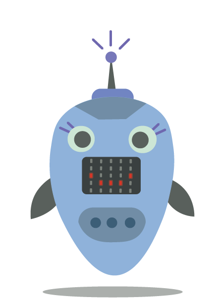
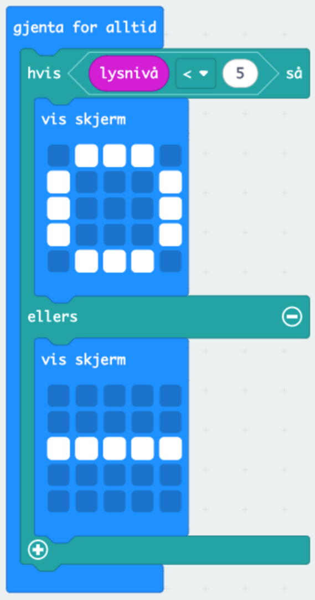
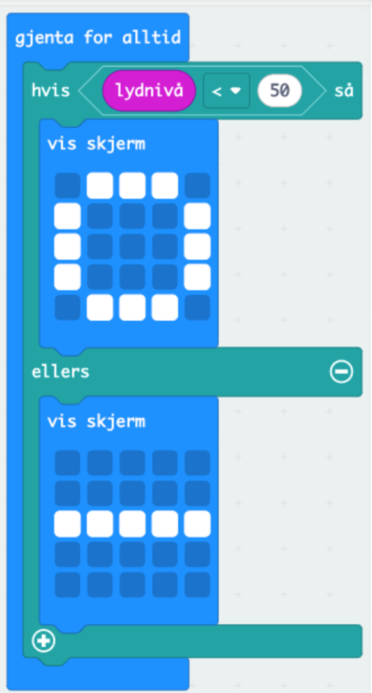
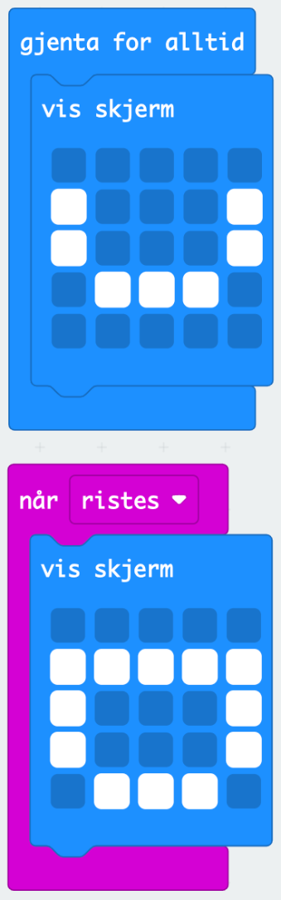

# Introduksjon {.intro}
  
 Elevene skal lære hvordan roboter kan "føle" omgivelsene og utføre oppgaver ved å programmere micro:bit til å reagere på lys, lyd og bevegelse.

# Utstyr:  {.activity}

- [ ] 1 micro:bit per elev eller gruppe
- [ ] Batteripakke til micro:bit
- [ ] Papp, kartong eller annet hobbyutstyr til å lage et "robotansikt" rundt micro:bit
- [ ] Maling, markører, og teip for å dekorere

# Steg 1: Lag robotens ansikt eller kropp {.activity}

- [ ] La elevene bruke papp eller kartong for å lage et morsomt "robotansikt" rundt micro:bit, hvor LED-skjermen blir robotens "munn".
- [ ] De kan tegne eller lage øyne, nese, ører, og kanskje til og med "antenner" eller lignende detaljer.
- [ ] De kan også lage en hel robot - kanskje av en gammel melkekartong? 
- [ ] De som vil kan til og med bruke ulike servoer til å lage mer bevegelse! 

# Steg 2: Programmer robotens reaksjoner {.activity}

**Elevene skal nå programmere robotens reaksjoner ved å bruke forskjellige sensorer og LED-displayet på micro:bit. Her er noen eksempler på funksjoner de kan kode:**

**A) Robot som reagerer på lys**
- [ ] Bruk `lyssensoren`{.microbitinput} på micro:bit for å få roboten til å reagere når det blir mørkt eller lyst. Denne klossen brukes i kombinasjon med `Hvis så - Ellers`{.microbitlogic}-kloss, som bestemmer at roboten skal ha en nøytral munn med mindre lysnivået endres. 
- [ ] Eksempel: Hvis lysnivået faller under en viss verdi, kan roboten vise en "glad munn" på LED-skjermen ved å bruke `basis`{.microbitbasic}-klossene. Hvis lysnivået øker igjen, viser roboten en "nøytral munn."

**Koden din skal nå se slik ut:**

**B) Robot som reagerer på lyd (klapp) OBS: Denne fungerer kun på Micro:bit V2** 

- [ ] Bruk lydsensoren på micro:bit til å få roboten til å reagere på lyder, som klapping.
- [ ] Eksempel: Hvis elevene klapper to ganger, kan micro:bit vise en "redd" munn på skjermen, eller en animasjon der øynene beveger seg hvis du bruker flere micro:biter på roboten deres.

Kodeblokk:
- [ ] Gå til `Input`{.microbitinput} og velg `Lydnivå`{.microbitinput} for å sette opp en terskel for når lyd blir registrert.
- [ ] Bruk en `Gjenta for alltid`{.microbitbasic}-løkke for å sjekke lydnivået og reagere med en animasjon eller uttrykk.

**Koden din skal nå se slik ut:**

**C) Robot som reagerer ved bruk av akselerometer**
- [ ] Bruk Micro:bitens innebygde `akselerometer`{.microbitinput} for å få roboten til å registrere bevegelse, som når den blir `ristet`{.microbitinput} eller `vippet`{.microbitinput}.
- [ ] Eksempel: Hvis elevene `rister`{.microbitinput} micro:bit’en, kan roboten vise et `morsomt uttrykk`{.microbitbasic}, som om den er svimmel eller forvirret. Eller de kan lage et "`våken-ansikt`{.microbitbasic}" når micro:bit’en holdes i ro og et "`søvnig-ansikt`{.microbitbasic}" når den legges ned.

- [ ] **Husk:** For at micro:bit'en skal **endre** ansiktsuttrykk må den ha et nøytralt ansikt fra før! Hvordan kan vi sørge for at micro:bit'en alltid smiler før den endrer seg til latter-fjes? 

## Utfordring {.challenge}
- [ ] Kan dere bruke krokodilleklips og ledende materialer til å få andre ting til å skje?
- [ ] Hvis dere har tilgang på servoer kan dere skape enda mer bevegelse i robotene deres!

# Steg 3: Test og vis frem robotene {.activity}
- [ ] Elevene kan teste sine roboter ved å gå gjennom alle sansene (lys, lyd og bevegelse) for å se hvordan robotene reagerer. Kanskje noen roboter blir "redde" når det er mørkt, mens andre blir "overrasket" når de hører lyd, eller synes det er morsomt å bli ristet på?
- [ ] La elevene presentere robotene sine for klassen og forklare hvilke sansereaksjoner de har programmert.

# Utvidelsesoppgaver (valgfritt) {.activity}
- [ ] Lag en "følelsesrobot": Elevene kan programmere roboten til å vise forskjellige følelser avhengig av hvordan den behandles. For eksempel kan den bli "lei seg" hvis den ristes for mye eller "glad" når den holdes i ro.
- [ ] Lag en synge-robot: Elevene kan programmere en enkel lyssekvens eller animasjon på LED-skjermen som aktiveres av lyd, som om roboten synger til musikk.
- [ ] Tekst herLag en vennlig robot: Programmer micro:bit’en til å vise en hilsebeskjed når noen trykker på knappene.