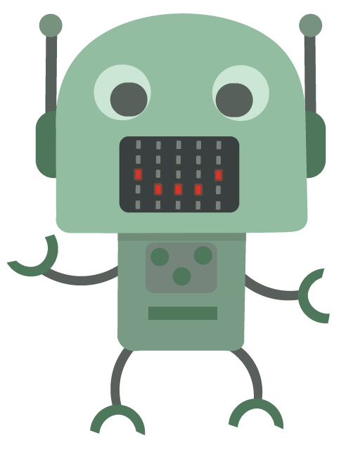
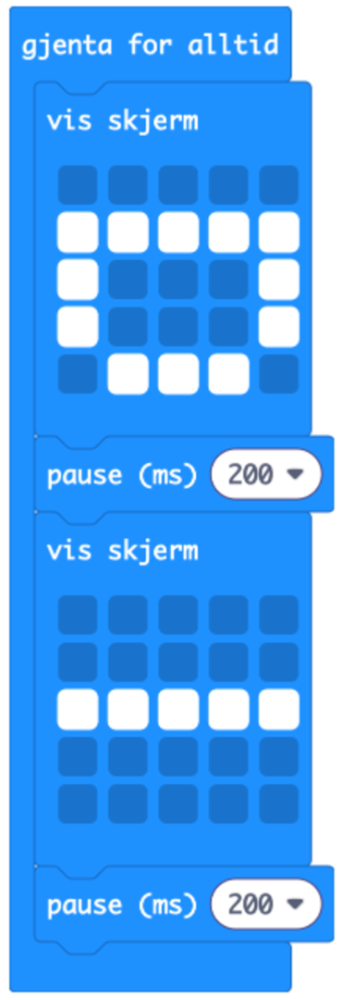

# Introduksjon {.intro}
  
I denne oppgaven skal vi lage en robot i papir eller kartong og koble den opp mot en Micro:bit’en for å få den til å snakke!
Figuren du skal lage er en robot, og kan se ut akkurat slik du vil. Du kan lage en klassisk robot, eller kanskje den ser ut som en ball? Eller en person? Her setter kun fantasien grenser!

Micro:bit'en har et panel med LED-pærer på fronten, og disse skal vi programmere til å lyse og blinke og fungere som robotens munn.

Figuren trenger ikke være større enn ca. 15-20 cm. Der munnen er plassert skal dere lage et firkantet hull på størrelse med Micro:bit'ens LED-panel (ca. 2,5 x 3 cm).

Det kan være lurt at læreren klipper ut / skjærer ut hullet for de yngre barna.

**Utstyret dere trenger:**

-[ ] 1 BBC Micro:bit med USB-kabel og batteripakke per elev/per gruppe
- [ ] Papir / kartong / filt til robotens kropp
- [ ] Fargeblyanter eller tusjer
- [ ] Teip
- [ ] Saks
- [ ] Øvrig hobby-materialer som f.eks:
- [ ]  Klistermerker
- [ ] Rulleøyne
- [ ] Glitter
- [ ] Piperensere
- [ ] Det kan være lurt at lærer har en tapetkniv for å skjære ut hull til Micro:bit

# Steg 1: Lag en munn på Micro:bit'en {.activity}

Nå skal vi skrive den første algoritmen som får LED-pærene til å blinke.

- [ ] Vi starter med å finne frem en Micro:bit og starte et nytt prosjekt på [https://makecode.microbit.org/](https://makecode.microbit.org/)

- [ ] Som standard ligger det to blå blokker klare til bruk; Ved start og en Gjenta for alltid-løkke. Ved start-blokka kan du fjerne ved å dra den til verktøykassa midt på skjermen.

- [ ] Gå til Basis og finn vis skjerm-klossen. Legg den inni gjenta for alltid. Nå bruker du rutene inni vis skjerm-klossen til å tegne en åpen munn. Den kan enten se ut som en smilende D-formet munn, eller en åpen O-formet munn.
- [ ] Simulatoren til venstre skal nå vise en åpen munn.

**Nå skal vi få munnen til roboten til å åpne og lukke seg!** 
- [ ] Det vi gjør nå er å hente en Vis skjerm-kloss til. Den legges under "åpen munn"-klossen, og du skal nå lage en lukket munn i rutene. Den kan enten se ut som en rett strek, eller en smilende munn.

Koden din burde nå se slik ut:

## Test prosjektet {.flag}

**Klikk på det grønne flagget.** / **Start prosjektet for å teste koden så
langt.**

Start prosjektet for å teste koden så langt.
Kan du se at munnen beveger seg? Det skjer ganske fort, for bildet vises og endres så raskt som programmet klarer.

# Steg 2: Endre hvor raskt roboten åpner og lukker munnen. {.activity}

For å kontrollere hvor raskt roboten skal snakke, legger vi inn pauser.
Du finner `pause`{.microbitbasic}-klossen i `Basis`{.microbitbasic}. Legg til to `pause`{.microbitbasic}-klosser i koden din, og sett (ms) til 200. 

**Koden din burde nå se slik ut:**

**Last ned koden til Micro:bit**

Nå er programmet klart til å lastes ned på Micro:bit'en. For å laste ned koden må du først ha koblet Micro:bit’en til datamaskinen med en USB-kabel, eller til iPaden med bluetooth. 

Klikk deretter på "Connect device" og "Last ned" nede til venstre på skjermen. Nå vil koden lastes ned til Micro:bit’en automatisk.

Dersom koden ikke havner på Micro:bit’en, kan du finne koden i nedlastings-mappen og dra filen over på MICROBIT-disken på datamaskinen.

# Steg 3: Monter din robot! {.activity}
 

**Nå skal vi sette sammen roboten!**
Micro:bit'en kan enkelt festes til baksiden av roboten med teip. Du kan også teipe fast batteripakken til Micro:biten til baksiden av roboten. Du har nå en robot som beveger munnen sin opp og igjen!

## Utfordring {.challenge} 
- [ ] Bruk iPaden eller PC'en din til å spille av en beskjed fra roboten. Bruk en av appene eller programmene dine til å gjøre et opptak av stemmen din. 

- [ ] Kan du justere koden slik at munnen beveger seg i samme tempo som du snakker i klippet?

- [ ] Legg til flere ansiktsuttrykk hos roboten din! Kanskje den skal ha en sur munn innimellom? Eller en sjokkert munn? Her kan du være kreativ!

