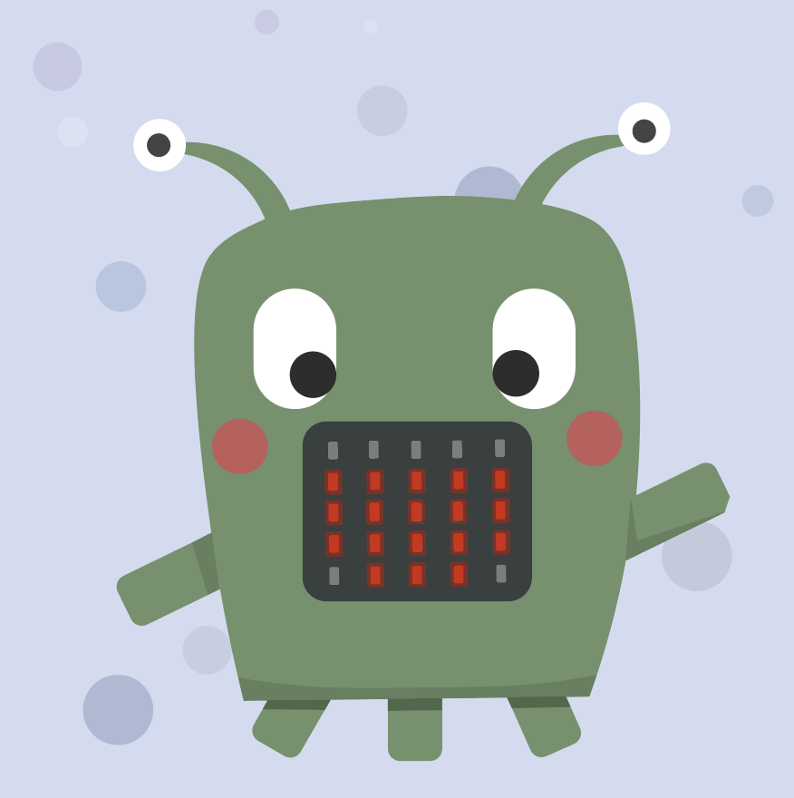
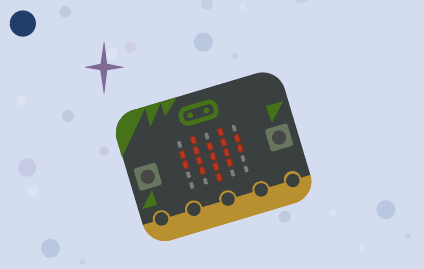

# Om oppgaven {.activity}

I denne oppgaven skal elevene lage et romvesen i papir eller kartong og koble den opp mot en Micro:bit for å få den til å snakke!

Figuren du skal lage er et romvesen, og kan se ut akkurat slik du vil. Du kan lage et klassisk alien, eller kanskje den ser ut som en sky? Eller en mark? Her setter kun fantasien grenser!

Micro:bit'en har et panel med LED-pærer på fronten, og disse skal vi programmere til å lyse og blinke og fungere som romvesenets munn.

Figuren trenger ikke være større enn ca 15-20 cm. Der munnen er plassert skal dere lage et firkantet hull på størrelse med Micro:bit'ens LED-panel (ca 2,5 x 3 cm).


Det kan være lurt at du som lærer klipper ut / skjærer ut hullet for elevene. Dette kan også gjøres i forkant.


## Oppgaven passer til: {.check}

 **Fag**: Kunst og Håndverk, Teknologi, Programmering

**Anbefalte trinn**: 1.-4. klasse

**Tema**: Animasjon, Elektronikk, Blokkbasert

**Tidsbruk**: 1 time

## Kompetansemål {.challenge}

Læringsmålene dekker kompetansemål innen kunst og håndverk og matematikk:

- Designe og lage et fysisk produkt av papir / kartong som kan utformes etter eget ønske og Micro:bit

- Utforske mulighetene som ligger i programmerbar elektronikk.

- Lage og utforske enkle algoritmer.


**Relevante kompetansemål:**
4. trinn:
- Naturfag:
utforske teknologiske systemer som er satt sammen av ulike deler, og beskrive hvordan delene fungerer og virker sammen
- K&H:
prøve ut ulike ideer og muligheter i gjenbruksmaterialer og formidle til andre hvordan man i egen hverdag kan bidra til å ivareta natur og miljø
gjennomføre kunst- og designprosesser ved å søke inspirasjon, utforske muligheter, gjøre valg og lage egne produkter


- Matte:
lage algoritmer og uttrykke de ved bruk av variabler, vilkår og løkker.


## Forslag til læringsmål {.challenge}

- [ ] Bruke håndverktøy og sammenføyningsteknikker i tre, leire og tekstil på en miljøbevisst og trygg måte
- [ ] Digitale ferdigheter i kunst og håndverk innebærer å kunne bruke digitale verktøy og medier til inspirasjon, utprøving, dokumentasjon og presentasjon. Det innebærer også å bruke digitale verktøy og programmering i kreative og skapende prosesser. Kjennskap til regler om opphavsrett og personvern når man bruker egne eller andres bilder, filmer og skapende arbeid, er vesentlig på alle trinn. Utviklingen av digitale ferdigheter i kunst og håndverk går fra å bruke enkle digitale verktøy og medier, til å forme egne digitale produkter som skaper opplevelser og kommuniserer følelser, ideer og meninger.


## Forslag til vurderingskriterier {.challenge}

Det er mange ulike måter man kan vurdere et programmeringsprosjekt, og her må en
selv vurdere hva som er den beste måten ut ifra hvilket fag man jobber i,
hvilken aldergruppe og hviklet nivå elevene er på, hva man ønsker å teste og
hvor mye tid man har til rådighet til å jobbe med prosjektet. I vårt
[lærerdokument](https://github.com/kodeklubben/oppgaver/wiki/Hvordan-undervise-i-og-vurdere-programmering){target=_blank} har vi blant
annet beskrevet ulike måter dette kan gjøres på, tillegg til en del andre
nyttige tips til hvordan man underviser i programmering.

## Forutsetninger og utstyr {.challenge}

- [ ] **Forutsetninger**: Ingen forutsetninger. 


**Utstyr**:
Nødvendig utstyr:
- [ ] 1 BBC Micro:bit med USB-kabel og batteripakke
- [ ] Papir / kartong / filt til romvesenets kropp
- [ ] Fargeblyanter eller tusjer
- [ ] Teip
- [ ] Saks
- [ ] **Øvrig hobby-materialer som f.eks:**
  - [ ] Klistermerker
  - [ ] Rulleøyne
  - [ ] Glitter
  - [ ] Piperensere
 - [ ] Det kan være lurt at lærer har en tapetkniv for å skjære ut hull til micro:biten


## Fremgangsmåte

# Steg 1:  Lag en munn på Micro:bit! {.activity}

Nå skal vi skrive den første algoritmen som får LED-pærene til å blinke.

## Sjekkliste {.check}

- [ ]  Vi starter med å finne frem en Micro:bit og starte et nytt prosjekt på https://makecode.microbit.org/



- [ ] Som standard ligger det to blå blokker klare til bruk; `Ved start`{.microbitbasic} og en `Gjenta for alltid`{.microbitbasic}-løkke. `Ved start`{.microbitbasic}-blokka kan du fjerne ved å dra den til verktøykassa midt på skjermen.  

- [ ]  Gå til `Basis`{.microbitbasic} og finn `vis skjerm`{.microbitbasic}-klossen. Legg den inni `gjenta for alltid`{.microbitbasic}. Nå bruker du rutene inni vis skjerm-klossen til å tegne en åpen munn. Den kan enten se ut som en smilende D-formet munn, eller en åpen O-formet munn.

Simulatoren til venstre skal nå vise en åpen munn.

- [ ]  Nå skal vi få munnen til romvesenet til å åpne og lukke seg! Det vi gjør nå er å hente en `Vis skjerm`{.microbitbasic}-kloss til. Den legges under "åpen munn"-klossen, og du skal nå lage en lukket munn i rutene. Den kan enten se ut som en rett strek, eller en smilende munn.

Koden din burde nå se slik ut:
```microbit
basic.forever(function () {
    basic.showLeds(`
        . . . . .
        # # # # #
        # . . . #
        # . . . #
        . # # # .
        `)
    basic.showLeds(`
        . . . . .
        . . . . .
        # # # # #
        . . . . .
        . . . . .
        `)
})

```


## Test prosjektet {.flag}

 **Start prosjektet for å teste koden så
langt.**

- [ ] Kan du se at munnen beveger seg? Det skjer ganske fort, for bildet vises og slettes så raskt som programmet klarer.


# Steg 2: Endre hvor raskt romvesenet åpner og lukker munnen. {.activity}

For å kontrollere hvor raskt romvesenet skal snakke, legger vi inn pauser.

- [ ] Du finner `pause`{.microbitbasic}-klossen i `Basis`{.microbitbasic}. Legg til to `pause`{.microbitbasic}-klosser i koden din, og sett (ms) til 200
Koden din burde nå se slik ut:

```microbit
basic.forever(function () {
    basic.showLeds(`
        . . . . .
        # # # # #
        # . . . #
        # . . . #
        . # # # .
        `)
    basic.pause(200)
    basic.showLeds(`
        . . . . .
        . . . . .
        # # # # #
        . . . . .
        . . . . .
        `)
    basic.pause(200)
})

```

## Last ned koden til Micro:bit {.flag}

Nå er programmet klart til å lastes ned på micro:bit'en. 
For å laste ned koden må du først ha koblet micro:biten til datamaskinen med en USB-kabel, eller til iPaden med bluetooth. Klikk deretter på **Connect device**, og **Last ned** nede til vestre på skjermen. Nå vil koden lastes ned til micro:biten automatisk.

Dersom koden ikke havner på micro:biten kan du finne koden i **nedlastings-mappen** og dra filen over på **MICROBIT-disken** på datamaskinen. 


# Steg 3:  Monter ditt romvesen!
Nå skal vi sette sammen romvesenet!

Micro:bit'en kan enkelt festes til baksiden av romvesenet med teip. Du kan også teipe fast batteripakken til Micro:biten til baksiden av romvesenet.
Du har nå et romvesen som beveger munnen sin opp og igjen! 

## Utfordring {.challenge}

Bruk iPaden eller PC'en din til å spille av en beskjed fra romvesenet. Bruk en av appene eller programmene dine til å gjøre et opptak av stemmen din. Kan du justere koden til at munnen beveger seg i samme tempo som du snakker i klippet?

Legg til flere ansiktsuttrykk hos romvesenet ditt! Kanskje den skal ha en sur munn innimellom? Eller en sjokkert munn? Her kan du være kreativ! 

