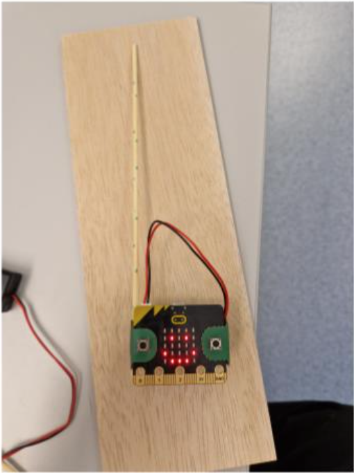

Denne oppgaven er utviklet av ESERO Norway for Lær Kidsa Koding. 

[ESERO Norway](https://www.esero.no/){:target=_blank} er et program som Andøya Space Education drifter på vegne av den europeiske romorganisasjonen ESA, for å tilby spennende og relevant etterutdanning, romfartsbaserte skoleaktiviteter og skoleprosjekter for både elever og lærere.

Stor takk til Truls og ESERO Norway for deres bidrag til Kodetimen 2023! 

# Bakgrunnsteori {.activity}


Vi benytter oss av jordens magnetfelt når vi navigerer med kompass. Kompassnålen dreier seg rundt slik at den peker mot nord og dermed kan vi sørge for at vi beveger oss i en rett linje. Magnetfelt har altså en retning. Jordens magnetfelt har også en styrke, mer konkret mellom 25 og 65 μT (mikrotesla). Dette er ganske svakt sammenlignet med feltet like utenfor en typisk kjøleskapsmagnet, som ligger på omkring 10 000–60 000 μT (dvs. ca. 0,01–0,06 T; tesla er en ganske «stor» måleenhet sammenlignet med størrelsene vi omgir oss med i dagliglivet).

Fysiske størrelser med både retning og styrke (eller mer presist måltall) kalles for vektorer, og jordens magnetfelt er derfor en vektor. Retningen er imidlertid ikke den man skulle tro etter å ha studert vanlige kompassnåler. På våre breddegrader peker faktisk jordmagnetfeltet mer nedover, inn i jorden, enn det peker nordover! Orienteringskompasser har derfor vanligvis ekstra vekt på kompassnålen som balanserer den vertikale kraften fra magnetfeltet. Dette gjør at orienteringskompass laget for den nordlige halvkule ikke er særlig velegnet i Australia eller andre steder sør for ekvator, hvor magnetfeltet peker opp fra bakken (og mot nord) i stedet for nedover. Skipskompass løser dette problemet annerledes, slik at de fungerer nesten like bra overalt på jorden (bortsett fra rett ved de magnetiske polene).

Retning til magnetfeltet er definert etter hvordan små kompassnåler vil peke når de utsettes for feltet. Positiv retning er der nordpilen peker mot, og magnetfelt går derfor fra magnetisk nord til magnetisk sør. Dette betyr også, forvirrende nok, at «magnetisk nord» egentlig er en magnetisk sørpol!

Jordens magnetfelt skyldes først og fremst strømninger av flytende jern i jordens indre. Disse endrer seg sakte, på en skala av hundretusener av år. Gjennom jordens historie har slike endringer ført til at magnetisk nord- og sørpol har byttet plass flere ganger. Men i løpet av en dag eller en uke er endringene alt for små til at vi merker det i hverdagen.

Likevel kan følsomme magnetfeltmålere, kalt magnetometre, registrere svake endringer i jordmagnetfeltet som skjer i løpet av sekunder og minutter. Disse endringene skyldes ikke forhold i jordens indre, men skriver seg i stedet fra et tilleggsmagnetfelt skapt av elektriske strømmer i atmosfæren. (Vi har også magnetfelt som skyldes menneskelig aktivitet, for eksempel trikk, T-bane, jernbane, el-biler, fossilbiler, kraftledninger, varmekabler, motorer, komfyrer, osv. Vi skal ikke gå inn på disse siste magnetfelt-bidragene i denne øvelsen, men i stedet konsentrere oss om de magnetfeltene naturen selv skaper).

Fra fysikken vet vi at elektriske strømmer skaper magnetfelt. Dette oppdaget dansken Hans Christian Ørsted i 1807, og hans oppdagelse fikk elektrofysikken til å blomstre kraftig opp. I løpet av få år hadde Ampère, Biot, Savart, Faraday og flere andre gjort noen av deres viktigste oppdagelser. Senere samlet Maxwell disse erfaringene i de velkjente Maxwells lover.

## Oppgaven passer til: {.check}

 **Fag**: Matematikk, Naturfag, Programmering, Teknologi

**Anbefalte trinn**: 8.-10. klasse, Videregående Skole

**Tema**: Elektronikk

**Tidsbruk**: 1-2 timer


## Forslag til læringsmål {.challenge}

Elevene vil lære om

- Sensorer

- Jordens magnetfelt, både styrke og retning

- Menneskeskapte magnetfelt

- Sender/mottaker

## Forslag til vurderingskriterier {.challenge}

Det er mange ulike måter man kan vurdere et programmeringsprosjekt, og her må en
selv vurdere hva som er den beste måten ut ifra hvilket fag man jobber i,
hvilken aldergruppe og hviklet nivå elevene er på, hva man ønsker å teste og
hvor mye tid man har til rådighet til å jobbe med prosjektet. I vårt
[lærerdokument](https://github.com/kodeklubben/oppgaver/wiki/Hvordan-undervise-i-og-vurdere-programmering){target=_blank} har vi blant
annet beskrevet ulike måter dette kan gjøres på, tillegg til en del andre
nyttige tips til hvordan man underviser i programmering.

## Forutsetninger og utstyr {.challenge}

- [ ] **Forutsetninger**:
Har kodet mye før, og er kjent med eksempelvis trigonometri.
- [ ] **Utstyr**:
Micro:bit, PC / iPad, enkel og kort kobberledning til å lede strøm 


# Introduksjon {.intro}
  
I denne øvelsen skal vi bruke en sensor innebygd i micro:bit som kan måle magnetfelt, kalt magnetometer. Den måler styrken til magnetfelt i tre akser og vi kan bruke denne informasjonen til å bestemme retningen til jordens magnetfelt. Dette kan gjøres praktisk, ved enkel geometri eller med trigonometri. Vi ønsker å sende sensordata fra en micro:bit til en annen, både for å lagre data og for å unngå feilkilder og menneskeskapte magnetfelt som kan påvirke magnetometeret.

Vi skal bruke en stk programmert micro:bit til å utføre eksperimentet som tar målinger, og et "mottakerprogram" i Makecode på pc'en vår. 


Dere kan selv velge om dere ønsker å åpne kodene via lenkene, eller om dere ønsker å skrive koden selv. 

Innholdet i denne oppgaven er utviklet av Andøya Space Education for [ESERO Norway.](https://www.esero.no/){:target=_blank} 


# Steg 1: Programmere micro:bit til å vise magnetfeltstyrke i 3 akser {.activity}

**Program for sender:** [https://makecode.microbit.org/S98175-12145-46440-75390](https://makecode.microbit.org/S98175-12145-46440-75390){:target=_blank}

**Obs: Om du bruker micro:bit v2, må du fjerne «kalibrer kompass» i start.**
- [ ] Vi starter med å definere de tre aksene vi skal jobbe med:

 I en `gjenta for alltid`{.microbitbasic}-kloss legger dere inn følgende `radioklosser`{.microbitradio}: 
 
  - `Radio send verdi ("mx") `{.microbitradio} = `magnetfelt (µT) x`{.microbitinput}
  - `Radio send verdi ("mx") `{.microbitradio} = `magnetfelt (µT) y`{.microbitinput}
  - `Radio send verdi ("mx") `{.microbitradio} = `magnetfelt (µT) z`{.microbitinput}


- [ ] Vi skal også definere en `radiogruppe`{.microbitradio} og `kalibrere kompasset`{.microbitinput} 

Dette gjør vi gjennom å legge en `radio sett gruppe (x)`{.microbitradio}-kloss og en `kalibrer kompass`{.microbitinput}-kloss inni en `ved start`{.microbitbasic}-kloss. 

Du bør nå ha en kode for sender som ser slik ut:


```microbit
radio.setGroup(1)
input.calibrateCompass()
basic.forever(function () {
    radio.sendValue("mx", input.magneticForce(Dimension.X))
    radio.sendValue("my", input.magneticForce(Dimension.Y))
    radio.sendValue("mz", input.magneticForce(Dimension.Z))
})
```

**Program for mottaker:** [https://makecode.microbit.org/S28166-63766-99567-34707](https://makecode.microbit.org/S28166-63766-99567-34707){:target=_blank}

Nå skal vi definere hva som skjer når vi mottar informasjonen på datamaskinen. Husk å trykke på "SHOW DATA ENHET" for å kunne lese av dataen. 
- [ ] For at Makecode skal visualisere dataen micro:biten vår samler inn og sender, må vi kode hva som skjer når `radioen mottar`{.microbitradio} informasjon. 
- [ ] Koden under illustrerer `logikken`{.microbitlogic} bak `inklinasjonsverdiene`{.microbitvariables} vi samler inn:

```microbit
radio.onReceivedValue(function (name, value) {
    if (name == "mx") {
        mx = value
        serial.writeValue("mx", mx)
    } else if (name == "my") {
        my = value
        serial.writeValue("my", my)
    } else if (name == "mz") {
        mz = value
        serial.writeValue("mz", mz)
    }
})
let mz = 0
let my = 0
let mx = 0
radio.setGroup(1)

```


For å lagre data velger du «eksporter data».


# Aktivitet 2: Bestemme retningen til jordens magnetfelt {.activity}

**I sanntid**

For å kunne vise retningen til jordens magnetfelt, altså hvilken retning magnetisk nord er, kan vi posisjonere micro:bit’en sånn at vi kun måler feltstyrke i en av aksene. Det vil si at magnetfeltet ligger parallelt med aksen vi måler en verdi.

Vi kan gjøre det litt lettere hvis vi fester en pinne langs en av aksene. På bildet har jeg valgt å peke langs y-aksen til magnetometeret. Vi kan også legge til en visuell bekreftelse som indikerer hvor nærme man er å peke langs magnetfeltet.

**Program sender:** [https://makecode.microbit.org/S89067-75635-13371-88070](https://makecode.microbit.org/S89067-75635-13371-88070){:target=_blank}

- [ ] Nå skal vi utvide koden til senderen til å inkludere `visuelle bekreftelser`{.microbitbasic} på dataen vi leser av med micro:biten. Dette gjør vi gjennom `logikk-klosser`{.microbitlogic}, `matematikk-klosser`{.microbitmath} og `magnetfelt inndataklosser`{.microbitinput}.

```microbit
radio.setGroup(1)
input.calibrateCompass()
basic.forever(function () {
    radio.sendValue("mx", input.magneticForce(Dimension.X))
    radio.sendValue("my", input.magneticForce(Dimension.Y))
    radio.sendValue("mz", input.magneticForce(Dimension.Z))
    if (input.magneticForce(Dimension.Y) > 0 && (Math.abs(input.magneticForce(Dimension.X)) < 1 && Math.abs(input.magneticForce(Dimension.Z)) < 1)) {
        basic.showLeds(`
            . # # # .
            # . . . #
            # . # . #
            # . . . #
            . # # # .
            `)
    } else if (input.magneticForce(Dimension.Y) > 0 && (Math.abs(input.magneticForce(Dimension.X)) < 3 && Math.abs(input.magneticForce(Dimension.Z)) < 3)) {
        basic.showLeds(`
            . . . . .
            . . . . .
            . . # . .
            . . . . .
            . . . . .
            `)
    } else if (input.magneticForce(Dimension.Y) > 0 && (Math.abs(input.magneticForce(Dimension.X)) < 6 && Math.abs(input.magneticForce(Dimension.Z)) < 6)) {
        basic.showLeds(`
            . . . . .
            . # . # .
            . . # . .
            . # . # .
            . . . . .
            `)
    } else if (input.magneticForce(Dimension.Y) > 0 && (Math.abs(input.magneticForce(Dimension.X)) < 10 && Math.abs(input.magneticForce(Dimension.Z)) < 10)) {
        basic.showIcon(IconNames.No)
    } else if (input.magneticForce(Dimension.Y) > 0 && (Math.abs(input.magneticForce(Dimension.X)) < input.magneticForce(Dimension.Strength) && Math.abs(input.magneticForce(Dimension.Z)) < input.magneticForce(Dimension.Strength))) {
        basic.showIcon(IconNames.Happy)
    } else if (input.magneticForce(Dimension.Y) < 0) {
        basic.showIcon(IconNames.Sad)
    }
})
```

**Program for mottaker endres ikke: (** [https://makecode.microbit.org/S28166-63766-99567-34707](https://makecode.microbit.org/S28166-63766-99567-34707){:target=_blank} )


**Obs: Det er viktig å kalibrere magnetometeret en plass der det er lite forstyrrelser.**


# **Ved hjelp av tegning og måling** {.intro}


Legg micro:bit’en flatt (parallelt med bakken) en plass lengst mulig unna metallgjenstander og elektriske kabler. Forsøk å orientere den slik at du kun måler en feltstyrke i y-aksen og z-aksen, det vil si så nær null som mulig i x-aksen.

Du vil få en måleverdi i y-aksen, det er hvor sterkt magnetfeltet er i horisontalplanet, noter denne. Du vil også få en måleverdi i z-aksen, det er styrken til magnetfeltet i vertikalplanet, noter denne. Disse to verdiene kan du bruke til å tegne de to katetene i en rettvinklet trekant, eventuelt som en formlik trekant. Tegn opp hypotenus og mål vinkelen mellom denne og y-aksen. Dette er den magnetiske inklinasjonen.

- [ ] Stemmer resultatet med målingen i forrige oppgave?


##  Utfordring: bruk trigonometri {.challenge}


- [ ] Kan du  også finne den magnetiske inklinasjonen ved hjelp av trigonometri? {.challenge}


# Aktivitet 3: Ørsteds eksperiment {.activity}

I denne øvelsen skal vi gjenta Ørsteds eksperiment og demonstrere at elektriske strømmer skaper magnetfelt.
**Her trenger dere en liten kobberledning for å gjennomføre eksperimentet.** 

- [ ] Plasser micro:bit’en på en horisontal flate et godt stykke vekk fra metallgjenstander. Hold ledningen horisontalt like over micro:bit’en. Sørg for at krumningene i ledningen er lengst mulig unna kompassnålen.

- [ ] Hold ledningsendene kortvarig inntil polene på et enkelt 9 V-batteri kortvarig samtidig som du observerer om magnetometeret slår ut eller ikke. (Husk at du kortslutter batteriet, så hold ikke koblingen mellom ledning og batteri lenger enn nødvendig).

- [ ] Har du tilgang til et kompass kan du forsøke å gjøre samme øvelsen og se om du får et utslag på kompassnålen.

## Forslag til etterarbeid {.challenge}


- [ ] **Undersøke endringer i magnetfeltet i nærområdet.**

Etter å ha funnet retningen til jordens magnetfelt kan du forsøke å måle magnetfeltet under høyspentmast, nær elektriske installasjoner eller nær ferromagnetiske materialer. Hva finner du?

- [ ] **Måle nordlyset**

Om du bor en plass der det er nordlysaktivitet kan du sette opp micro:bit’en din for å undersøke hva som skjer med jordens magnetfelt når det er mye nordlys. Sett opp sender og mottaker og samle data gjennom en hel natt.

Endret magnetfeltet seg i løpet av natten?

## Ordliste{.protip}


**Ferromagnetiske materialer:** materialer fremviser en spontan magnetisering under bestemte forhold, blant annet jern (Fe), Kobolt (Co) og nikkel (Ni).

**Magnetfelt:** kraftfelt rundt en magnet, magnetisk gjenstand, elektrisk leder eller elektrisk ladning i bevegelse.

**Sensor:** et instrument som sender et signal som en reaksjon på en nærmere bestemt fysisk påvirkning fra omgivelsene.

**SI-enhet:** internasjonalt enhetssystem for måling av fysiske størrelser.

**Tesla:** SI-enhet for styrken til et magnetfelt.

#

# Bilder: {.intro}


Micro:bit er sur når du peker motsatt vei av magnetfeltet.


Glad når du peker ned


(X) når du nærmer deg


(x) når du er veldig nær


( . ) når du er nesten parallell 


Bullseye når du holder den parallelt med jordens magnetfelt. 


Da er det bare å måle vinkelen mellom jordens magnetfelt og bakken!

