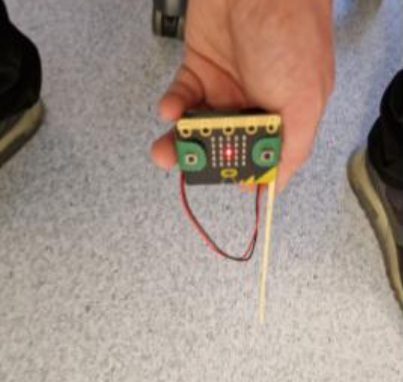

# Introduksjon {.intro}
  
I denne øvelsen skal vi bruke en sensor innebygd i micro:bit som kan måle magnetfelt, kalt magnetometer. Den måler styrken til magnetfelt i tre akser og vi kan bruke denne informasjonen til å bestemme retningen til jordens magnetfelt. Dette kan gjøres praktisk, ved enkel geometri eller med trigonometri. Vi ønsker å sende sensordata fra en micro:bit til en annen, både for å lagre data og for å unngå feilkilder og menneskeskapte magnetfelt som kan påvirke magnetometeret.

Vi skal bruke en stk programmert micro:bit til å utføre eksperimentet som tar målinger, og et "mottakerprogram" i Makecode på pc'en vår. 


Dere kan selv velge om dere ønsker å åpne kodene via lenkene, eller om dere ønsker å skrive koden selv. 

Innholdet i denne oppgaven er utviklet av Andøya Space Education for [ESERO Norway.](https://www.esero.no/){:target=_blank} 


# Steg 1: Programmere micro:bit til å vise magnetfeltstyrke i 3 akser {.activity}

**Program for sender:** [https://makecode.microbit.org/S98175-12145-46440-75390](https://makecode.microbit.org/S98175-12145-46440-75390){:target=_blank}

**Obs: Om du bruker micro:bit v2, må du fjerne «kalibrer kompass» i start.**
- [ ] Vi starter med å definere de tre aksene vi skal jobbe med:

 I en `gjenta for alltid`{.microbitbasic}-kloss legger dere inn følgende `radioklosser`{.microbitradio}: 
 
  - `Radio send verdi ("mx") `{.microbitradio} = `magnetfelt (µT) x`{.microbitinput}
  - `Radio send verdi ("mx") `{.microbitradio} = `magnetfelt (µT) y`{.microbitinput}
  - `Radio send verdi ("mx") `{.microbitradio} = `magnetfelt (µT) z`{.microbitinput}


- [ ] Vi skal også definere en `radiogruppe`{.microbitradio} og `kalibrere kompasset`{.microbitinput} 

Dette gjør vi gjennom å legge en `radio sett gruppe (x)`{.microbitradio}-kloss og en `kalibrer kompass`{.microbitinput}-kloss inni en `ved start`{.microbitbasic}-kloss. 

Du bør nå ha en kode for sender som ser slik ut:


```microbit
radio.setGroup(1)
input.calibrateCompass()
basic.forever(function () {
    radio.sendValue("mx", input.magneticForce(Dimension.X))
    radio.sendValue("my", input.magneticForce(Dimension.Y))
    radio.sendValue("mz", input.magneticForce(Dimension.Z))
})
```

**Program for mottaker:** [https://makecode.microbit.org/S28166-63766-99567-34707](https://makecode.microbit.org/S28166-63766-99567-34707){:target=_blank}

Nå skal vi definere hva som skjer når vi mottar informasjonen på datamaskinen. Husk å trykke på "SHOW DATA ENHET" for å kunne lese av dataen. 
- [ ] For at Makecode skal visualisere dataen micro:biten vår samler inn og sender, må vi kode hva som skjer når `radioen mottar`{.microbitradio} informasjon. 
- [ ] Koden under illustrerer `logikken`{.microbitlogic} bak `inklinasjonsverdiene`{.microbitvariables} vi samler inn:

```microbit
radio.onReceivedValue(function (name, value) {
    if (name == "mx") {
        mx = value
        serial.writeValue("mx", mx)
    } else if (name == "my") {
        my = value
        serial.writeValue("my", my)
    } else if (name == "mz") {
        mz = value
        serial.writeValue("mz", mz)
    }
})
let mz = 0
let my = 0
let mx = 0
radio.setGroup(1)

```


For å lagre data velger du «eksporter data».


# Aktivitet 2: Bestemme retningen til jordens magnetfelt {.activity}

**I sanntid**

For å kunne vise retningen til jordens magnetfelt, altså hvilken retning magnetisk nord er, kan vi posisjonere micro:bit’en sånn at vi kun måler feltstyrke i en av aksene. Det vil si at magnetfeltet ligger parallelt med aksen vi måler en verdi.

Vi kan gjøre det litt lettere hvis vi fester en pinne langs en av aksene. På bildet har jeg valgt å peke langs y-aksen til magnetometeret. Vi kan også legge til en visuell bekreftelse som indikerer hvor nærme man er å peke langs magnetfeltet.


- [ ] Nå skal vi utvide koden til senderen til å inkludere `visuelle bekreftelser`{.microbitbasic} på dataen vi leser av med micro:biten. Dette gjør vi gjennom `logikk-klosser`{.microbitlogic}, `matematikk-klosser`{.microbitmath} og `magnetfelt inndataklosser`{.microbitinput}.

Denne koden er svært lang, og får ikke plass på denne siden. Dersom du ønsker å laste den ned direkte, eller bare åpne filen for å se hvordan koden ser ut, bruker du lenken under for å se koden til sender: 

**Program sender:** [https://makecode.microbit.org/S89067-75635-13371-88070](https://makecode.microbit.org/S89067-75635-13371-88070){:target=_blank}


**Program for mottaker endres ikke: (** [https://makecode.microbit.org/S28166-63766-99567-34707](https://makecode.microbit.org/S28166-63766-99567-34707){:target=_blank} )


**Obs: Det er viktig å kalibrere magnetometeret en plass der det er lite forstyrrelser.**


# **Ved hjelp av tegning og måling** {.intro}


Legg micro:bit’en flatt (parallelt med bakken) en plass lengst mulig unna metallgjenstander og elektriske kabler. Forsøk å orientere den slik at du kun måler en feltstyrke i y-aksen og z-aksen, det vil si så nær null som mulig i x-aksen.

Du vil få en måleverdi i y-aksen, det er hvor sterkt magnetfeltet er i horisontalplanet, noter denne. Du vil også få en måleverdi i z-aksen, det er styrken til magnetfeltet i vertikalplanet, noter denne. Disse to verdiene kan du bruke til å tegne de to katetene i en rettvinklet trekant, eventuelt som en formlik trekant. Tegn opp hypotenus og mål vinkelen mellom denne og y-aksen. Dette er den magnetiske inklinasjonen.

- [ ] Stemmer resultatet med målingen i forrige oppgave?


##  Utfordring: bruk trigonometri {.challenge}


- [ ] Kan du  også finne den magnetiske inklinasjonen ved hjelp av trigonometri? {.challenge}


# Aktivitet 3: Ørsteds eksperiment {.activity}

I denne øvelsen skal vi gjenta Ørsteds eksperiment og demonstrere at elektriske strømmer skaper magnetfelt.
**Her trenger dere en liten kobberledning for å gjennomføre eksperimentet.** 

- [ ] Plasser micro:bit’en på en horisontal flate et godt stykke vekk fra metallgjenstander. Hold ledningen horisontalt like over micro:bit’en. Sørg for at krumningene i ledningen er lengst mulig unna kompassnålen.

- [ ] Hold ledningsendene kortvarig inntil polene på et enkelt 9 V-batteri kortvarig samtidig som du observerer om magnetometeret slår ut eller ikke. (Husk at du kortslutter batteriet, så hold ikke koblingen mellom ledning og batteri lenger enn nødvendig).

- [ ] Har du tilgang til et kompass kan du forsøke å gjøre samme øvelsen og se om du får et utslag på kompassnålen.

## Forslag til etterarbeid {.challenge}


- [ ] **Undersøke endringer i magnetfeltet i nærområdet.**

Etter å ha funnet retningen til jordens magnetfelt kan du forsøke å måle magnetfeltet under høyspentmast, nær elektriske installasjoner eller nær ferromagnetiske materialer. Hva finner du?

- [ ] **Måle nordlyset**

Om du bor en plass der det er nordlysaktivitet kan du sette opp micro:bit’en din for å undersøke hva som skjer med jordens magnetfelt når det er mye nordlys. Sett opp sender og mottaker og samle data gjennom en hel natt.

Endret magnetfeltet seg i løpet av natten?

## Ordliste{.protip}


**Ferromagnetiske materialer:** materialer fremviser en spontan magnetisering under bestemte forhold, blant annet jern (Fe), Kobolt (Co) og nikkel (Ni).

**Magnetfelt:** kraftfelt rundt en magnet, magnetisk gjenstand, elektrisk leder eller elektrisk ladning i bevegelse.

**Sensor:** et instrument som sender et signal som en reaksjon på en nærmere bestemt fysisk påvirkning fra omgivelsene.

**SI-enhet:** internasjonalt enhetssystem for måling av fysiske størrelser.

**Tesla:** SI-enhet for styrken til et magnetfelt.

#


# Bilder: {.intro}


Micro:bit er sur når du peker motsatt vei av magnetfeltet.


Glad når du peker ned


(X) når du nærmer deg


(x) når du er veldig nær


( . ) når du er nesten parallell 


Bullseye når du holder den parallelt med jordens magnetfelt. 


Da er det bare å måle vinkelen mellom jordens magnetfelt og bakken!


