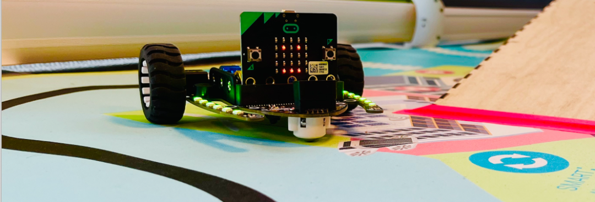
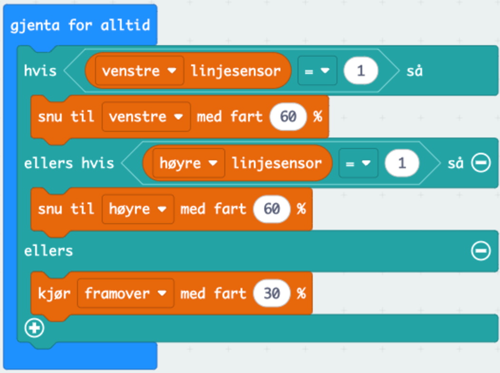
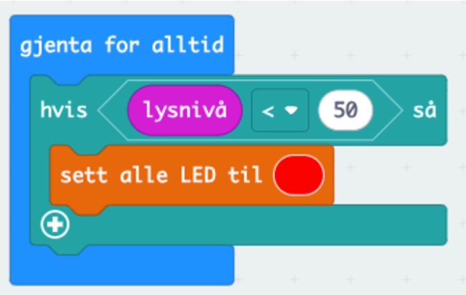

 
# Introduksjon {.intro}
  
**Mål:** Elevene skal lære hvordan roboter kan bruke sensorer og enkel programmering for å navigere i omgivelsene. Oppgaven gir også innblikk i hvordan roboter kan oppdage hindringer og navigere selvkjørende.

# Utstyr dere trenger {.activity}

- [ ] 1 Bit:Bot per elev eller gruppe 
- [ ] 2 Micro:bit per elev eller gruppe 
- [ ] 1 batteripakke per elev eller gruppe 
- [ ] Programmeringsmiljø: [MakeCode](https://makecode.microbit.org/)
- [ ] Teip, sprittusj eller annet utstyr til å lage en "bane" for robotene

# Steg 1: Introduksjon til roboter og Bit:bot {.activity}

Roboter kan utføre oppgaver selvkjørende ved hjelp av sensorer og programmering. Sensorer gir roboten informasjon om omgivelsene, mens programmering bestemmer hvordan roboten skal reagere på denne informasjonen. For eksempel kan roboter bruke ulike sensorer og motorer som kan kombineres for å navigere og utføre oppgaver autonomt. (Autonomt betyr selvstyrende!) 

BitBot er en liten, programmerbar robot som bruker en micro:bit-mikrokontroller for styring. Ved å programmere micro:bit, kan BitBot instrueres til å følge linjer på bakken ved hjelp av innebygde linjesensorer. Disse sensorene registrerer kontraster mellom lys og mørk overflate og gjør det mulig for BitBot å holde seg på en bestemt sti. BitBot har også en ultralydsensor som kan måle avstanden til objekter foran seg. Dette gjør det mulig å programmere den til å stoppe, svinge, eller velge en annen vei når den møter hindringer. Programmeringen kan gjøres med enkle blokkbaserte verktøy som MakeCode, som gjør roboten lett å bruke for nybegynnere.

# Steg 2: Planlegg hva bit:boten skal gjøre {.activity}

- [ ] Diskuter og planlegg hvordan Bit:Bot-en skal navigere. Den kan f.eks. kjøre en bane, stoppe ved hindringer eller følge en linje.

- [ ] Elevene kan lage en enkel plan for hvordan roboten skal bevege seg på banen (f.eks. "kjør fremover til du ser en hindring, stopp, og ta til venstre").
- [ ] Bruk gjerne materialer til å gjøre bit:botene personlige! Kanskje du kan bruke noen gamle melkekartonger til å gjøre de til faktiske roboter med hjul? 

# Steg 3: Programmering av bit:boten {.activity}
# Eksempler på mulige funksjoner: {.intro}

**A) Følge en linje**

Lag en bane med svart teip eller svart tusj på et lyst underlag som BitBot-en kan følge.
Bruk linjesensorene på BitBot til å få roboten til å oppdage og følge linjen automatisk.

**Kodeblokk:**
Nå ønsker vi at roboten skal følge linjen vi har laget. Derfor finner vi frem en `Gjenta for alltid`{.microbitbasic}-kloss. Deretter henter vi frem en `Hvis - Ellers`{.microbitlogic}-kloss som skal styre hva servoene i hjulene skal gjøre, avhengig av hva linjesensoren plukker opp. Deretter finner vi frem blokker for `venstre linjesensor`{.microbitarrays} og `høyre linjesensor`{.microbitarrays}.

- [ ] Lag en løkke der Bit:Bot fortsetter å kjøre fremover så lenge den er på linjen.

**Denne koden vil se slik ut:**

## Test prosjektet {.flag}

Last ned koden til Micro:biten og sett Micro:biten i Bit:boten for å teste om linjesensorene fungerer!

**B) Hindringsunngåelse**

Denne koden gjør at Bit:boten kjører unna ulike hinder som plasseres utover på banen ved hjelp av ultralydsensoren. 

- [ ] Sett opp en `Gjenta for alltid`{.microbitbasic}-løkke der målet er at roboten kjører fremover.
- [ ] Legg til en `Hvis - Ellers`{.microbitlogic}-blokk som sjekker avstanden til hindringer.
- [ ] Hvis roboten oppdager en hindring, kan den stoppe, rygge, og svinge til siden før den kjører videre.

**Denne koden vil se slik ut:**

## Test prosjektet {.flag}

Last ned koden til Micro:biten og sett Micro:biten i Bit:boten for å teste om ultralydsensoren fungerer!

**C) Lysrespons**

Få Bit:Bot til å lyse opp LED-lysene hvis det blir mørkt!

Bruk `Hvis - så`{.microbitlogic}-klosser, `Inndata`{.microbitinput}-klosser og `lysblokker`{.microbitarrays} i MakeCode for å programmere lysene. Her kan dere selv velge hvilken farge som skal lyse!

`Hvis - så`{.microbitlogic} -klossen gir micro:bit'en beskjed om at `lysdiodene på bit:boten`{.microbitarrays} skal endre farge dersom lysnivået som måles gjennom `inndata`{.microbitinput}-klossen er under et visst nivå. Dette må dere teste selv for å finne ut av hvilket nivå dere skal putte inn, da rommet dere er i vil ha ulikt lysnivå! 

**Et eksempel på hvordan denne koden vil se ut:**

# Steg 3: Test og juster roboten {.activity}

- [ ] Elevene tester nå robotene sine på banen og observerer hvordan den reagerer på hindringer, linjer eller andre stimuli.
- [ ] Oppmuntre elevene til å gjøre justeringer i koden for å forbedre robotens kjøring, for eksempel ved å justere avstandssensorens følsomhet eller endre bevegelsesmønsteret ved hindringer.

## Utfordring {.challenge}
- [ ] Sett opp ulike kjøringsfunksjoner ved å bruke A og B-knappene på micro:biten

- [ ] Bruk en ekstra micro:bit til å lage en fjernkontroll som kontrollerer bit:boten! Husk at hver bit:bot trenger sin egen radiokanal for å kommunisere med micro:bit-fjernkontrollen. 

# 5. Utvidelsesoppgaver (valgfritt) {.activity}

- [ ]  Lag en hinderløype: Opprett en hinderløype med flere svinger, hindringer, og linjer for BitBot-en å navigere gjennom.
- [ ] Robotkappløp: Lag en konkurranse der robotene skal fullføre en bane så raskt som mulig uten å treffe hindringer.
- [ ] Programmer "personlighet": Elevene kan programmere robotene til å reagere med lys- og lydsignaler, slik at de får en "personlighet" når de møter hindringer eller fullfører banen.

