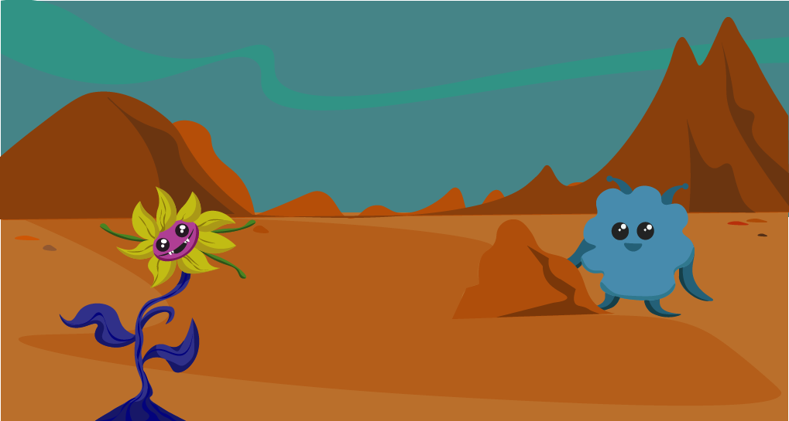
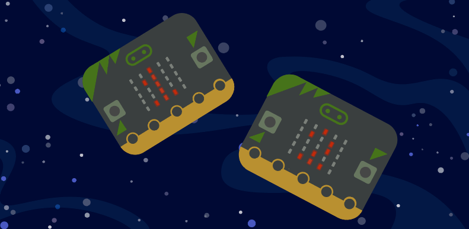

  
# Introduksjon {.intro}
  
Vel møtt, modige romfarere! Jeg heter Kodar, og velkommen til min planet; Timenor! 

Som gjester på min planet vil jeg at dere skal utforske hvilket liv som finnes her. I dette oppdraget skal dere bruke Micro:bit til å sende signaler til basen, for å loggføre funnene på Timenor!


Denne oppgaven utføres som grupper (eller et rommannskap om du vil). Lærer vil ha rollen som kaptein for romstasjonen, og være ansvarlig for å motta informasjon på hvert rommannskaps romstasjon-Micro:bit. 

Kanskje dere gjør oppdraget til en konkurranse, der det er om å gjøre å finne så mange fremmede vesen og planter som mulig? 


# Steg 1: Forberedelser {.activity}

- [ ] Klassen tegner ulike vesen og mystiske planter. 
- [ ] Disse klipper dere ut og leverer de ulike figurene til læreren.
- [ ]  Læreren gjemmer figurene rundt om i klasserommet - **klasserommet har nå blitt forvandlet til Kodars planet Timenor!**


Nødvendig utstyr:

- [ ] 2 micro:bit per rommannskap
- [ ] 2 batteripakker per rommanskap
- [ ] Papir / kartong - kanskje forskjellige farger?
- [ ] Fargeblyanter / tusjer
- [ ] Teip / lim
- [ ] Sakser
- [ ] Klistremerker?
- [ ] Glitter?
- [ ] Lærertyggis for å henge opp kreasjonene




# Steg 2: Programmer romstasjon-micro:bit'en {.activity}

I dette steget skal vi programmere vår "romstasjon-Micro:bit".  

- [ ] Gå inn på [https://makecode.microbit.org/](https://makecode.microbit.org/){:target=_blank} og opprett et nytt prosjekt. Kall prosjektet ROMSTASJON MICRO:BIT. 

Dette er Micro:biten som skal motta informasjonen romfarerne sender. 

- [ ]  Definer to variabler: `Planter`{.microbitvariables} og `Vesen`{.microbitvariables}
- [ ] Legg til en `Ved start`{.microbitbasic} -kloss
- [ ]  Sett `radio til gruppe`{.microbitradio} (...)  - **Her er det viktig at hver elev velger seg sin egen unike radiokanal, så man ikke blander seg med de andre romfarernes oppdrag!** 

- [ ] Vi skal også sende en beskjed til romfarerne, der vi spør "HVA FINNER DU?" når vi trykker på A-knappen på Micro:bit'en. 

- [ ] Når romstasjon-Micro:biten `mottar en beskjed`{.microbitradio} fra romfarerne  de sender via `radio`{.microbitradio}.skal vi `vise teksten`{.microbitbasic}  de har sendt. 
- [ ] Romstasjon-Micro:bit'en skal også vise antall `Planter`{.microbitvariables} og `Vesen`{.microbitvariables} romfarerne sender. 

```microbit
radio.onReceivedNumber(function (receivedNumber) {
    basic.showString("" + (receivedNumber))
})
input.onButtonPressed(Button.A, function () {
    radio.sendString("HVA FINNER DU?")
})
radio.onReceivedString(function (receivedString) {
    basic.showString(receivedString)
})
let Planter = 0
let Vesen = 0
radio.setGroup(1)

```
# Steg 3: Programmer astronaut-micro:bit'en til å kommunisere med romstasjonen {.activity}
 

Nå skal vi programmere micro:biten astronautene skal bruke for å registrere og kommunisere sine funn på Timenor til romstasjonen. 

- [ ] Opprett et nytt prosjekt og kall dette ASTRONAUT MICRO:BIT. 


- [ ] Legg til en `ved start`{.microbitbasic} - kloss. Denne kobles til to `variabelklosser`{.microbitvariables} der vi setter `Planter`{.microbitvariables} og `Vesen`{.microbitvariables} til `0`{.microbitvariables}. 

- [ ] Legg til en `radiokloss`{.microbitradio} som har lik `gruppe`{.microbitradio} som romstasjonen vår. 

 

- [ ] I forrige steg programmerte vi romstasjonen vår til å sende astronautene en beskjed - sørg for at Micro:bit'en `viser beskjeden`{.microbitbasic} som er sendt over `radio`{.microbitradio}. 

```microbit
radio.onReceivedString(function (receivedString) {
    basic.showString(receivedString)

```
```microbit
let vesen = 0
let planter = 0

vesen = 0
radio.setGroup(1)
```

# Steg 4: Programmer astronaut-micro:bit'en til å registrere og sende data {.activity}
Nå skal vi programmere micro:bit'ens knapper til å telle funnene våre, og å sende informasjonen når vi er ferdig. For å registrere informasjonen vi samler inn, skal vi bruke knappene på micro:bit’en. 

Nærmere bestemt: A, B og A+B. 
Knappene skal telle antall planter og vesen astronautene finner på den mystiske planeten de utforsker, og sende informasjonen til romstasjonen ved endt oppdrag. 

- [ ] Bruk `inndata`{.microbitinput}-klosser til knapp `A`{.microbitinput} og `B`{.microbitinput} til å telle `Vesen`{.microbitvariables} og `Planter`{.microbitvariables}. Hvert trykk skal `endre antallet`{.microbitvariables} med 1. 

- [ ] For å sende dataen, bruker vi `inndata`{.microbitinput} for `A+B`{.microbitinput}. Vi skal `sende teksten`{.microbitradio} **"VI FANT VESEN"** og **"VI FANT PLANTER"**, og tallet på `antall Planter`{.microbitvariables} og `Vesen`{.microbitvariables}. Vi legger også inn en `pause`{.microbitbasic} på 2000 ms, så all infoen ikke kommer rett etter hverandre. 

```microbit
input.onButtonPressed(Button.A, function () {
    VESEN += 1
})
input.onButtonPressed(Button.B, function () {
    PLANTER += 1
})
input.onButtonPressed(Button.AB, function () {
    radio.sendString("VI FANT VESEN :")
    radio.sendNumber(vesen)
    basic.pause(2000)
    radio.sendString("VI FANT PLANTER : ")
    radio.sendNumber(PLANTER)
```



## Test prosjektet {.flag}

**Last ned prosjektet for å teste koden.**

- [ ] Du skal se at det dukker opp en "HVA FINNER DU?"-beskjed på astronaut-micro:biten når du trykker på A på romstasjon-micro:biten 

- [ ] Nå kan du prøve å trykke på A og B noen ganger før du trykker på A+B samtidig på astronaut-micro:bit'en. Dukker det opp beskjeden "VI FANT VESEN :" "(TALL)" og "VI FANT PLANTER :" "(TALL)" på romstasjon-micro:bit'en? 

# Steg 5: Utforsk Timenor med ditt astronaut-crew!  {.activity}
Nå som dere er ferdige med å programmere begge micro:bitene er det klart for å utforske planeten! Let høyt og lavt etter liv på planeten, og registrer funnene deres med micro:biten før dere sender informasjonen til romstasjonen. 

Husk at A er Vesen og B er Planter! 

Lykke til modige romfarere! 

## Lagre spillet {.save}


Husk å lagre programmet ditt på Makecode.