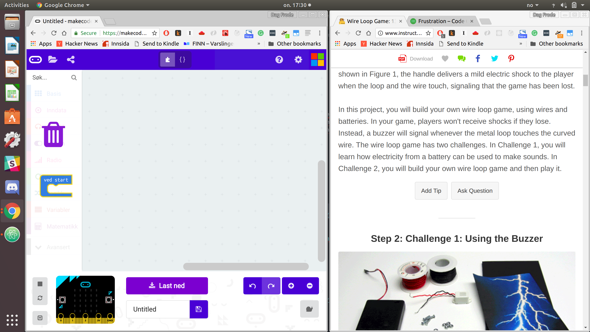
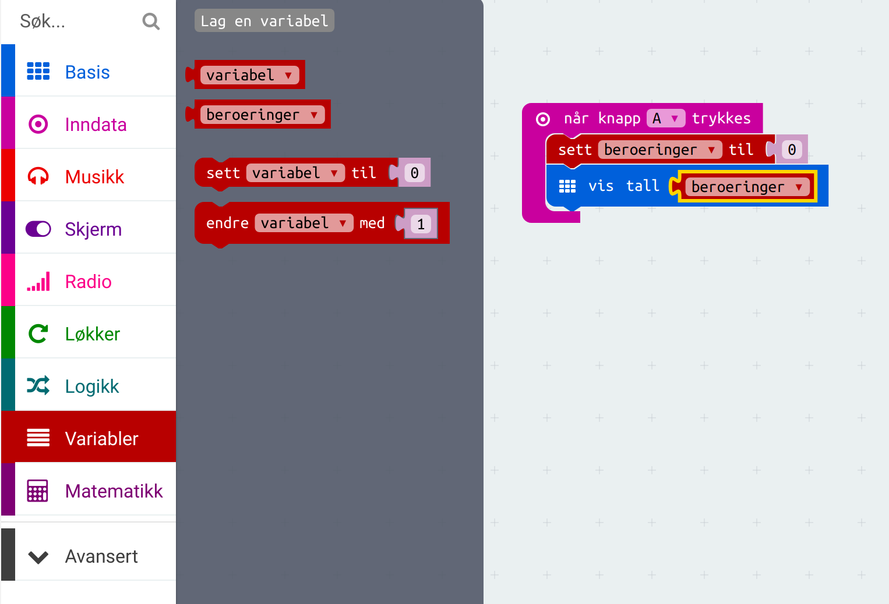
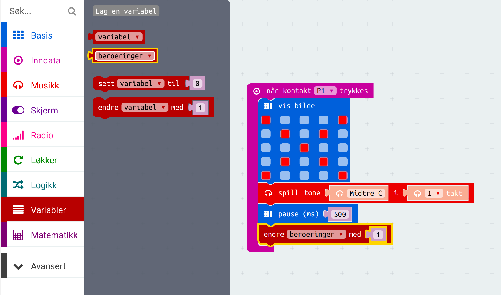
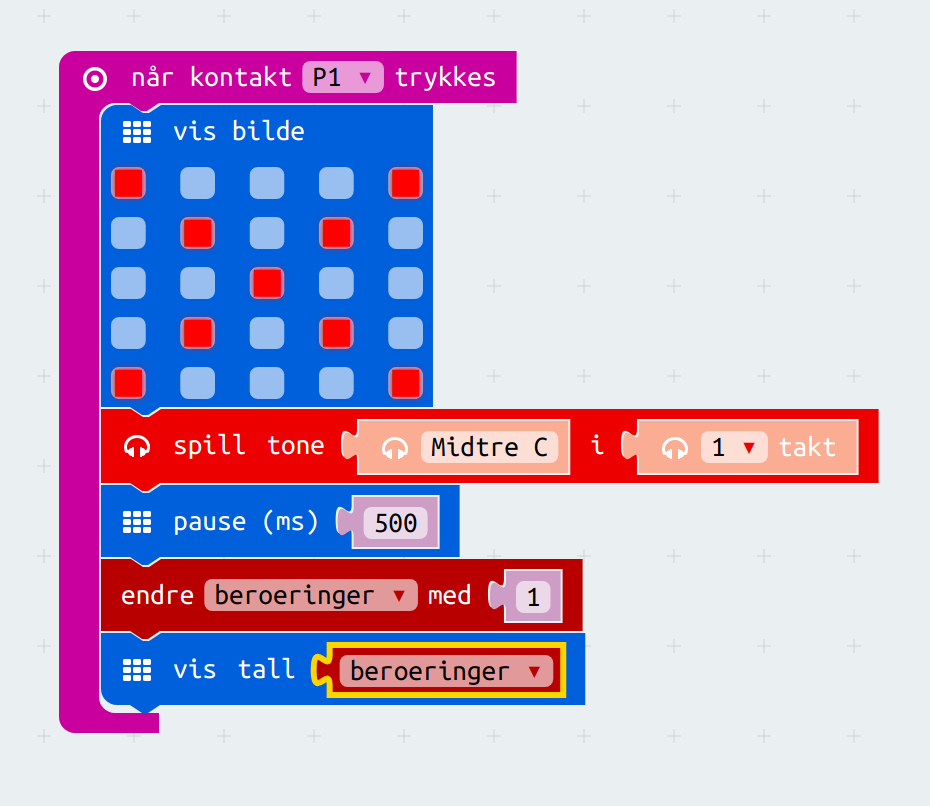

# Introduksjon {.intro}

Dette er et enkelt kordinasjonspill som går ut på å lede en stav med en løkke langs en bøyd ståltråd. Hvis spilleren kommer borti ståltråden vil en buzzer gi lyd og såilleren får et poeng. Spilleren med færrest poeng vinner!

Til dette prosjektet trengs det et par ekstra ting:

- [ ] Ståltråd
- [ ] Krokkodilleklyper
- [ ] Treklosser med hull til å stikke ståltråden i.
- [ ] Buzzer

Basert på: https://codeclubprojects.org/en-GB/microbit/frustration/
http://www.instructables.com/id/Wire-Loop-Game/
https://makecode.microbit.org/?lang=no
http://oppgaver.kidsakoder.no/microbit/pxt_gangespill/gangespill.html

# Steg 1: Lagre poeng {.activity}

## Sjekkliste {.check}

- [ ] Start et nytt PXT-prosjekt, for eksempel ved å gå til
  [makecode.microbit.org](https://makecode.microbit.org/?lang=no).

- [ ] Slett de eksisterende blokkende.

 

- [ ] Vi ønsker å starte et nytt spill når spilleren trykker på knapp A. Til dette kan vi bruke `når knapp A trykkes`-klossen som finnes i kategorien `Inndata`.

 

  - [ ] Vi må opprette en `variabel` til å ta vare på hvor mange ganger spilleren berører ståltråden i løpet av spillet. Vi oppretter variabelen `beroering` til dette. Husk det er lurt å unngå `æøå` fordi det fungerer ikke i alle tilfeller.

   

   

   

   - [ ] Legg til at antall `beroeringer` vises etter at `knapp a` er trykket.

      

# Steg 2: Oppdatere berøringene {.activity}

## Sjekkliste {.check}

- [ ] Du skal legge til 1 til variabelen `beroeringer` hver gang kontakt `P0` trykkes.

	

- [ ] Videre skal vi vise et kryss for 1 sekund hver gang kontakt `P1` trykkes.

  

  

  

- [ ] Så må du endre verdien til `beroeringer` med 1.

- [ ] Så må vi vise hvor mange ganger  vi har berørt.

# Steg 3: Bygg spillet {.activity}

## Sjekkliste {.check}

- [ ] ta en bit ståltråd og lag en løkke i den ene enden.

- [ ] tre løkken i en annen bit ståltråd som du setter i to treklosser med hull i.

- [ ] fest en kabel med ktrokkodilleklyper i `P0` til det ene beinet på `buzzeren` og en annen kabel fra `GND` til det andre beinet på `buzzeren`.

- [ ] fest en kabel med krokkodilleklyper til `P1` og til ståltråden med løkke. Fest en kabel til ståltråden som er festet til treklossene og til `GND`.
