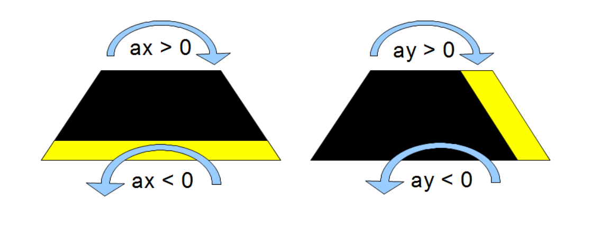

# Introduksjon {.intro}

Micro:biten har et akselerometer som merker hvilken vei vi holder micro:biten, om
den ristes, er i fritt fall og lignende. Akselerasjonen måles langs tre akser:
x (høyre/venstre), y (framover/bakover) og z (opp/ned). I denne oppgaven skal
vi se på akselerasjon langs x- og y-aksen for så å vise piler i hvilken retning
micro:biten heller.


# Steg 1: Lage variabler {.activity}

## Sjekkliste {.check}

- [ ] Start et nytt PXT-prosjekt, for eksempel ved å gå til
  [makecode.microbit.org](https://makecode.microbit.org/?lang=no){target=blank}.

- [ ] Lag to nye variabler `ax`{.microbitvariables} og `ay`{.microbitvariables}
(kort for akselerasjon i x/y-retning) ved å gå til `Variabler -> Lag ny variabel`{.microbitvariables}.
Sett de nye variablene til å være verdien av akselerasjonen vi måler langs x- og
y-aksen. Klossen som inneholder verdien for målt akselerasjon finner du under
`Inndata`{.microbitinput}.
Nå bør koden din se ut som dette:

```microbit
basic.forever(function () {
    ax = input.acceleration(Dimension.X)
    ay = input.acceleration(Dimension.Y)
})
```


# Steg 2: Positiv og negativ akselerasjon {.activity}

## Sjekkliste {.check}

- [ ] Akselerasjonen er enten positiv eller negativ. Akselerasjonen langs x-aksen
er positiv (ax>0) dersom micro:biten heller mot høyre, og negativ(ax<0) dersom den
heller mot venstre.

- [ ] Akselerasjonen langs y-aksen er positiv(ay>0) dersom micro:biten heller
framover, og negativ dersom micro:biten heller bakover.

På bildet under kan du se forklaring på hvilke helninger som gir positiv og
negativ akselerasjon:



# Steg 3: Hvor skal pila peke? {.activity}

## Sjekkliste {.check}

- [ ] Nå skal vi lage flere `hvis`{.microbitlogic}-blokker hvor vi setter regler
for hvilke krav som må være oppfylt for at vi skal vise pil i en bestemt retning.

- [ ] Vi legger vekt på den aksen som har mest akselerasjon. For eksempel om vi heller
litt langs x-aksen, og mye langs y-aksen, er det langs y-aksen pila vår vil peke.
Dette kan du gjøre ved å sjekke om absoluttverdien av `ax`{.microbitvariables}
er mindre enn absoluttverdien av `ay`{.microbitvariables}. Klossen for dette
finner du under kategorien `Matematikk`{.microbitmath}. Dette legger vi nå inn
som krav i vår første `hvis`{.microbitlogic}-kloss.
Den første delen av koden din bør nå se slik ut:

```microbit
let ax = 0
let ay = 0
basic.forever(function () {
    ax = input.acceleration(Dimension.X)
    ay = input.acceleration(Dimension.Y)
    if (Math.abs(ax) < Math.abs(ay)) {

    } else {

    }
})
```
- [ ] Dersom vi først får bekreftet at det er mest akselerasjon i y-retning, må vi
sjekke om vi har en positiv eller negativ akselerasjon. Fra steg 2 vet vi at `ay`{.microbitvariables}
er positiv når micro:biten heller framover. Dette er kravet i vår neste `hvis`{.microbitlogic}-kloss
som skal legges inne i vår første.

- [ ] At micro:biten heller framover er det samme som at micro:biten heller i
retningen Sør. Det finnes en egen kloss for å vise piler under kategorien
`Basis`{.microbitbasic}

- [ ] Dersom microbiten ikke heller framover, altså vi har at den heller bakover,
skal pila peke mot Nord.
Nå bør den kodeblokken din se slik ut:

```microbit
let ax = 0
let ay = 0
basic.forever(function () {
    ax = input.acceleration(Dimension.X)
    ay = input.acceleration(Dimension.Y)
    if (Math.abs(ax) < Math.abs(ay)) {
        if (ay > 0) {
            basic.showArrow(ArrowNames.South)
        } else {
            basic.showArrow(ArrowNames.North)
        }
    } else {

    }
})
```

- [ ] Nå skal vi hoppe tilbake til vår ytterst `hvis`{.microbitlogic}-kloss, og
den delen hvor det står `ellers`{.microbitlogic}. Vi husker at det første som skjedde
var at koden sjekker om det er større helning langs y-aksen. Hvis det ikke er det,
er det det motsatte, altså størst helning langs x-aksen. Det er koden for dette
vi skal lage inne i `ellers`{.microbitlogic}.

- [ ] Vi husker at akselerasjonen er positiv langs x-aksen dersom micro:biten heller
mot høyre. Så inne i `ellers`{.microbitlogic} legger vi en ny `hvis`{.microbitlogic}-kloss
hvor vi først sjekker om `ax`{.microbitvariables} er positiv (ax>0). Dersom
dette er tilfellet, vil vi vise en pil mot Øst.

- [ ] Dersom `ax`{.microbitvariables} er negativ, vil vi ha en pil mot Vest.

- [ ] Nå er koden vår ferdig og klar til å testes. Koden din bør ligne på dette:

```microbit
let ax = 0
let ay = 0
basic.forever(function () {
    ax = input.acceleration(Dimension.X)
    ay = input.acceleration(Dimension.Y)
    if (Math.abs(ax) < Math.abs(ay)) {
        if (ay > 0) {
            basic.showArrow(ArrowNames.South)
        } else {
            basic.showArrow(ArrowNames.North)
        }
    } else {
        if (ax > 0) {
            basic.showArrow(ArrowNames.East)
        } else {
            basic.showArrow(ArrowNames.West)
        }
    }
})
```

## Test prosjektet {.flag}

- [ ] Koble micro:biten din til datamaskinen med en USB-kabel. Klikk deretter
  på knappen `Last ned` nede til venstre på skjermen.

  Det lastes nå ned en fil som heter `microbit-Uten-navn.hex` til datamaskinen
  din. Samtidig dukker det opp et vindu som sier at du må flytte denne filen til
  MICROBIT-disken på datamaskinen din.

  Nå kan du se hvilken retning micro:biten din har mest akselerasjon i når du
  beveger på den!


## Utfordring : {.challenge}

- [ ] Vis en sirkel istedet for en pil når micro:biten ligger flatt. Da er
akselerasjonen i begge retninger tilnærmet lik null. Du kan for eksempel kreve
at akselerasjonen skal være større enn -100 og mindre enn 100. Prøv gjerne med
andre verdier. For å få til dette kan du bruke `hvis`{.microbitlogic}-klosser,
`og`{.microbitlogic}-klosser, `0 < 0`{.microbitlogic}-klosser og `0 < 0`{.microbitlogic}-klosser
til å sette kravene.

- [ ] Vis piler i alle åtte retninger, istedet for fire, når du
heller på micro:biten.
