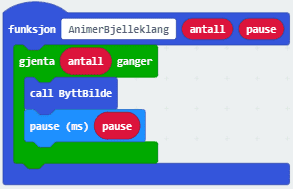
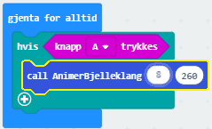

# Introduksjon {.intro} 

I denne oppgaven skal vi komme litt i julestemning og få micro:biten til å spille en julesang og vise en enkel animasjon. Du vil også lære hvordan du kan skrive
egne funksjoner. 

Vi trenger litt ekstra utstyr:
- 2 ledninger med krokodilleklemmer
- Hodetelefoner eller 1 buzzer (en liten høyttaler)

Micro:biten har fem store tilkoblinger på brettet, som vi kaller porter. Disse er koblet til store hull og er merket: 0, 1, 2, 3V og GND, på micro:biten. 

GND porten blir brukt for å fullføre en krets. Hvis du holder på GND-porten med en hånd, kan du programmere micro:biten til å oppdage at du berører 0, 1 eller 2 pinnen med den andre hånden (da bruker du kroppen din til å fullføre en elektrisk krets). Dette kan du bruke for å få micro:biten til å gjøre eller vise ulike ting. Du kan også få micro:biten til å sende signaler ut gjennom portene. For eksempel kan du programmere micro:biten til å sende ut lyd, og kobler du på en høyttaler med krokodilleklemmer, kan du høre på lyden. 

Du kan lese mer om portene på micro:biten her:
[microbit.org](https://microbit.org/no/guide/hardware/pins/){target=_blank}

# Steg 1: Spill Bjelleklang {.activity}

Vi skal skrive funksjoner som kan brukes for å spille Bjelleklang.

## Sjekkliste {.check}

- [ ] Lag din første funksjon ved å velge `Avansert` og deretter`Funksjoner` og trykk på `Lag en funksjon`.
 Da vil du få opp en egen meny for å lage en funksjon. Gi den navnet 'Bjelleklang' 

	

- [ ] Nå kan du bestemme hva denne funksjonen skal gjøre. Vi skal legge inn noter slik at den spiller de tre første notene der vi synger 'Bjelleklang'
Du starter med å legge inn en `spill tone` kloss fra `Musikk`-kategorien. Den første tonen skal være `Midtre E` i `1` takt. Denne klossen kan du kopiere ved å høyreklikke.
De to påfølgende tonene skal være `Midtre E` i `1` takt og deretter `Midtre E` i `2` takter.

	

- [ ] Nå kan du lage en funksjon som heter OverSkogOgHei som spiller de fem notene der vi synger 'Over skog og hei'. Da skal tonene `Midtre E, G, C, D, E` spilles i 
hhv `1`,`1`,`1`,`1` og `2` takter. 

	

- [ ] Nå er de nye funksjonene vi har laget tilgjengelige under `Funksjoner` kategorien. Nå skal vi kode at sangen vår spilles når vi trykker på A-knappen, 
og der vi  bruker de nye funksjonene vi har laget. For å få et OK tempo, kan du legge til en `sett tempo til` - kloss fra `Musikk`-kategorien og sette tempoet 
til `180 Bpm`

	

# Steg 2: Lag en animasjon {.activity}

Vi skal nå lage en enkel animasjon der micro:biten veksler mellom to ikoner som skal vise en bjelle som svinger fram og tilbake.
## Sjekkliste {.check}

- [ ] Lag en variabel som heter `bilde` og sett den til å være `2` ved start. Da kan du også vise et ikon av en bjelle som svinger mot venstre.
	
	
Nå skal vi lage en funksjon som bytter ikonet som vises på micro:biten. Vi bruker da variabelen c til å kontrollere hvilket ikon som skal vises. 
Siden vi veksler mellom to ikon, kan variabelen `bilde` bilde kun ha to verdier. 

- [ ] Du må lage en ny funksjon som heter `ByttBilde`.

- [ ] Inne i denne funksjonen må du legge inn en `hvis - ellers` kloss fra `logikk` kategorien for å kunne teste for hvilke verdier variabelen `bilde` har. 
Klosser for å sammenligne verdier ligger også under `logikk` kategorien. Hvis den er `1` skal bjella svinge mot høyre, og hvis den er `2` 
skal bjella svinge mot venstre. Etter at ikonet er vist, må vi endre verdien på variabelen `bilde`.
	

 
- [ ] Lag en funksjon som heter `AnimerBjelleklang`. Pass på at den får med seg to parametre av typen `Number` og kall disse `antall` og `pause`.
Dette gjør at hver kan vi kaller funksjonen kan bestemme hvor mange ganger bildet skal byttes og hvor lenge hvert ikon vises. Funksjonen vil se slik ut til slutt:
 
	
	
- [ ] For å vise animasjonen samtidig som melodien vises, kan du bruke et triks for å gjøre to ting samtidig når knapp A trykkes. 
Bruk en `for-alltid` kloss og inne i denne legger du en `hvis` kloss som tester for om knapp A trykkes. Da startes funksjonen som vi har kalt
`AnimerBjelleklang` og vi kan gi med verdiene `8` og `260` till hhv `antall` og `pause`slik at bjellene svinger sånn omtrent i takt med musikken. 
Du må kanskje justere `pause` for å få riktig hastighet.

	

# Steg 3: Gjør klart til lyd {.activity}

*Micro:biten har ikke høytalere. Derfor må vi koble til en buzzer eller hodetelefoner. Måten vi kobler til en buzzer er litt forskjellig fra måten vi kobler til hodetelefoner. Først kommer en sjekkliste for hvordan du kobler til en buzzer, og etter det kommer sjekklisten for om du bruker hodetelefoner.*

## Buzzer sjekkliste {.check}

- [ ] Fest en ledning fra port 0 på micro:biten til pinnen som det står pluss (+) ved på buzzeren. 

- [ ] Fest den andre ledningen fra der det står GND på micro:biten til den andre pinnen på buzzeren.

## Hodetelefoner sjekkliste {.check}

- [ ] Fest en ledning fra GND-porten på micro:biten til helt øverst på den metaliske delen av hodetelefonene.

- [ ] Fest den andre ledningen fra port 0 på micro:biten til helt nederst på den metaliske delen av hodetelefonene.

- [ ] Simulatoren viser hvordan det nå skal se ut:

	

## Test prosjektet {.flag}

*Nå er det tid for å se om micro:biten klarer å spille melodien du har komponert!*

- [ ] Last ned prosjektet til micro:biten og lytt!

# Steg 4: Non utfordringer {.activity}

*Noen forslag til endringer og utvidelser, men prøv selv dine ideer!*

## Flere ideer {.check}

Du har nå lært hvordan du kan skrive en melodi i micro:biten. Nedenfor er noen ideer til videreutvikling, men finn gjerne på noe
helt eget!

- [ ] Kan du endre hvor fort melodien spilles? 

- [ ] Kan du spille en annen melodi når knapp B trykkes?

- [ ] Kan du lage en annen animasjon?

