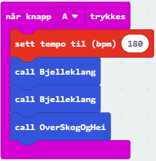

# Introduksjon {.intro}

I denne oppgaven skal vi komme litt i julestemning og få micro:biten til å
spille en julesang samtidig som den viser en enkel animasjon. Du vil også lære
hvordan du kan skrive egne funksjoner.

Vi trenger litt ekstra utstyr:
- 2 ledninger med krokodilleklemmer
- Hodetelefoner eller 1 buzzer (en liten høyttaler)

Micro:biten har fem store tilkoblinger på brettet, som vi kaller porter. Disse
er koblet til store hull og er merket: 0, 1, 2, 3V og GND på micro:biten.


GND porten blir brukt for å fullføre en krets. Hvis du holder på GND-porten med
en hånd, kan du programmere micro:biten til å oppdage at du berører 0, 1 eller
2 pinnen med den andre hånden (da bruker du kroppen din til å fullføre en
elektrisk krets). Dette kan du bruke for å få micro:biten til å gjøre eller
vise ulike ting. Du kan også få micro:biten til å sende signaler ut gjennom
portene. For eksempel kan du programmere micro:biten til å sende ut lyd, og
kobler du på en høyttaler med krokodilleklemmer, kan du høre på lyden.

Du kan lese mer om portene på micro:biten her:
[microbit.org](https://microbit.org/no/guide/hardware/pins/){target=blank}


# Steg 1: Spill Bjelleklang {.activity}

Vi skal nå lage enkle funksjoner som vi kan bruke for å spille Bjelleklang.

## Sjekkliste {.check}

- [ ] Lag din første funksjon ved å velge __Avansert__ og deretter
`Funksjoner`{.microbitfunctions} og trykk på __Lag en funksjon__. Da vil du få
opp en egen meny for å lage en funksjon. Gi den navnet `Bjelleklang`{.microbitfunctions}.

```microbit
function Bjelleklang () {
}
```

- [ ] Nå kan du bestemme hva denne funksjonen skal gjøre. Vi skal legge inn
noter slik at den spiller de tre første notene der vi synger 'Bjelleklang'
Du starter med å legge inn en `spill tone`{.microbitmusic}-kloss fra
`Musikk`{.microbitmusic}-kategorien. Den første tonen skal være
`Midtre E`{.microbitmusic} i `1`{.microbitmusic} takt. Denne klossen kan du
kopiere ved å høyreklikke. De to påfølgende tonene skal være `Midtre E`{.microbitmusic}
i `1`{.microbitmusic} takt og deretter `Midtre E`{.microbitmusic} i `2`{.microbitmusic}
takter.

```microbit
function Bjelleklang () {
    music.playTone(330, music.beat(BeatFraction.Whole))
    music.playTone(330, music.beat(BeatFraction.Whole))
    music.playTone(330, music.beat(BeatFraction.Whole))
}
```

- [ ] Nå kan du lage en funksjon som heter OverSkogOgHei som spiller de fem
notene der vi synger 'Over skog og hei'. Da skal tonene `Midtre E, G, C, D, E`{.microbitmusic}
spilles i henholdsvis __1__, __1__, __1__, __1__ og __2__ takter.

```microbit
function OverSkogOgHei () {
    music.playTone(330, music.beat(BeatFraction.Whole))
    music.playTone(392, music.beat(BeatFraction.Whole))
    music.playTone(262, music.beat(BeatFraction.Whole))
    music.playTone(294, music.beat(BeatFraction.Whole))
    music.playTone(330, music.beat(BeatFraction.Double))
}
```

- [ ] Nå er de nye funksjonene vi har laget tilgjengelige under `Funksjoner`{.microbitfunctions}-
kategorien. Nå skal vi lage en kode som gjør at sangen vår spilles når vi
trykker på A-knappen, ved å bruke de nye funksjonene vi har laget. For å få et
OK tempo, kan du legge til en `sett tempo til`{.microbitmusic}-kloss fra `Musikk`{.microbitmusic}-kategorien
og sette tempoet til `180 Bpm`{.microbitmusic}.




# Steg 2: Lage en animasjon {.activity}

Vi skal nå lage en enkel animasjon der micro:biten veksler mellom to ikoner.
Disse skal etterligne en bjelle som svinger fram og tilbake.

## Sjekkliste {.check}

- [ ] Lag en variabel som heter `bilde`{.microbitvariables} og sett den til å
være __2__ ved start. Da kan du også vise et ikon av en bjelle som svinger mot
venstre.

```microbit
let bilde = 0
bilde = 2
basic.showLeds(`
    . . # # #
    . # # # #
    # # # # #
    . # # # .
    . . # . .
    `)
```

Nå skal vi lage en funksjon som bytter ikonet som vises på micro:biten. Vi
bruker da variabelen `bilde`{.microbitvariables} til å kontrollere hvilket ikon
som skal vises. Siden vi veksler mellom to ikoner, kan variabelen `bilde`{.microbitvariables}
kun ha to verdier.

- [ ] Du må lage en ny funksjon som heter `ByttBilde`{.microbitfunctions}.

- [ ] Inne i denne funksjonen må du legge inn en `hvis - ellers`{.microbitlogic}-kloss
fra `Logikk`{.microbitlogic}-kategorien for å kunne teste for hvilke verdier
variabelen `bilde`{.microbitvariables} har. Klosser for å sammenligne verdier
ligger også under `Logikk`{.microbitlogic}-kategorien. Hvis den er __1__ skal
bjella svinge mot høyre, og hvis den er __2__ skal bjella svinge mot venstre.
Etter at ikonet er vist, må vi endre verdien på variabelen `bilde`{.microbitvariables}
til å bli det motsatte.

```microbit
function ByttBilde () {
    if (bilde == 1) {
        basic.showLeds(`
            # # # . .
            # # # # .
            # # # # #
            . # # # .
            . . # . .
            `)
        bilde = 2
    } else {
        basic.showLeds(`
            . . # # #
            . # # # #
            # # # # #
            . # # # .
            . . # . .
            `)
        bilde = 1
    }
}
```

- [ ] Lag en funksjon som heter `AnimerBjelleklang`{.microbitfunctions}. Pass på
at den får med seg to parametre av typen `Number`{.microbitvariables} og kall
disse `antall`{.microbitvariables} og `pause`{.microbitvariables}. Dette gjør at
hver kan vi kaller funksjonen kan vi bestemme hvor mange ganger bildet skal
byttes og hvor lenge hvert ikon vises. Når vi vil bruke parametrene `antall`{.microbitvariables}
og `pause`{.microbitvariables} inne i funksjonen, må du klikke på og
og deretter dra parameter-klossene som ligger på toppen av `AnimerBjelleklang`{.microbitfunctions}.
Funksjonen vil se slik ut til slutt:


- [ ] For å vise animasjonen samtidig som melodien vises, kan du bruke et
triks som gjør to ting samtidig når knapp A trykkes. Bruk en `for-alltid`{.microbitbasic}-kloss
og legg en `hvis`{.microbitlogic}-kloss inne i denne som sjekker om knapp A
trykkes. Da starter funksjonen som vi har kalt `AnimerBjelleklang`{.microbitfunctions}.
Legg ved verdiene __8__ og __260__ til henholdsvis `antall`{.microbitvariables}
og `pause`{.microbitvariables} slik at bjellene svinger sånn omtrent i takt med
musikken. Du må kanskje justere `pause`{.microbitvariables} for å få riktig
hastighet.


# Steg 3: Gjør klart til lyd {.activity}

*Micro:biten har ikke høyttalere. Derfor må vi koble til en buzzer eller
hodetelefoner. Måten vi kobler til en buzzer på er litt forskjellig fra måten
vi kobler til hodetelefoner. Først kommer en sjekkliste for hvordan du kobler
til en buzzer, og etterpå kommer sjekklisten for deg som vil bruke hodetelefoner.*

## Buzzer sjekkliste {.check}

- [ ] Fest en ledning fra port 0 på micro:biten til pinnen det står pluss
(+) ved på buzzeren.

- [ ] Fest den andre ledningen fra der det står GND på micro:biten til den
andre pinnen på buzzeren.

## Hodetelefoner sjekkliste {.check}

- [ ] Fest en ledning fra GND-porten på micro:biten til helt øverst på den
metalliske delen av hodetelefonene.

- [ ] Fest den andre ledningen fra port 0 på micro:biten til helt nederst på
den metalliske delen av hodetelefonene.

- [ ] Simulatoren viser hvordan det nå skal se ut:

	

## Test prosjektet {.flag}

*Nå er det tid for å se om micro:biten klarer å spille melodien du har
komponert!*

- [ ] Last ned prosjektet til micro:biten og lytt!


## Noen utfordringer {.challenge}

*Noen forslag til endringer og utvidelser, men prøv gjerne egne ideer!*

Du har nå lært hvordan du kan lage en melodi som micro:biten spiller. Nedenfor
er noen ideer til videreutvikling, men finn gjerne på noe helt eget!

- [ ] Kan du skrive inn hele bjelleklang?

- [ ] Kan du endre hvor fort melodien spilles?

- [ ] Kan du spille en annen melodi når knapp B trykkes?

- [ ] Kan du lage en annen animasjon?
