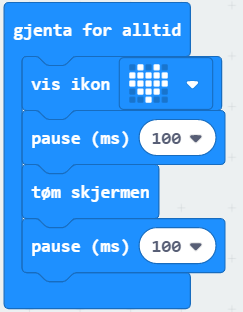

# Introduksjon {.intro}
I denne opggaven skal vi få et hjerte til å blinke i ulike hastigheter. 

# Steg 1: Vi finner "gjenta for alltid"-klossen {.activity}

## Sjekkliste {.check}

- [ ] Finn en `gjenta for alltid`-kloss. Den ligger nok allerede i kodefeltet ditt, eller så kan du finne den i menyen under `Basis`. 

Koden som er inni en `gjenta for alltid`-kloss vil gjenta seg så lenge micro:biten er koblet til strøm (batteri eller PC).

# Steg 2: Hjerte som blinker {.activity}

## Sjekkliste {.check}

- [ ] Gå til `Basis` og finn `vis ikon`-klossen. Legg den inni `gjenta for alltid`. Simulatoren skal nå vise et hjerte. 

- [ ] Nå skal vi få hjertet til å blinke. Vi gjør dette ved å fjerne bildet fra skjermen med `tøm skjermen`-klossen. Den finner du ved å trykke på `Basis` og så på `more` (mer) *som står rett under*. 

Kan du se at hjertet blinker? Det skjer ganske fort, for bildet vises og slettes så raskt som programmet klarer. 

# Steg 3: Endre hastighet på blinkingen {.activity}

## Sjekkliste {.check}

For å kontrollere hvor lenge bildet skal vises, og hvor lenge skjermen skal være blank, legger vi inn pauser. 

- [ ] Du finner `pause`-klossen i `Basis`. Legg til to `pause`-klosser i koden din.

- [ ] Koden din burde nå se slik ut:

## {.tip}

Hvis du skal bruke samme kloss flere ganger kan du høyreklikke på den og trykke på lag kopi. 

## Utfordring {.challenge}

- [ ] Kan du klare å få hjertet til å blinke i samme tempo som pulsen din?

- [ ] Hva skjer dersom du endrer tallet i `pause`-klossene til 200? Hva med 1000? 5000? Test det ut! Gjerne prøv med flere tall en disse. 
