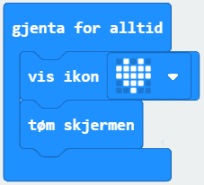

# Introduksjon {.intro}

I denne oppgåva skal me få eit hjarte til å blinke i ulike hastigheiter.

# Steg 1: Me finn "gjenta for alltid"-klossen {.activity}

## Sjekkliste {.check}

- [ ] Finn ein `gjenta for alltid`-kloss. Den ligg nok allereie i kodefeltet
- ditt, elles finn du den under `Basis` i menyen.

Koden som er inni ein `gjenta for alltid`-kloss vil gjenta seg så lenge
micro:bit-en er kopla til straum (batteri eller PC).

# Steg 2: Hjarte som blinkar {.activity}

## Sjekkliste {.check}

- [ ] Gå til `Basis` og finn `vis ikon`-klossen. Legg den inni `gjenta for
  alltid`. No skal simulatoren til venstre vise eit hjarte.

- [ ] No skal me få hjartet til å blinke. Det gjer me ved å fjerne biletet frå
  skjermen med `tøm skjermen`-klossen. Den finn du ved å trykkje på `Basis` og
  så på `more` (meir) som står rett under.

Ser du at hjartet blinkar? Det skjer veldig fort, for biletet visast og slettast
så raskt programmet får til.

# Steg 3: Endre hastigheit på blinkinga {.activity}

## Sjekkliste {.check}

For å kontrollere kor lenge biletet skal vere synleg, og kor lenge skjermen skal
vere mørk, legg me inn pauser.

- [ ] Du finn `pause`-klossen i `Basis`. Legg til to `pause`-klossar i koden
  din.

- [ ] No bør koden din sjå slik ut:

## {.tip}

Viss du skal bruke den same klossen fleire gonger kan du høgreklikke på den og
trykke på `lag kopi`.

## Test prosjektet {.flag}

- [ ] No er programmet klart til å bli lasta ned på micro:bit-en. For å laste
  ned koden må micro:bit-en vere kopla til datamaskina med ein USB-kabel. Trykk
  på knappen `Last ned` nede til venstre på skjermen. No blir det lasta ned ei
  fil som heiter `microbit-Utan-namn.hex` til datamaskina di. Samstundes får du
  opp eit vindauge som seier at du må flytte denne fila til MICROBIT-disken på
  datamaskina di.

## Utfordring {.challenge}

- [ ] Kva skjer viss du endrar talet i `pause`-klossane til 200? Kva med 1000?
  5000? Prøv deg fram! Gjerne prøv med andre tal òg.

- [ ] Klarar du å få hjartet til å blinke i same tempo som pulsen din?
