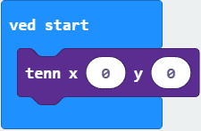
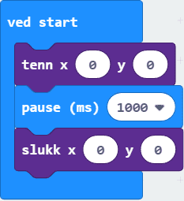
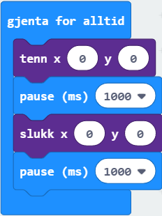

# Introduksjon {.intro}

I denne oppgåva skal me lage eit program som får eit lys på micro:bit-en til å
blinke!

# Steg 1: Tenn eit lys {.activity}

*Me kan bruke klossen `tenn` til å slå på eit lys på micro:biten og klossen
 `slukk` til å slå av eit lys som er på. Du finn begge klossane i
 `Skjerm`-kategorien.*

## Sjekkliste {.check}

- [ ] Sjå kva som skjer når `tenn`-klossen ligg inne i ein `ved start`-kloss.

For at lyset skal slå seg av att må me leggje til ein `slukk`-kloss. Men me vil
sjå at lyset er på fyrst, så me legg inn ei `pause`.

- [ ] Legg ein `pause`-kloss under `tenn`-klossen og ein `slukk`-kloss under
  `pause`-klossen. Du finn `pause`-klossen i `Basis`.

- [ ] Set talet inne i `pause`-klossen til 1000 (1000 millisekund = 1 sekund).

## Test prosjektet {.flag}

__Prøv koden i simulatoren for å teste koden så langt.__

- [ ] Kva skjer når du endrar tala i `tenn`-klossen og `slukk`-klossen? *Hint:
  prøv med eit tal mellom 0 og 4*

- [ ] Kva skjer når tala i `tenn`-klossen er ulike dei tala som er i
  `slukk`-klossen?

# Steg 2: La det blinke {.activity}

*Til no får me lyset til å blinke éin gong. Men me vil gjerne at det skal blinke
 fleire gonger.*

## Sjekkliste {.check}

- [ ] Prøv å få lyset til å blinke mange gonger ved å bruke ei løkke. Du må
  kanskje legge til ei ekstra pause.

- [ ] No kan koden din til dømes sjå slik ut:

## Test prosjektet {.flag}

- [ ] Last ned programmet til micro:bit-en og sjå at lyset slår seg av og på.

## Utfordringar {.challenge}

- [ ] Legg til kode slik at fleire lys blinkar samstundes.

- [ ] Få fleire lys til å blinke, men med ulike hastigheiter. *Prøv med ulike
  tal i `pause`-klossane.*
