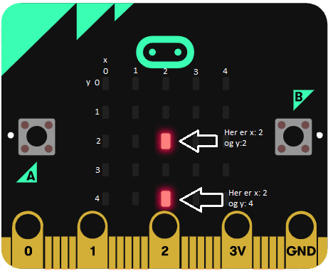

# Introduksjon {.intro}

"Det regner mat!" er et spill som går ut på å fange flest mulig matbiter. Det
fungerer slik at matbiter faller ned på skjermen og spilleren som står på bunn
skal prøve å fange maten. Spilleren skal bevege seg med knappene A og B. Liv går
tapt når spilleren ikke klarer å få tak i maten. Spilleren har til sammen tre
liv før spillet er over.  


# Steg 1: Grunnlag {.activity}

*Det første vi skal gjøre er å kode grunnlaget for spillet. Vi skal lage mat,
en spiller og sette antall liv. Vi må også starte opp noe som holder kontroll
på poengsummen.*

## Sjekkliste {.check}

- [ ] Lag tre variabler `spiller`{.microbitvariables}, `mat`{.microbitvariables}
og `liv`{.microbitvariables} med `Lag en variabel...`{.microbitvariables} i kategorien `Variabler`{.microbitvariables}.

Skjermen vår består av 5x5 ledlys. Disse kan vi skru av og på med litt kode. I denne oppgaven bruker vi klosser fra `Spill`{.microbitgame}-kategorien til å sette og endre hvor lysene skal være. Posisjonen til lysene blir gitt med en x- og en y-posisjon som i et rutenett. Verdien til x angir plassen til lyset bortover (horisontalt) og verdien til y angir plassen nedover (vertikalt), dette er vist på bildet under. Hjørnet øverst til venstre har verdiene __(0,0)__ mens hjørnet nederst til høyre har verdiene __(4,4)__.



Spilleren skal bevege seg på nederste rad til høyre og venstre. Vi vil at `spiller`{.microbitvariables} skal starte på midten av skjermen ved start (x: 2 og y: 4).

- [ ] Legg til koden under i `ved start`{.microbitbasic}-klossen som allerede finnes i kodefeltet ditt (eller du kan finne den i `Basis`{.microbitbasic}-kategorien).

```microbit
let spiller: game.LedSprite = null
spiller = game.createSprite(2, 4)
```

- [ ] Gjør det samme med vaiabelen `mat`{.microbitvariables} som du gjorde med variabelen `spiller`{.microbitvariables} i punktet over. `mat`{.microbitvariables} skal settes til x: 2 og y: 2.

## {.tip}
`Sett spiller til`{.microbitvariables}-klossen finner du i `Variabler`{.microbitvariables}. `Create sprite at x: 2 y: 4`{.microbitgame}-klossen finner du i kategorien `Spill`{.microbitgame} i __Avansert__.
##

## {.tip}
Det er egentlig ikke så viktig hvor vi plasserer `mat`{.microbitvariables} ved starten siden den kommer til å flytte på seg i neste steg. Det som er viktig er at `mat`{.microbitvariables} finnes på spillebrettet ved start slik at det går an å bruke variabelen senere.
##

- [ ] Sett variabelen `liv`{.microbitvariables} til 3. Klossen du skal bruke finner du i `Variabler`{.microbitvariables}.

- [ ] Ved start skal også poengsum settes til 0. Du finner en kloss som gjør dette i `Spill`{.microbitgame}-kategorien.

- [ ] Dersom du har gjort alt rett så vil koden din se slik ut:

```microbit
let spiller = game.createSprite(2, 4)
let mat = game.createSprite(2, 2)
let liv = 3
game.setScore(0)
```

## {.tip}

Både `mat`{.microbitvariables} og `spiller`{.microbitvariables} blir et ledlys hver på micro:biten. Hvis du vil skille litt mer mellom dem kan du få maten til å lyse litt mindre enn spilleren. Dette gjør du ved å sette `sprite angir x til 0`{.microbitgame}-klossen etter `sett poengsum til 0`{.microbitgame}. Bytt ut `sprite`{.microbitvariables} med `mat`{.microbitvariables} og __x__ med `lysstyrke`{.microbitled}. Det er litt forskjell på hvordan simulatoren og micro:biten opplever lysstyrke, så imens du er i simulaturen setter du lysstyrke til 100. Når du laster spillet opp til micro:biten, endre lysstyrken til 30.


# Steg 2: Mat regner {.activity}

*I dette steget skal vi få maten til å regne ned. Maten skal starte på et tilfeldig sted på øverste rad hver runde.*

## Sjekkliste {.check}

- [ ] I `gjenta for alltid`{.microbitbasic}-klossen (denne finnes allerede i kodefeltet ditt, eller du kan finne den i `Basis`{.microbitbasic}), sett inn `sprite angir x til 0`{.microbitgame}-klossen som du finner i `Spill`{.microbitgame}. Bytt ut `sprite`{.microbitvariables} med variabelen `mat`{.microbitvariables}. 0 bytter du ut med `velg tilfeldig 0 til 4`{.microbitmath}-klossen som du finner i kategorien `Matematikk`{.microbitmath}.

- [ ] Sett inn en til `sprite angir x til 0`{.microbitgame}-kloss under den forrige og bytt ut __x__ med __y__.

- [ ] Så trenger vi en `pause`{.microbitbasic}-kloss (finnes i `Basis`{.microbitbasic}). Endre tallet til 300.

Det vi har gjort til nå er å ha satt `mat`{.microbitvariables} til en tilfeldig x-posisjon (et tilfeldig sted bortover). Vi har i tillegg passet på at `mat`{.microbitvariables} starter på øverste rad for hver runde. Det vi skal gjøre videre, er å lage kode for maten som skal regne ned.  

- [ ] Finn en `gjenta 4 ganger`{.microbitloops}-kloss i `Løkker`{.microbitloops} og plasser den under `pause`{.microbitbasic}-klossen.

For å få maten til å regne nedover, må vi endre posisjonen til variabelen `mat`{.microbitvariables} i y-retning. Vi endrer posisjonen med 1 for hver gang vi går gjennom løkka.

- [ ]  Legg til koden under i `gjenta 4 ganger`{.microbitloops}-klossen.

## {.tip}
Hvis vi ikke legger til `pause`{.microbitbasic}-klosser vil maten bevege seg for fort til at vi klarer å fange den!


# Steg 3: Få poeng og tap liv {.activity}

*Nå skal vi lage kode som enten gir spilleren poeng hvis den klarer å fange maten eller som tar bort et liv hvis spilleren ikke greier å fange den.*

## Sjekkliste {.check}

- [ ] Plasser en `hvis-ellers`{.microbitlogic}-kloss under `gjenta 4 ganger`{.microbitloops}-blokken. `Hvis-ellers`{.microbitlogic}-klossen finner du i `Logikk`{.microbitlogic}.

Vi vil at poengsummen skal øke med én hvis spilleren klarer å fange maten.

- [ ] Bytt ut `sann`{.microbitlogic} med `is sprite touching`{.microbitgame}-klossen som du finner i `Spill`{.microbitgame}-kategorien. I stedenfor `sprite`{.microbitvariables}, vil vi ha variabelen `spiller`{.microbitvariables} og i den tomme boksen vil vi ha variabelen `mat`{.microbitvariables}. *"Is spiller touching mat" betyr "berører spiller mat" på norsk.*

- [ ] Sett klossen `endre poengsum med 1`{.microbitgame}.

## {.tip}
`Hvis-ellers`{.microbitlogic}-klossen fungerer slik at hvis spilleren får tak i maten, vil programmet kjøre koden som hører til `hvis`{.microbitlogic}-delen av klossen. Hvis dette ikke er sant (spilleren klarte ikke å få tak i maten denne runden), vil programmet kjøre koden som hører til `ellers`{.microbitlogic}-delen av klossen.
##

Når `spiller`{.microbitvariables} ikke klarer å fange maten, skal vi miste et liv.

- [ ] I `ellers`{.microbitlogic}-delen av `hvis-ellers`{.microbitlogic}-klossen, sett inn `endre liv med -1`{.microbitvariables} som du finner i `Variabler`{.microbitvariables}. *Husk å endre fra 1 til -1 i klossen*.

Videre må vi sjekke om variabelen `liv`{.microbitvariables} er lik null, for hvis den er det, er spillet over.

- [ ] Sett koden nedenfor under `endre liv med -1`{.microbitvariables}-klossen. "Game over" er et uttrykk for at spillet er slutt.

- [ ] Sjekk at koden din fra steg 2 og 3 ser slik ut:

```microbit
basic.forever(function () {
    let spiller: game.LedSprite = null
    let mat: game.LedSprite = null
    mat.set(LedSpriteProperty.X, Math.randomRange(0, 4))
    mat.set(LedSpriteProperty.Y, 0)
    basic.pause(300)
    for (let i = 0; i < 4; i++) {
        mat.change(LedSpriteProperty.Y, 1)
        basic.pause(300)
    }
    if (spiller.isTouching(mat)) {
        game.addScore(1)
    } else {
        liv += -1
        if (liv == 0) {
            game.gameOver()
        }
    }
})
```

## Test prosjektet {.flag}

- [ ] Sjekk i simulatoren at det regner et ledlys ned med forskjellig verdi av x for hver runde. Et annet ledys skal hele tiden stå stille i midten av nederste rad.


# Steg 4: Beveg spilleren! {.activity}

*Nå skal vi lage siste del av koden, nemlig koden for å bevege på spilleren!*

## Sjekkliste {.check}

- [ ] Når knapp A trykkes skal `spiller`{.microbitvariables} bevege seg mot venstre. Dette får vi til ved å bruke en kloss vi finner i `Spill`{.microbitgame}-kategorien. Lag koden som er vist under.

```microbit
  input.onButtonPressed(Button.A, function () {
      let spiller: game.LedSprite = null
      spiller.change(LedSpriteProperty.X, -1)
  })
```

- [ ] Kopier koden fra forrige punkt og endre den slik at når knapp B trykkes, skal `spiller`{.microbitvariables} bevege seg til høyre.

## Test prosjektet {.flag}

*Koden din er nå ferdig!*

- [ ] Sjekk simulatoren og se til at alt fungerer som det skal.

- [ ] Last ned spillet til micro:biten og spill i vei!

## {.tip}

For lett eller vanskelig? Du kan endre hastigheten maten faller ned og/eller endre antall liv man har ved start.

## Utfordring {.challenge}

- [ ] Legg på lyd!
