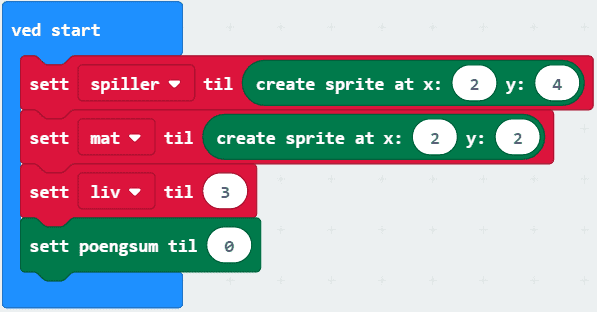
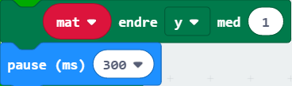
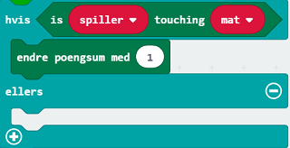
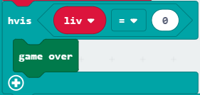

# Introduksjon {.intro}

"Det regnar mat!" er eit spel som går ut på å fange flest mogleg matbitar. Det
fungerer slik at matbitar fell ned på skjermen og spelaren som står på botnen
skal prøve å fange maten. Spelaren skal bevege seg med knappane A og B. Ein
mistar liv når spelaren ikkje klarar å få tak i maten. Spelaren har til saman
tre liv før spelet er over.

# Steg 1: Grunnlag {.activity}

*Det fyrste me skal gjere er å kode grunnlaget for spelet. Me skal lage mat, ein
 spelar og setje antal liv. Me må også starte noko som kan halde styr på
 poenga.*

## Sjekkliste {.check}

- [ ] Lag tre variablar `spelar`, `mat` og `liv` med `Lag ein variabel...` i
  kategorien `Variablar`.

Skjermen vår har 5x5 ledlys. Desse kan me skru av og på med litt kode. I denne
oppgåva brukar me klossar frå `Spel`-kategorien til å setje og endre kor lysa
skal vere. Posisjonen til lysa blir gitt ved ein `x`- og ein `y`-posisjon, som i
eit rutenett. Verdien til `x` gir plassen til lyset bortover (vassrett) og
verdien til `y` gir plassen nedover (loddrett), som du ser på biletet under.
Hjørnet øvst til venstre er `(0, 0)` og hjørnet nedst til høgre er `(4, 4)`.

Spelaren skal bevege seg til høgre og venstre nedst på skjermen. Me vil at
`spelar` skal starte på midten av skjermen når me startar, (`x = 2` og `y = 4`).

- [ ] Legg til koden under i `ved start`-klossen som allereie er i kodefeltet
  ditt (eller i `Basis`-kategorien).

	

- [ ] Gjer det same med variabelen `mat` som du gjorde med variabelen `spelar` i
  punktet over. Me set `mat` til `x = 2` og `y = 2`.

## {.tip}

Du finn `Set spelar til`-klossen i `Variablar`. `Create sprite at x: 2 y:
4`-klossen finn du i kategorien `Spel` i `Avansert`.

## {.tip}

Det er eigentleg ikkje så viktig kor me plasserer `mat` ved starten, sidan den
skal flytte på seg i neste steg. Det som er viktig er at `mat` er på
spelebrettet når me startar, slik at det går an å bruke variabelen seinare.

##

- [ ] Set variabelen `liv` til `3`. Klossen du skal bruke finn du i `Variablar`.

- [ ] Ved start skal poengsummen vere `0`. settes til 0. Du finn ein kloss som
  gjer dette i `Spel`-kategorien.

- [ ] Viss du har gjort alt rett skal koden din sjå slik ut:

	

## {.tip}

Både `mat` og `spelar` blir eit ledlys kvar på micro:bit-en. Viss du vil skilje
dei meir frå kvarandre kan du få maten til å lyse litt mindre enn spelaren. Det
gjer du ved å setje -klossen etter `set poengsum til 0`. Bytt ut `sprite` med
`mat` og `x` med `lysstyrke`. Simulatoren og micro:bit-en opplever lysstyrke på
litt ulike måtar, så i simulatoren kan du ha lysstyrke `100`, men når du lastar
det ned bør du har endra lysstyrken til `30`.

# Steg 2: Mat regnar {.activity}

*I dette steget skal me få maten til å regne ned. Maten skal starte på ein
 tilfeldig stad på øvste rad kvar runde.*

## Sjekkliste {.check}

- [ ] I `gjenta for alltid`-klossen (denne har du allereie i kodefeltet ditt,
  eller du finn den i `Basis`), set inn  som du finn i `Spel`. Bytt ut `sprite` med
  variabelen `mat`. Så byttar du ut `0` med `plukk eit tilfeldig tal mellom 0 og
  4`-klossen som du finn i kategorien `Matematikk`.

- [ ] Set inn endå ein `sprite angir x til 0` -kloss under den førre og bytt ut
  `x` med `y`.

- [ ] Så treng me ein `pause`-kloss (den ligg i `Basis`). Endre talet til `300`.

Til no har me sett `mat` til ein tilfeldig `x`-posisjon, og sikra at den startar
på øvste rad kvar runde. Vidare skal me lage kode for maten som skal regne ned.

- [ ] Finn ein `gjenta 4 gonger`-kloss i `Løkker` og plasser den under
  `pause`-klossen.

For å få maten til å regne nedover må me endre posisjonen til `mat` i
`y`-retninga. Me endrar posisjonen med `1` for kvar gong me går gjennom løkka.

- [ ] Legg til koden under i `gjenta 4 gonger`-klossen.

	

## {.tip}

Viss me ikkje legg til `pause`-klosser vil maten bevege seg for fort til at me
klarar å fange den!

# Steg 3: Få poeng og tap liv {.activity}

*No skal me lage kode som anten gir spelaren poeng viss den fangar maten, eller
 som tek bort eit liv viss spelaren ikkje klarar det.*

## Sjekkliste {.check}

- [ ] Plasser ein `viss-elles`-kloss under `gjenta 4 gonger`-blokka.
  `Viss-elles`-klossen finn du i `Logikk`.

Me vil at poengsummen skal auke med `1` viss spelaren klarar å fange maten.

- [ ] Bytt ut `sann` med `is sprite touching`-klossen som du finn i
  `Spel`-kategorien. I staden for `sprite` vil me ha variabelen `spelar` og i
  den tomme boksen vil me ha variabelen `mat`. *"Is `spelar` touching `mat`"
  tyder "berører `spelar` `mat`" på norsk.*

- [ ] Set inn klossen `endre poengsum med 1` slik som på biletet under.

## {.tip}

`Viss-elles`-klossen fungerer slik at viss spelaren får tak i maten, så vil
programmet køyre koden som høyrer til `viss`-delen av klossen. Viss ikkje dette
er sant (spelaren klarte ikkje å få tak i maten denne runden), så vil programmet
køyre koden som høyrer til `elles`-delen av klossen.

##

Når `spelar` ikkje klarar å fange maten skal me miste eit liv.

- [ ] I `elles`-delen av `viss-elles`-klossen må du setje inn `endre liv med -1`
  som du finn i `Variablar`. *Hugs å endre frå `1` til `-1` i klossen. Kva skjer
  viss du ikkje gjer det?*

Vidare må me sjekke om variabelen `liv` er lik null, for viss den er det har
spelaren tapt.

- [ ] Set koden i biletet inn rett under `endre liv med -1`-klossen. "Game over"
  er engelsk for at spelet er slutt, og blir ofte nytta i slike spel.  

	

- [ ] Sjekk at koden din frå steg 2 og 3 ser slik ut:

	

## Test prosjektet {.flag}

- [ ] Sjekk i simulatoren at det regnar eit ledlys ned med ulik `x`-posisjon for
  kvar runde. Eit anna ledys skal heile tida stå stille midt på nedste rad.

# Steg 4: Beveg spelaren! {.activity}

*No skal me lage siste del av koden, nemleg koden for å styre spelaren!*

## Sjekkliste {.check}

- [ ] Når knapp `A` vert trykt skal `spelar` bevege seg mot venstre. Dette får
  me til ved å bruke ein kloss me finn i `Spel`-kategorien. Lag koden som er
  vist under.

	

- [ ] Kopier koden frå førre punkt og endre den slik at når knapp `B` vert
  trykt, skal `spelar` bevege seg til høgre.

## Test prosjektet {.flag}

*No er koden ferdig!*

- [ ] Sjekk simulatoren og sjå til at alt fungerer som det skal.

- [ ] Last ned spelet til micro:bit-en og spel i veg!

## {.tip}

Er spelet for lett eller vanskeleg? Du kan endre hastigheiten maten fell ned med
og/eller endre kor mange liv ein startar med.

## Utfordring {.challenge}

- [ ] Legg på lyd!
