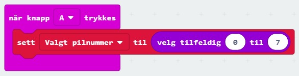
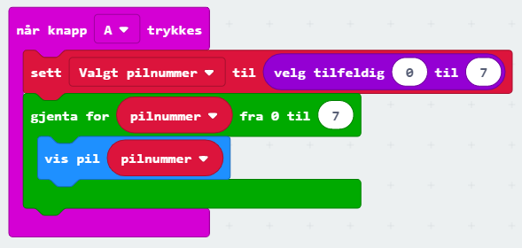
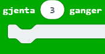

# Introduksjon {.intro}
I denne oppgaven skal vi lage en roterende pil som stopper i en tilfeldig posisjon.

# Steg 1: Velge en tilfeldig pil {.activity}

Under *Basis - > Mer* i menyen over alle klossene, finner vi en kloss som
heter `Vis pil`. Her kan man velge mellom piler som peker
i åtte forskjellige retninger. Der har hver pil et nummer og et navn.  I
tabellen under finner du en oversikten over dette, både med norske og engelske navn.

|      Pil     	|   ↑   	|      ↗     	|   →  	|      ↘     	|   ↓   	|      ↙     	|   ←  	|      ↖     	|
|:------------:	|:-----:	|:----------:	|:----:	|:----------:	|:-----:	|:----------:	|:----:	|:----------:	|
|    Nummer    	|   0   	|      1     	|   2  	|      3     	|   4   	|      5     	|   6  	|      7     	|
|  Norsk navn  	|  Nord 	|   Nordøst  	|  Øst 	|   Sørøst   	|  Sør  	|   Sørvest  	| Vest 	|  Nordvest  	|
| Engelsk navn 	| North 	| North East 	| East 	| South East 	| South 	| South West 	| West 	| North West 	|

Å velge en tilfeldig pil, blir derfor det samme som å velge et tilfeldig tall.
Altså: Velger vi tallet 4, viser vi en pil som peker mot Sør.

## Sjekkliste {.check}

- [ ] Lag en ny variabel som skal lagre det tilfeldige tallet.

- [ ] Sett denne variabelen til et tilfeldig tall mellom 0 og 7.

- [ ] Koden burde nå se slik ut:

# Steg 2: Rotasjon av pil {.activity}

Nå som vi har fått til å velge et tilfeldig tall som velger pilretningen vi
ender opp i, skal vi la pila rotere rundt en hel gang før den stopper.  For å
gjøre dette skal vi lage en for-løkke som først viser pil nummer 0, så pil
nummer 1, og fortsetter slik helt til pil nummer 7.

## Sjekkliste {.check}

- [ ] Først må vi ha en hendelse som gjør at hele pila starter å rotere. Skal
  den rotere fra start? Når den ristes? Når knapp A trykkes? Det er helt opp til
  deg!

- [ ] Her må vi huske å legge inn blokkene vi satte sammen i steg 1, slik at hver
gang vi vil prøve på nytt, velges et helt nytt tilfeldig tall.

- [ ] Lag en for-løkke som for hvert pilnummer fra 0 til 7 viser variabelen
 pilnummer.
 *Tips! For-løkke finner du under Logikk i menyen. Pilene kan vises
 med klossen* `Vis pil`.

- [ ] Koden din kan for eksempel se ut som under. Her har vi brukt at hver gang
vi trykker på knapp A, starter spillet på nytt.

# Steg 3: Stoppe pilen i riktig retning {.activity}

I steg 1 og 2 har vi fått pila til å snurre rundt en hel runde og vi har valgt
en tilfeldig pil vi skal stoppe på. Nå skal vi også få pila til å rotere videre
slik at den stopper når den peker i riktig retning.

## Sjekkliste {.check}

- [ ] Først trenger vi enda en for-løkke nesten helt lik den fra steg 2. I
  stedet fra å rotere hele veien rundt fra 0 til 7, skal vi bare rotere fra null
  og til vi kommer til riktig pilretning. Prøv å lage denne på egenhånd.
  *Husk: Vi lagret pilretningen vi skal stoppe på i variabelen fra steg 1.*

# Steg 4: Blinke tre ganger ved riktig retning {. activity}

Det siste vi nå vil gjøre er å få pila til å blinke tre ganger for å vise at vi
har havnet i riktig retning. Bruk disse klossene for å lage koden.

  

# Videre arbeid {.activity}

- [ ] Last ned koden og test spillet ditt!

- [ ] Synes du pila blinker for fort? Legg til et par `pause`-klosser da vel!
